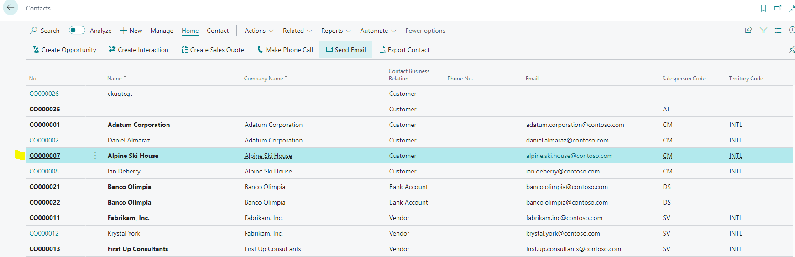
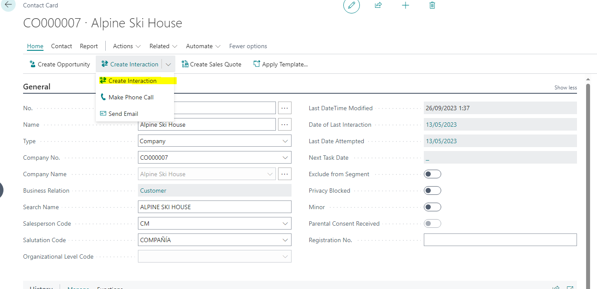
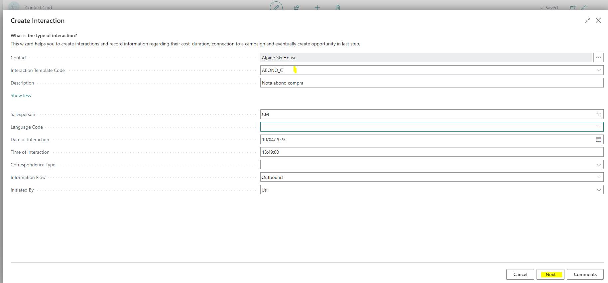
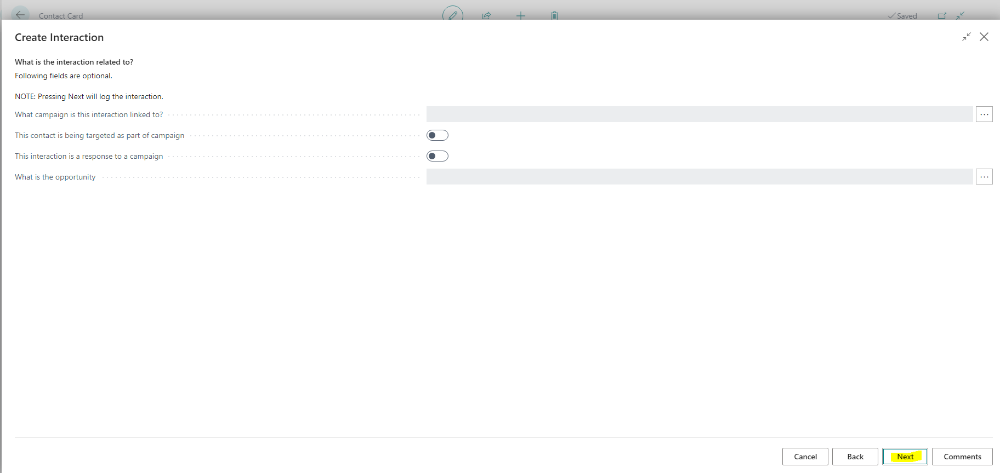
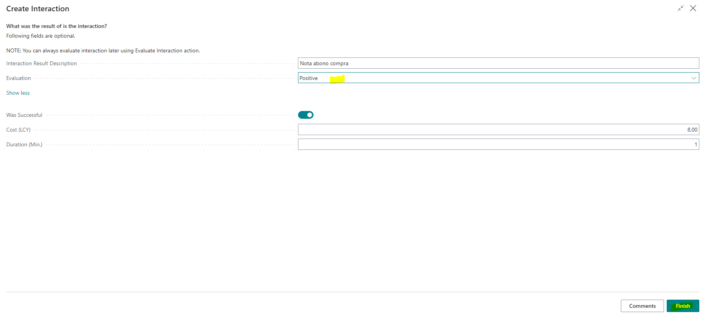
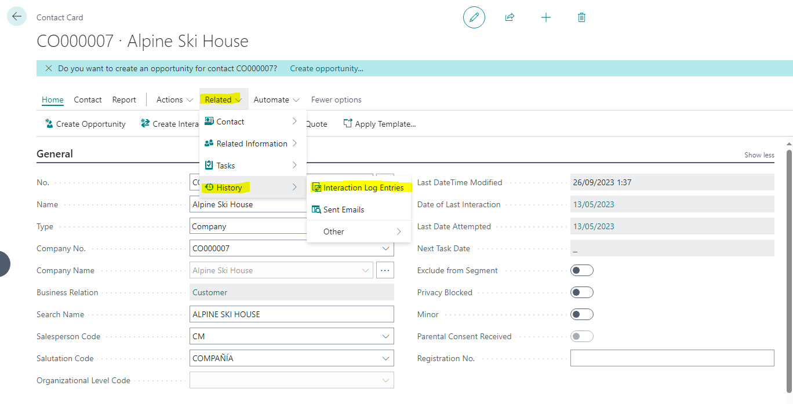
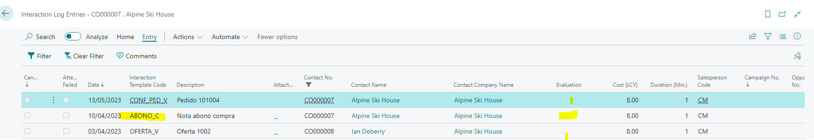
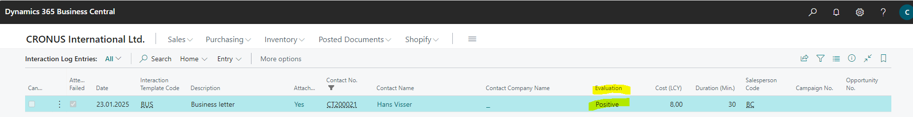

# Title: "Evaluation" field in "Interaction Log Entry" table is not saved.
## Repro Steps:
22

## Description:
An issue with the "Evaluation" field in the "Interaction Log Entry" table not being saved when creating a new interaction.

The scenario was tested in Version 22.5 Saas, 23.1 OnPrem and SaaS 23.3.

However, when I tested the exact scenario in 22.3 OnPrem, the Evalution filed is auto populated with the entered value (Positive) when I check the interaction Log Entry

