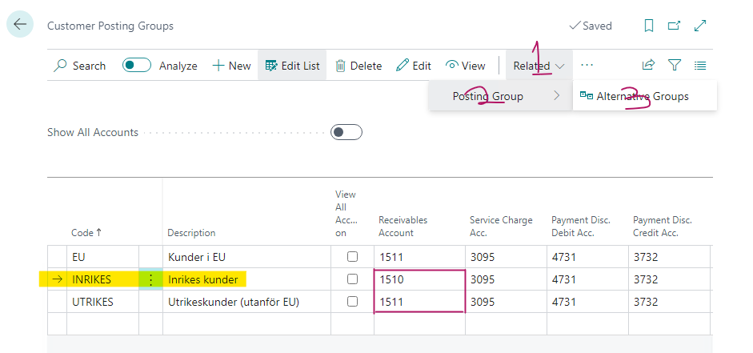
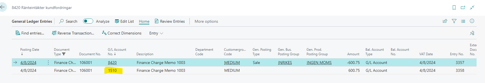

# Title: Allow Multiple Posting Groups does not work as expected with Fin. Charge Memos
## Repro Steps:
**Detailed Repro**

This was reproduced on a SE environment V23.3 (Same as cx environment), but it is a W1 issue.
Also reproduced in other country versions (ES)

>>> go to `Sales & Receivables Setup` to enable multiple posting groups.

>>> Go to customer card to enable Allow multiple posting group. Also take note of the Customer posting group

>>> Go to "customer Posting Groups" CPG >> On INRIKES >> Related >> Alternative Groups

From the Screenshot above we can see that UTRIKES and INRIKES has different G/L Acct in the Receivables Account.

>>> Go to Fin charge Memo

Fill the fields as shown in the image above then click on Issue, a wizard should pop up click okay.

>>> Go to Issued Finance Charge Memos to see the recent Fin charge memo we issued. then we inspect the page

==================
ACTUAL RESULTS
==================
On the page inspection we can see that the CPG is set to UTRIKES which is the CPG we selected when creating our Fin charge memo. OKEY!

>>> But when we navigate to Gen Ledger Entries and see the G/L Acct that it was posted into. we will see that it is going to 1510 which is the G/L Acct No. for INRIKES (the original posting group)

==================
EXPECTED RESULTS
==================
The G/L Account should be the one under UTRIKES Customer Posting Group, and not take the one from INRIKES (the original posting group)

## Description:
Allow Multiple Posting Groups does not work as expected with Fin. Charge Memos.
