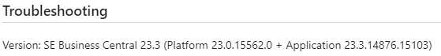
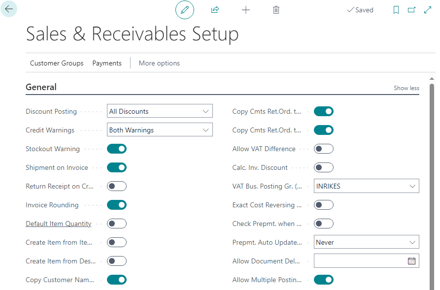
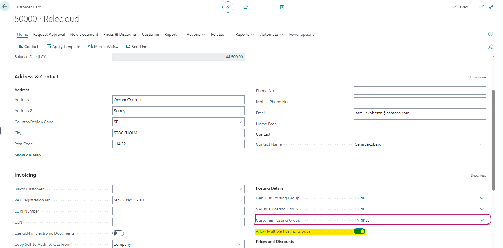
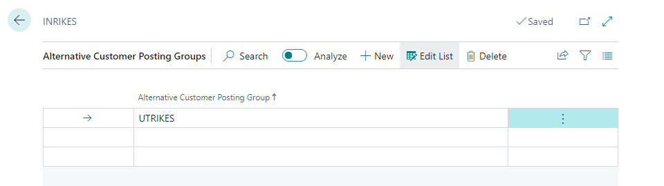
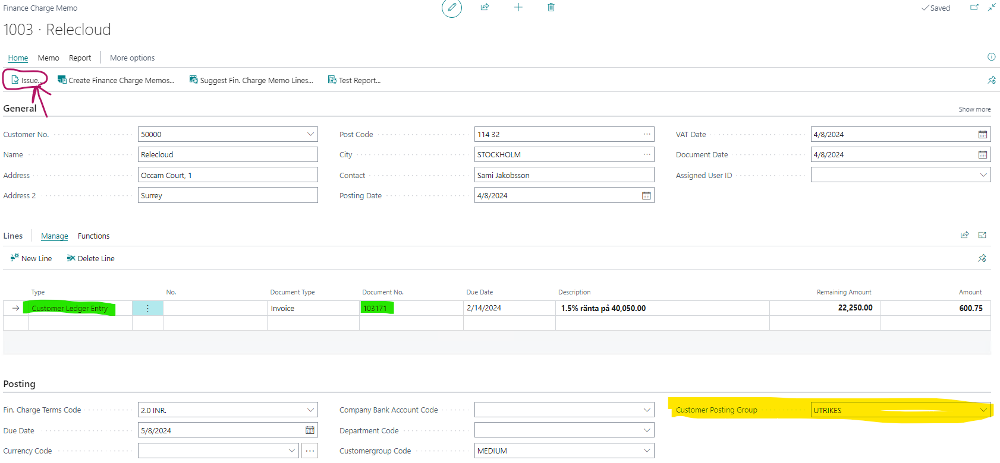

# Title: Allow Multiple Posting Groups does not work as expected with Fin. Charge Memos
## Repro Steps:
**Detailed Repro**

This was reproduced on a SE environment V23.3 (Same as cx environment), but it is a W1 issue.
Also reproduced in other country versions (ES)

>>> go to `Sales & Receivables Setup` to enable multiple posting groups.

>>> Go to customer card to enable Allow multiple posting group. Also take note of the Customer posting group

>>> Go to "customer Posting Groups" CPG >> On INRIKES >> Related >> Alternative Groups

From the Screenshot above we can see that UTRIKES and INRIKES has different G/L Acct in the Receivables Account.

>>> Go to Fin charge Memo

Fill the fields as shown in the image above then click on Issue, a wizard should pop up click okay.

==================
ACTUAL RESULTS
==================
The G/L Account is derived from the customer's default posting group instead of the selected Finance Charge Memo posting group.

==================
EXPECTED RESULTS
==================
The G/L Account should be the one under UTRIKES Customer Posting Group that was selected on the Finance Charge Memo, not the customer's default posting group.
