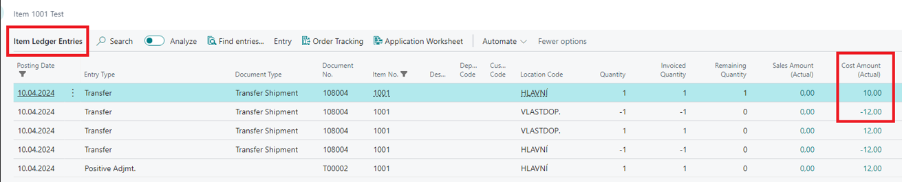

# Title: Posted Transfer Shipment - Undo Shipment function - valuation issue
## Repro Steps:
We encountered an error when using Undo Shipment function from Posted Transfer Shipment.
If, after posting the transfer shipment, a revaluation of the original item ledger entry that was used to apply the shipment is performed, the cost adjustment should be run before undoing the transfer shipment to propagate the revalued cost.

## Description:
Run the cost adjustment before undoing the transfer shipment to ensure correct cost propagation.
