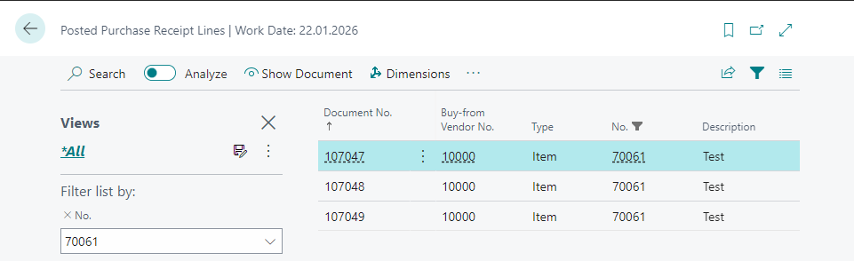
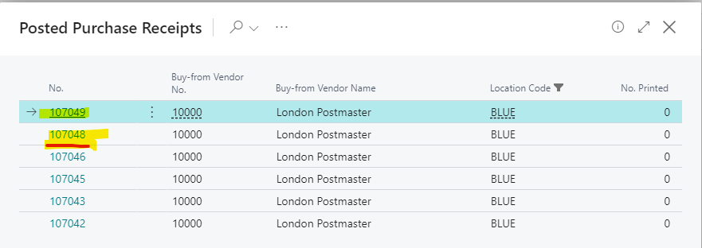
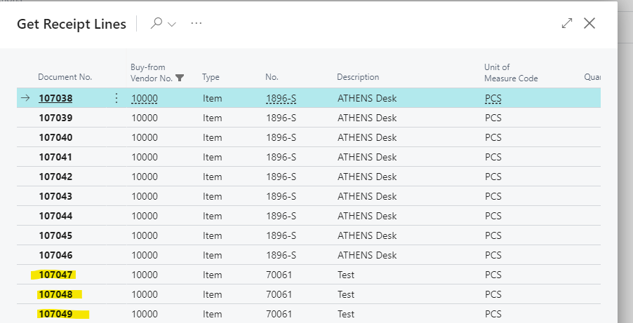
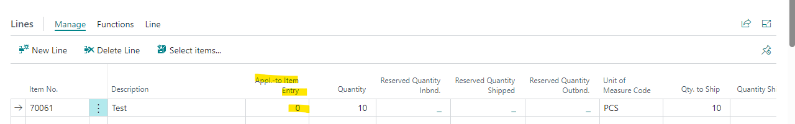
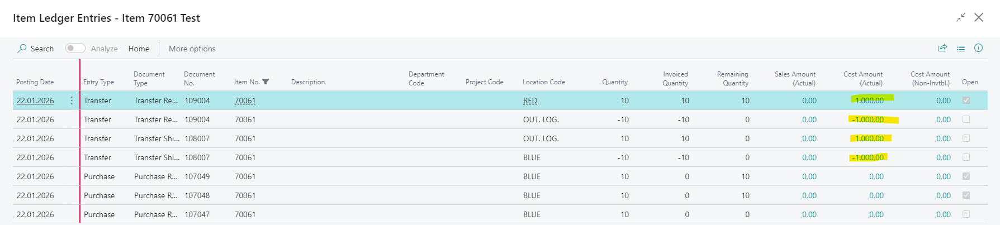
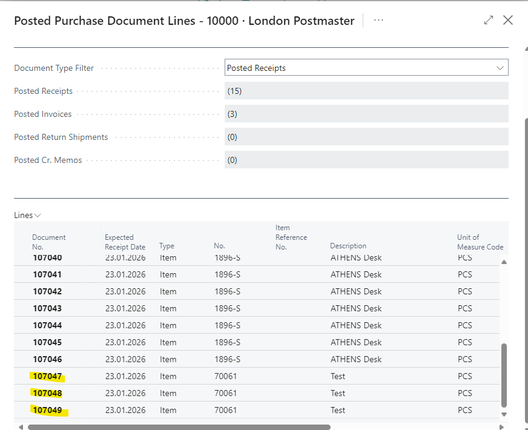
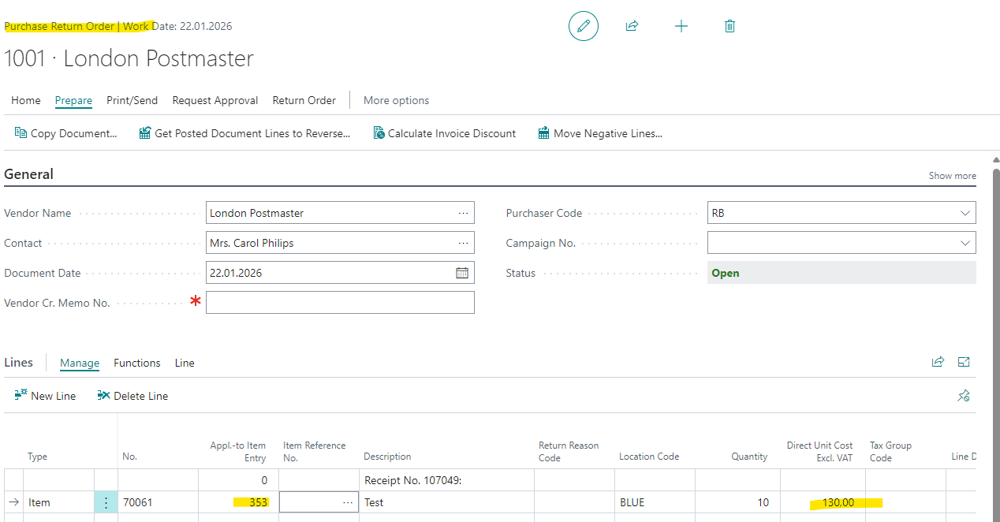

# Title: The functionality get purchase receipt lines in a transfer order is not correct filtered and does not apply to the selected purchase receipt line.
## Repro Steps:
1. Open BC23.4
2. Search for Items
    Create a new Item with costing method FIFO
3. Search for Purchase Orders
    Create 3 Orders

    **First Order:**
    Customer: 10000
    Item: 70061 (the new Item)
    Quantity: 10
    Location (just in the line, do not change the header): BLUE
    Direct Unit Cost: 100,00
    Post receive

    **Second Order:**
    Customer: 10000
    Change the Location in the header
    Shipping and Payment -> Sip-to: Location -> Location Code: BLUE
    Item: 70061 (the new Item)
    Quantity: 10
    Location : BLUE
    Direct Unit Cost: 120,00
    Post receive

    **Third Order:**
    Customer: 10000
    Change the Location in the header
    Shipping and Payment -> Sip-to: Location -> Location Code: BLUE
    Item: 70061 (the new Item)
    Quantity: 10
    Location : BLUE
    Direct Unit Cost: 130,00
    Post receive

4. Search for Posted purchase receipt lines
    Filter on the new item:
    You should have 3 posted purchase receipt lines:
    
5. Search for Transfer Order
    Create a new Transfer Order
    Transfer from BLUE to RED
    Prepare -> Get receipt lines

    FIRST ISSUE:
    RESULT:
    Just the documents which have in the header the location are shown. Our first purchase receipt is not listed: 107047
    

    If you use for example in the Purchase Invoice the functionality -> Get receipt lines
    All lines are listed:
    

    EXPECTED RESULT:
    All lines should be shown

6. Select the newes line 107049 since you want to move this specific item to another location
    No applied to Item Entry is filled:
    

    post ship and receive

7. Search for Items
    Open the ILE from Item 70061
    

    ACTUAL RESULT:The system used the first posted purchase order (Cost 1000 and not 1300)

    EXPECTED RESULT:
    It should behave like in the Purchase Return Order:
    

    You select the newest:
    The applies to ID is set.
    

## Description:
