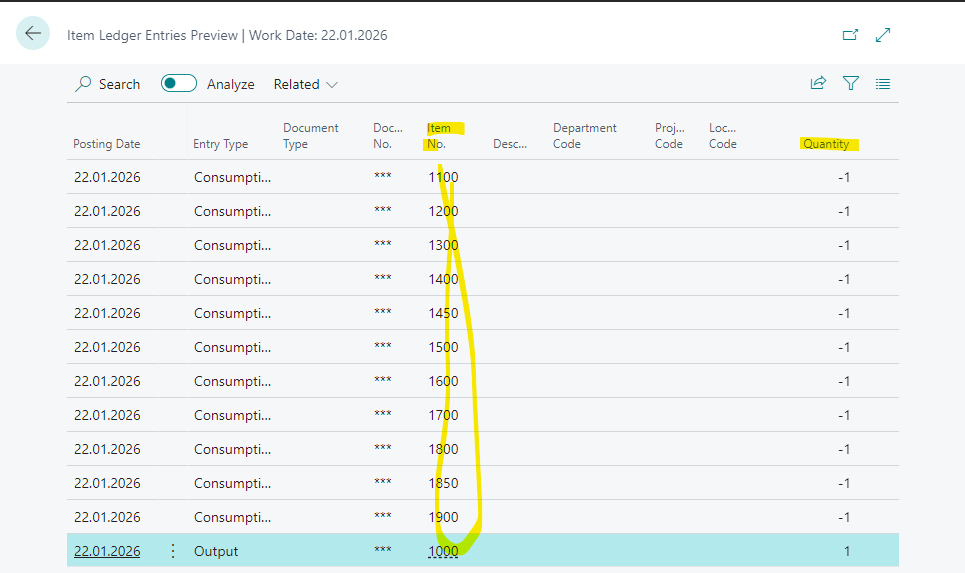
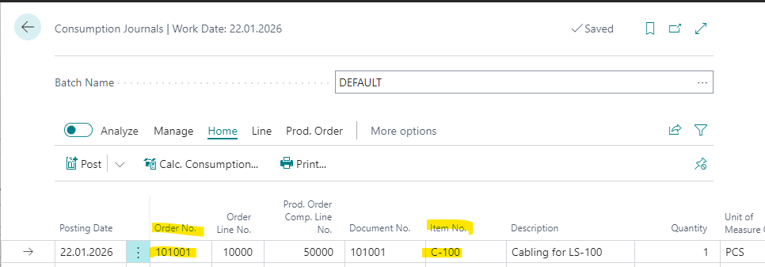

# Title: Preview Posting on Production Journal shows just Consumption line from the Consumption Journal
## Repro Steps:
1. Open BC23.4 W1
2. Search for Released Production Order
    Create a new Production Order
    Source: 1000
    Quantity: 1
    Home -> Refresh Production Order
3. Select the created Line
    Line -> Production Journal
    Post -> Preview
    Open Item Ledger Entries:
    
    This is correct
4. Search for Consumption Journal
    Insert a Line as follows (from a totally different Production Order)
    
    Leave the Consumption Journal without posting
5. Go back to released Production Order
    Line -> Production Journal -> Post Preview

ACTUAL RESULT:
The posting preview is selecting the line from the Consumption Journal and it's issues

or if you select in the consumption Order the same released production Order just this line for preview.

EXPECTED RESULT:
The Posting preview should be the same as in step 3, since this is what the system is posting.
## Description:
Preview Posting on Production Journal shows just Consumption line from the Consumption Journal
