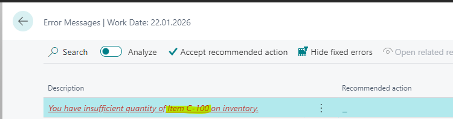

# Title: Preview Posting on Production Journal shows just Consumption line from the Consumption Journal
## Repro Steps:
1. Open BC23.4 W1
2. Search for Released Production Order
    Create a new Production Order
    Source: 1000
    Quantity: 1
    Home -> Refresh Production Order
3. Select the created Line
    Line -> Production Journal
    Post -> Preview
    Open Item Ledger Entries:
    
    This is correct
4. Search for Consumption Journal
    Insert a Line as follows (from a totally different Production Order)
    
    Leave the Consumption Journal without posting
5. Go back to released Production Order
    Line -> Production Journal -> Post Preview

ACTUAL RESULT:
The posting preview includes entries for the same Production Order, regardless of item filtering.

EXPECTED RESULT:
The Posting preview should include all entries for the same Production Order, regardless of item filtering.
## Description:
Preview Posting on Production Journal should filter by Production Order only
