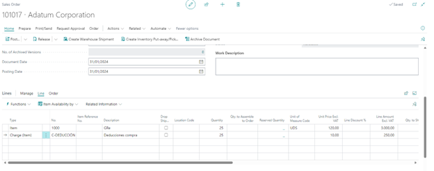
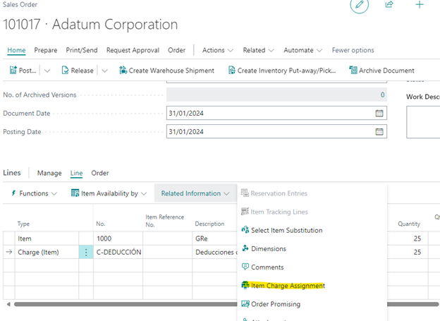
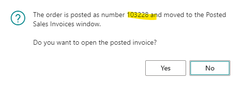
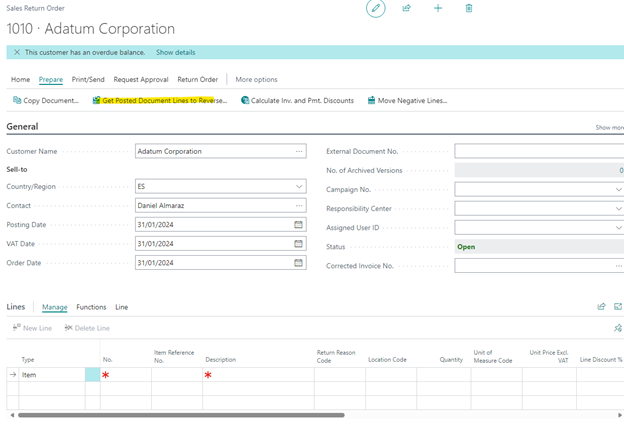
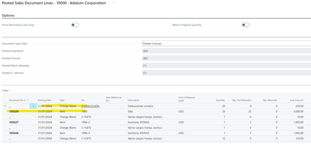
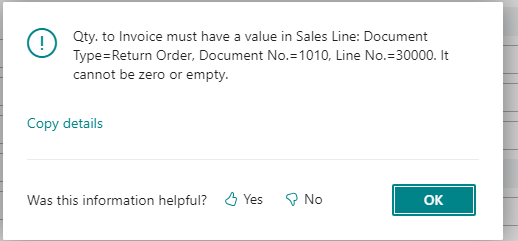
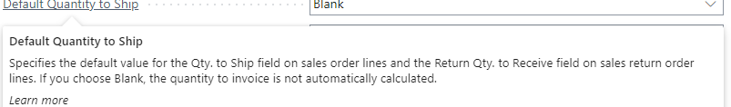

# Title: Item Charge throws error when pulled into Sales Return Order when Default Qty. to Ship is set to 'Blank' on Sales & Rec Setup
## Repro Steps:
REPRO:

==============
Change Default Quantity to Ship to Blank

Create Sales Order
Line 1: Item (Qty: 25)
Line 2: Item Charge (Qty:25)

Carry out Item Charge Assignment
Related Information -> Item Charge Assignment

Post (Ship and Invoice) the Sales Order: Inv 103228

Create Sales Return Order

Customer: Same as Sales Order

Click Get Posted Document Lines to Reverse
mark both lines, item and Charge item

ACTUAL RESULT:
Error:

Qty. to Invoice must have a value in Sales Line: Document Type=Return Order, Document No.=1010, Line No.=30000. It cannot be zero or empty.

EXPECTED RESULT:
Both lines should be copied

## Description:
PROBLEM:
==============
When Default Qty to Ship on Sales & Receivable Setup is change to Blank, Item Charge cannot be brought into a Sales Return Order. The error message suggests that without the automatic calculation of Invoice, the system does not know what invoice to assign to Item Charge, and thus it cannot bring it in.

However if you change Default Qty to Ship. To Remainder, it is called in fine.

EXPECTATION:
==============
Item Charge should be successfully called in to reverse

RESULT:
==============
Error message pops up

Do note however, that the Default Qty to ship flavor text states that qty to invoice is not automatically calculated when set to blank, which might be why item charge does not get called in. Customer wants item charge to be called in even when it is set to blank. Is this a limitation or by-design, which would require them to raise an IDEA, or a BUG?

Default Quantity to Ship
Specifies the default value for the Qty. to Ship field on sales order lines and the Return Qty. to Receive field on sales return order lines. If you choose Blank, the quantity to invoice is not automatically calculated.
