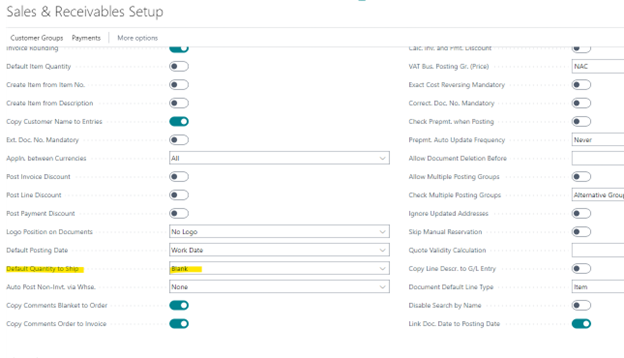
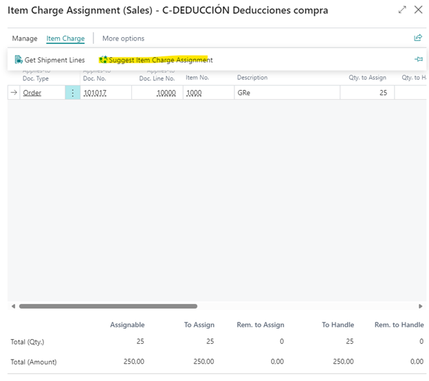

# Title: Item Charge throws error when pulled into Sales Return Order when Default Qty. to Ship is set to 'Blank' on Sales & Rec Setup
## Repro Steps:
Item Charge should only be validated when Default Qty to Ship is Blank, not when it is non-Blank.

The validation condition is inverted: Qty. to Invoice is checked only when setup is Blank.

## Description:
Item Charge Qty. to Invoice validation condition is inverted.
