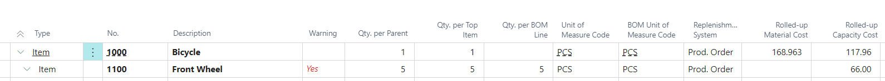
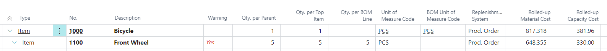

# Title: Inconsistency in Rolled-up Capacity Cost field on BOM Cost Shares page.
## Repro Steps:
1. Cronus database. Open item '1000' -> Production BOM No. field -> open -> change the status to "Under Development" -> find the component 1100 and increase the Quantity per from 1 to 5. Certify the BOM.
2. Open item '1100' -> Production BOM No. field -> erase the current BOM No. and create a new BOM for the item '1100'. Do not add any lines to the new BOM, just leave it blank and certify. Make sure that the new blank BOM is selected for the item '1100'.
3. Go back to item '1000' -> open 'Cost Shares' page. Note that 'Rolled-up Capacity Cost' for the component '1100' is equal to 66.

4. Go back to item '1100' -> Production BOM No. field -> erase the current BOM No. so that this field is blank.
5. Reopen 'Cost Shares' page for item '1000'. Note that 'Rolled-up Capacity Cost' for '1100' is now equal to 330 (66 * 5):

The Unit Cost fallback is determined after item cost retrieval, not during BOM tree calculation.

## Description:
