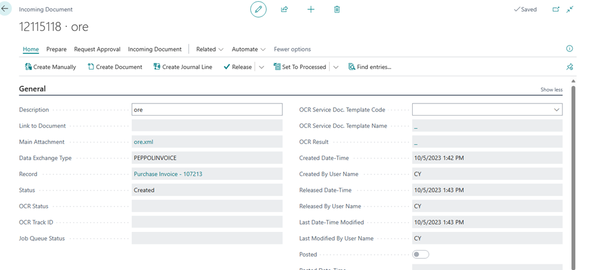
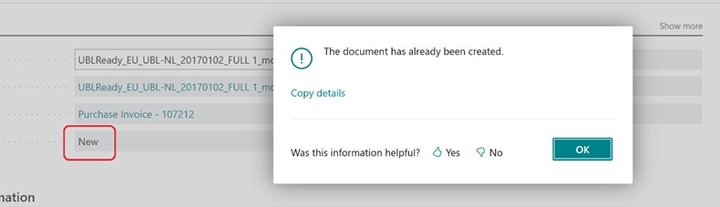

# Title: Incoming Document status stuck at new after file is created and reopened.
## Repro Steps:
**ISSUE REPRO:**

Navigate to the Incoming document page on the new document page click on NEW and Create from file as shown in the screenshot below:

After the document has been imported click on create document. If the setting in the environment match with the incoming document the document is created as shown below and the status set to "Created"

Click on release and then click on Re- Open the status is changed to NEW as shown below.

If you click on create document, you get a prompt that "The document has already been created" and the status is still set at NEW after click okay as shown below.

CX is saying there is a bug, and the status is supposed to move to Create after clicking ok or after the document has been successfully created there should not be an option to reopen and click on create document (Create document should be grayed out).

================
ACTUAL RESULTS
================

Incoming Document status stuck at new after file is created and reopened.

================
EXPECTED RESULTS
================

Either: 1. The incoming document cannot be reopened after reaching status “Created” while the resulting document exists.
Or
2. Pressing Create Document sets status back to “Created” when existing document is detected as regards the present behavior where there is a prompt, but the status is still at NEW.

## Description:
The customer does not have issue with creating the document or the document created. The issue is with the status that there is a bug

Either: 1. The incoming document cannot be reopened after reaching status “Created” while the resulting document exists.

Or

2. Pressing Create Document sets status back to “Created” when existing document is detected as regards the present behavior where there is a prompt, but the status is still at NEW.

I have search bug and wikis there is no existing ticket as regards this and in the documentation, there is no definite explanations for what each status connotes. Please Investigate.

I attached the repro and the file use to create the repro. The issue is not with the document created it is with the status of the document after it has been created.

## Hints

We should go with option 2
