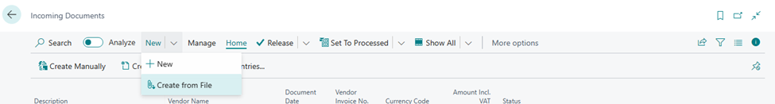
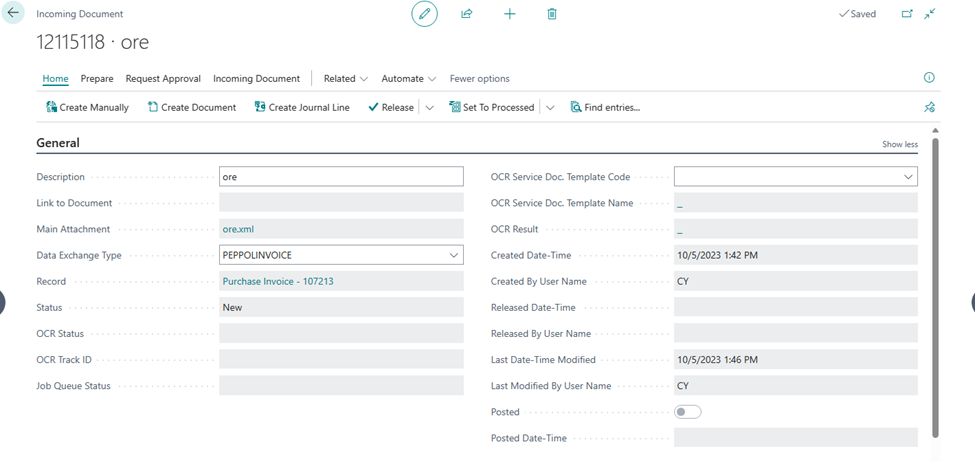

# Title: Incoming Document status stuck at new after file is created and reopened.
## Repro Steps:
**ISSUE REPRO:**

Navigate to the Incoming document page on the new document page click on NEW and Create from file as shown in the screenshot below:

After the document has been imported click on create document. If the setting in the environment match with the incoming document the document is created as shown below and the status set to "Created"

Click on release and then click on Re-Open. Reopen does nothing when a document is already linked.

If you click on create document, you get a prompt that "The document has already been created" and the status is still set at NEW after click okay as shown below.

================
ACTUAL RESULTS
================

Incoming Document status stuck at new after file is created and reopened.

================
EXPECTED RESULTS
================

Reopen does nothing when a document is already linked.
