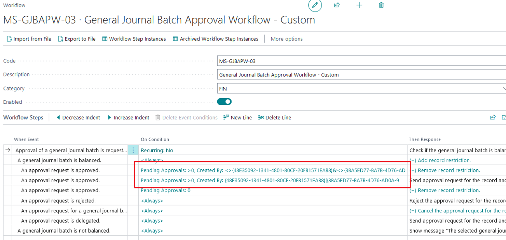
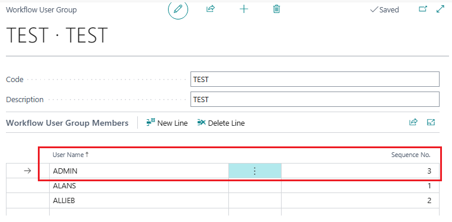
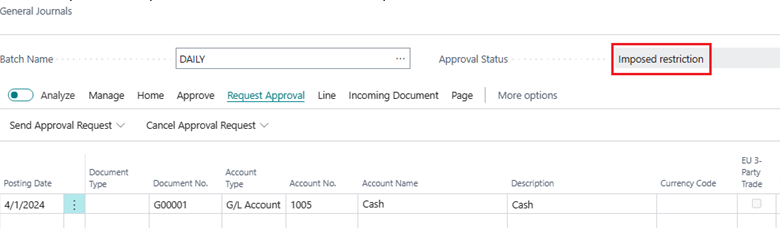
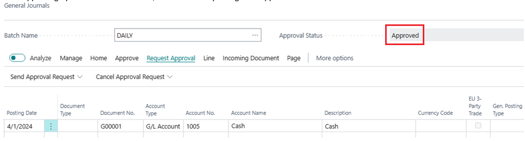

# Title: Approval status for the batch display wrong for Workflow User Group
## Repro Steps:
1. They have some special demand, requirement for GL journal batch is:
- there are multiple approvers - we have set up a Workflow User Group for this
- if a requestor is also an approver, the batch should be submitted to the other approvers
2. They made some adjustment based on the conditions of the workflow.

They setup these two conditions based on 'Created By' field.
First condition:
<>{B9D9DD66-C814-4F58-B3CF-6BE428D3F23E}&<>{95DBCAE3-51C7-464C-A81F-7F35F0D7DEAA}&<>{661D271C-0441-4762-8AFA-B95DBE69CD66}
Second condition:
{B9D9DD66-C814-4F58-B3CF-6BE428D3F23E}|{95DBCAE3-51C7-464C-A81F-7F35F0D7DEAA}|{661D271C-0441-4762-8AFA-B95DBE69CD66}
The string are user id.

The workflow worked well in my clean sandbox. But when the last sequence of the approver sent approval request

The status will change to 'Imposed restriction' but not pending approval.

And the approval process still could go on, which means other approver could approve this and the status finally update to approved.

## Description:
