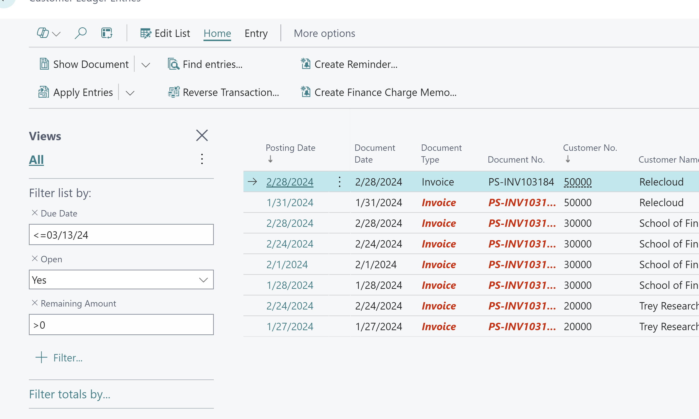
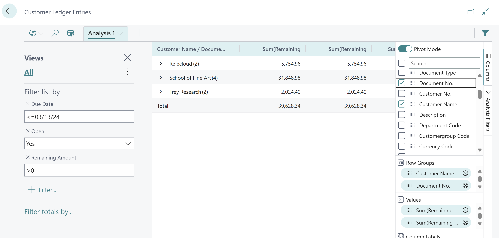

# Title: New AR rolecenter: the overdue filter must be applied dynamically during drilldown instead of page initialization
## Repro Steps:
Note: the overdue filter must be applied dynamically during drilldown instead of page initialization

besically you can ignore the repro and just implement the correct filter date

repro: the total Overdue (LCY) cue is not updated correctly:
open the new AR rolecenter
the filter is set during page initialization but should be applied dynamically during drilldown

actual: filter is set on page open, which can become stale

expected value:

## Description:

## Hints

Also, found that calculation and drilldown for "Total Overdue (LCY)" are not in line.
