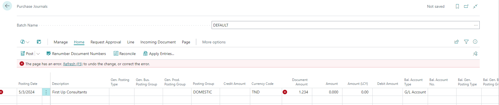
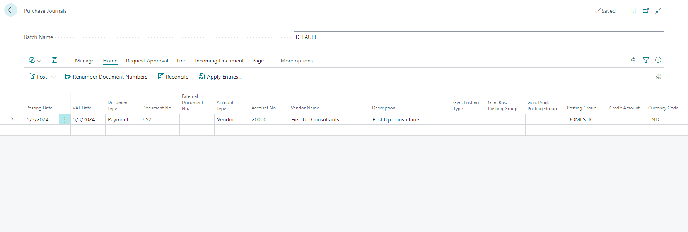

# Title: Document Amount in Purchase Journal not showing the correct decimals
## Repro Steps:
I was able to repro the issue using TND currency, which actually has 3 decimal places.

1.I created a purchase journal and insert a new entry for vendor 20000.and set my currency to TND and amount to 1.23.

If I enter an amount (1.234) in the document amount filed, I get this error message" Your entry of '1.234' is not an acceptable value for 'Document Amount'. The field can have a maximum of 2 decimal places."

2.To ignores this error, The amount was entered in the amount field and the journal was posted.

## Description:
Issue: Document Amount in Purchase Journal not showing the correct decimals

Expectation: It is expected that the document amount field should accept at most 2 decimal figures.
