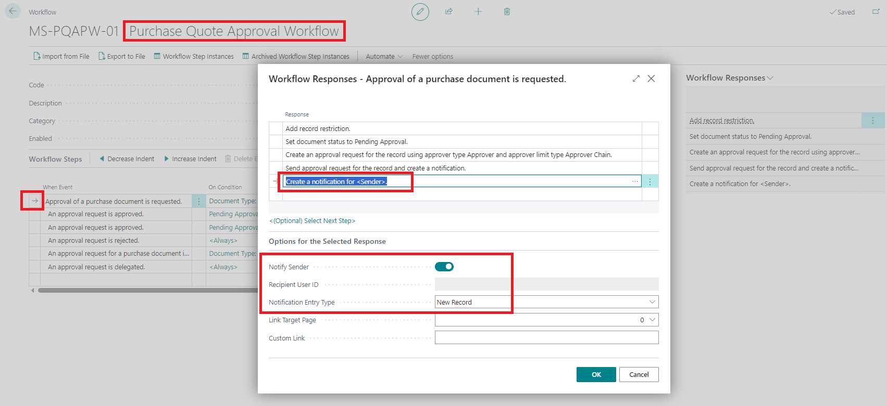
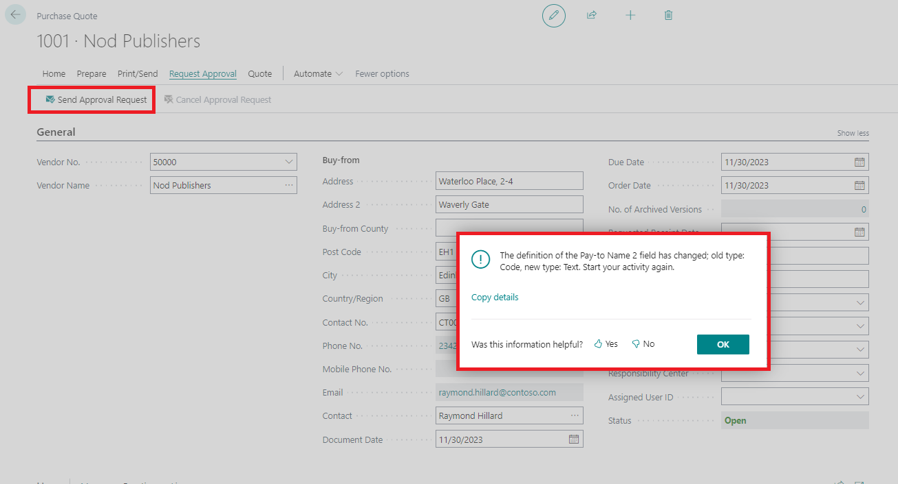
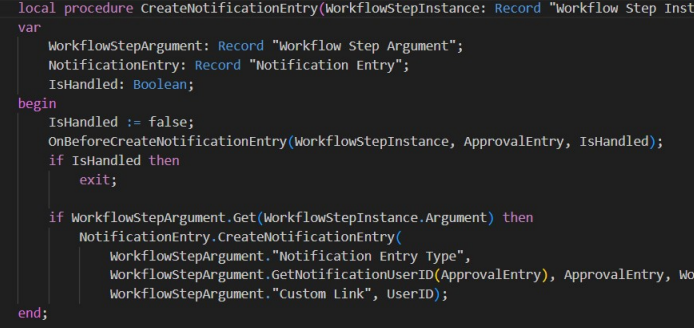
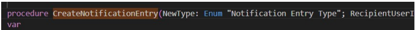
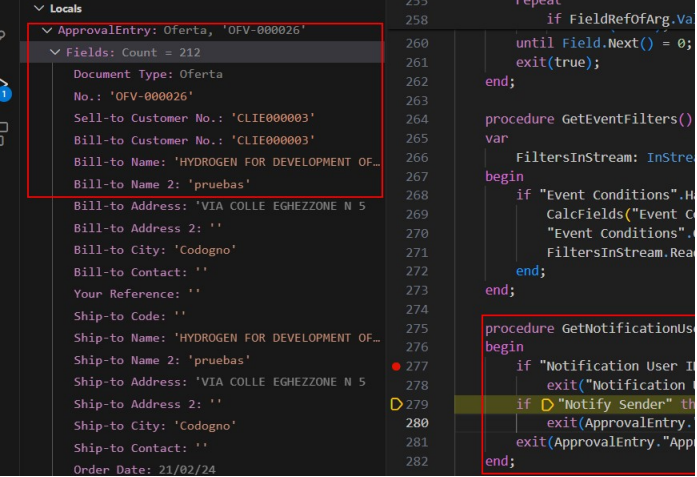

# Title: "The definition of the Pay-to Name 2 field has changed; old type: Code, new type: Text. Start your activity again." error message if you request approval of a Purchase Quote with Notify Sender activated.
## Repro Steps:
1-Take a BC 23.x (any localization)
2-Create from Template the Purchase Quote Approval Workflow from the Workflow page.
3-Just add the following new Response to Notify Sender:

4-Create a new Purchase Quote and try to Send Approval Request from it.
================
ACTUAL RESULTS
================
"The definition of the Pay-to Name 2 field has changed; old type: Code, new type: Text. Start your activity again." error message if you request approval of a Purchase Quote with Notify Sender activated.

================
EXPECTED RESULTS
================
The system does not attempt to resolve Approval Entry automatically.

================
ADDITIONAL INFO
================

If requesting support, please provide the following details to help troubleshooting:

The definition of the Pay-to Name 2 field has changed; old type: Code, new type: Text. Start your activity again.

Internal session ID:
bf61c088-ec19-41f0-b24b-cf19d15c0257

Application Insights session ID:
ec2aa9d8-08cc-41f4-8bf6-ba7eed842b78

Client activity id:
801fcf32-876f-46b0-a65f-04f16827c7e4

Time stamp on error:
2024-02-22T09:07:55.9555575Z

User telemetry id:
8e1abf47-e5ce-4778-9d0c-6c45b151fb2c

AL call stack:
"Workflow Step Argument"(Table 1523).GetNotificationUserID line 5 - Base Application by Microsoft
"Workflow Response Handling"(CodeUnit 1521).CreateNotificationEntry line 12 - Base Application by Microsoft
"Workflow Response Handling"(CodeUnit 1521).ExecuteResponse line 27 - Base Application by Microsoft
"Workflow Management"(CodeUnit 1501).ExecuteResponses line 32 - Base Application by Microsoft
"Workflow Management"(CodeUnit 1501).HandleEventWithxRec line 28 - Base Application by Microsoft
"Workflow Management"(CodeUnit 1501).HandleEvent line 2 - Base Application by Microsoft
"Workflow Event Handling"(CodeUnit 1520).RunWorkflowOnSendPurchaseDocForApproval line 3 - Base Application by Microsoft
"Approvals Mgmt."(CodeUnit 1535).OnSendPurchaseDocForApproval(Event) line 2 - Base Application by Microsoft
"Purchase Quote"(Page 49)."SendApprovalRequest - OnAction"(Trigger) line 5 - Base Application by Microsoft

===================
EXTRA INFO FROM PARTNER
===================
Debugging function CreateNotificationEntry - Codeunit 1521

This function calls function CreateNotificationEntry from “Notification entry” Table, and in its definition is expecting to receive the following parameters:

The second parameter expects to receive Userid (Code 50) and here is where the problem is as to get the UserID it calls the GetNotificationUserID, with a register that should come from "Approval Entry". Field 6 of "Approval Entry" table is Sender ID, which is Code 50. But, we have checked that on this point in some situations we find a register of "Sales Header"... Field 6 of "Sales Header" is Bill-to Name 2... Text 50...
GetNotificationUserID exit this Text50 and the error happens.

This is the exact point in the code where the error happens:

The function try to exit the "Sender ID" and as we saw already this is field 6 of "Approval Entry" table and in "Sales Header" it doe snot exist... and exit the "Bill-to Name 2" field...which is field 6 of "Sales Header" table.

## Description:
When you request approval of a Purchase Quote with Notify Sender activated, we shall receive such error message: "The definition of the Pay-to Name 2 field has changed; old type: Code, new type: Text. Start your activity again."
