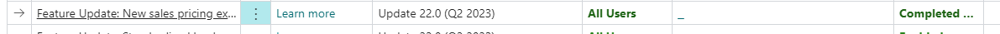
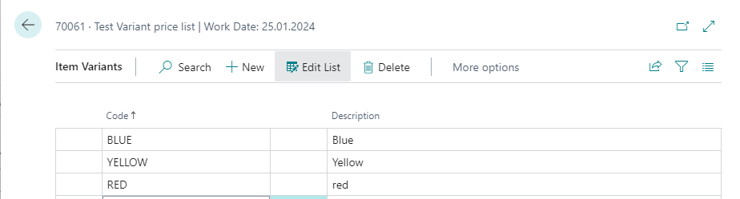
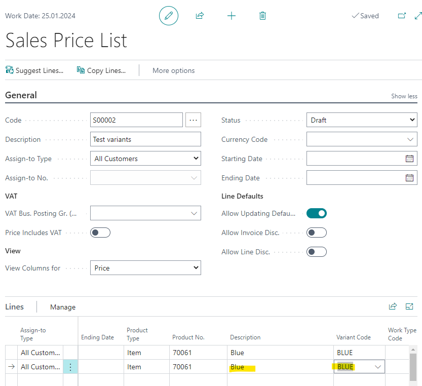

# Title: When creating a new price for variant items the variant code should be cleared when validating the Product No. on a new line
## Repro Steps:
1. Open BC 22.13 W1
2. Search for "Feature management"
   Activate "New sales pricing experience"
   
3. Search for Items
   Create a new item
4. Create 3 Variants for this item:
   Actions -> item -> variants
   
5. Search for "Sales price lists"
   Create a new price list
   Insert a line with your new item (70061) and select a variant "Blue"
   insert a second line for this item (70061) the variant should be cleared when validating the Product No. on a new line

ACTUAL RESULT:
the variant "Blue" is automatically presetted

