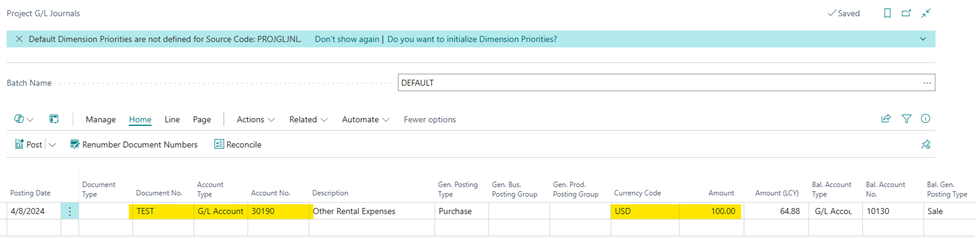
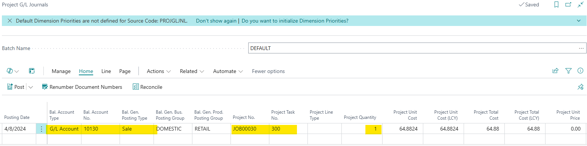
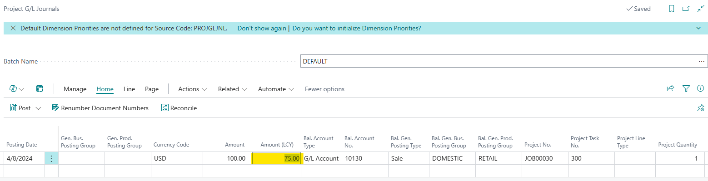
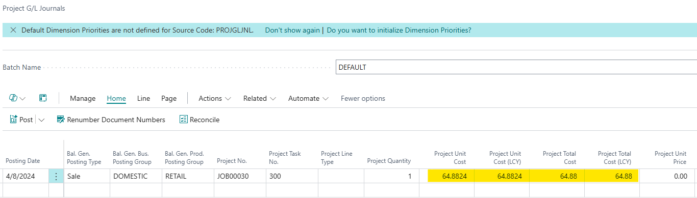
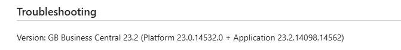
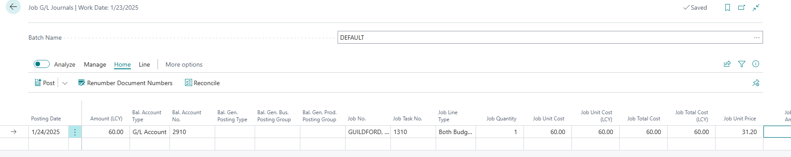
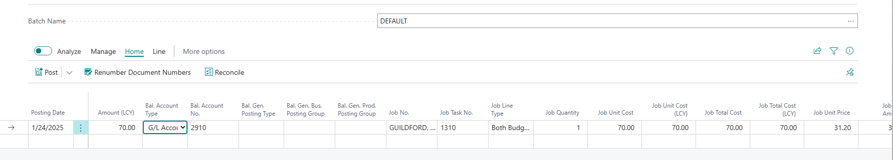

# Title: Issue in the Project G/L Ledgers line after changing the "Amount (LCY)" value
## Repro Steps:
Testing done on version 24.1:
1- Open Project G/L Journal & fill the line as follows:
Document No.

Account type & Account No.

Currency code

Bal. account type & Bal Account No.

Project No. & Project Task No.

Project quantity.

The following fields will be filled automatically according to the Amount (LCY) field:

Project Unit Cost, Project Unit Cost (LCY), Project Total Cost and Project Total Cost (LCY).

2- After changing the Amount (LCY) in the line:

3- The new amount will not reflect on the 4 fields mentioned:

I replicated the same scenario on version:

And the fields were updated once the Amount (LCY) field was adjusted:
Before:

After:

## Description:
Issue in the Project G/L Ledgers line after changing the "Amount (LCY)" value
