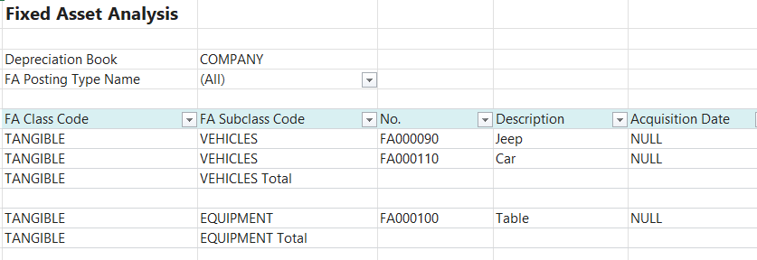

# Title: Acquisition date is null in excel file created by Fixed Asset Analysis Excel report
## Repro Steps:
Actions:
Create several Fixed Assets, acquire them, partially depreciate them.
Run Fixed Asset Analysis Excel report, open resulted excel file.

**Expected result:**
Acquisition date is specified for each FA when FA Setup default depreciation book is configured.

**Actual result:**
Acquisition date is null for all FAs.

## Description:
