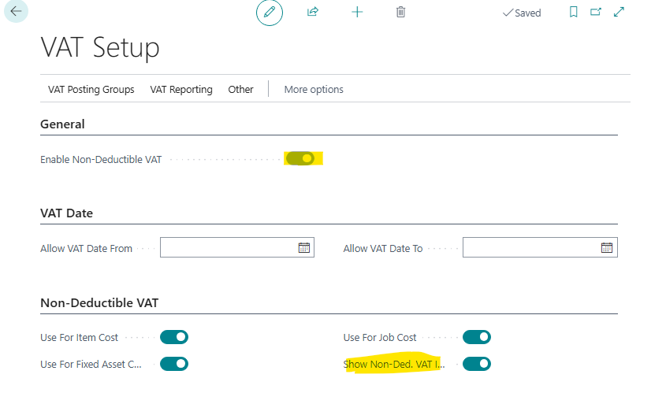
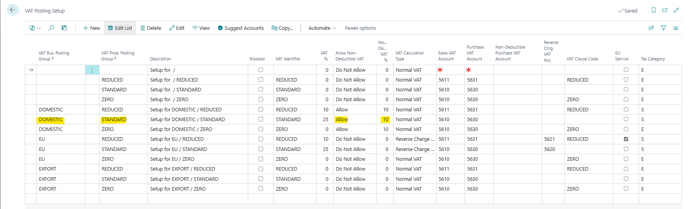
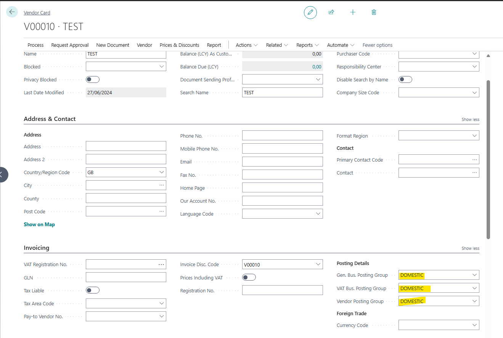
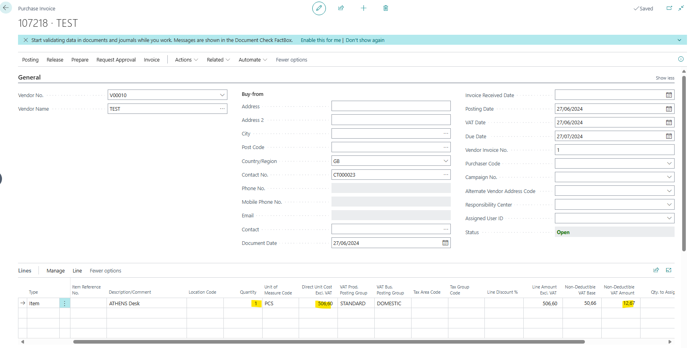
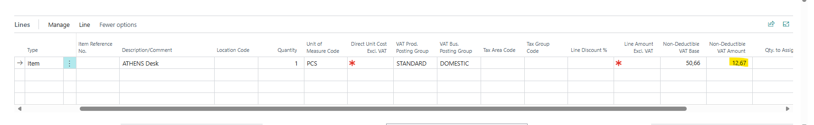
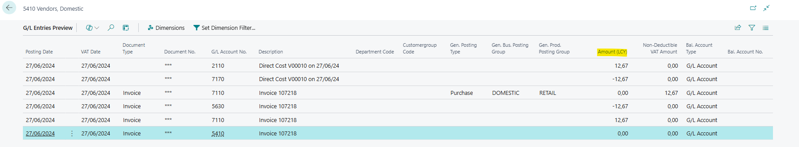

# Title: When Changing the Unit Amount to 0 in the purchase invoice line, the Non Deductible Vat is not removed when Non-Deductible VAT is enabled.
## Repro Steps:
1.  Open Cronus W1.
2.  Open Vat Setup and enable Non Deductible Vat.
3.  

4.  Open Vat Posting Groups.
5.  Setup and allow Non Deductible Vat with 10%.
6.  

7.  Go to Vendors and create a new DOMESTIC vendor.
8.  

9.  Go to Purchase Invoices and create a new one.
10.  Add the Test Vendor.
11.  Add the item Athens Desk for example, it will generate Direct Unit Cost Excl Vat and Non Deductible Vat Amount.
12.  

13.  Change the Direct Unit Cost Excl Vat to 0.
14.  After changing it to 0 the Non Deductible Vat Amount is still the same and hasn't been removed when Non-Deductible VAT is enabled.
15.  

16.  If we do preview posting.
17.  The Lines are posted with the Non Deductible Vat Amount.
18.  

## Description:
When Changing the Unit Amount to 0 in the purchase invoice line, the Non Deductible Vat is not removed when Non-Deductible VAT is enabled.
