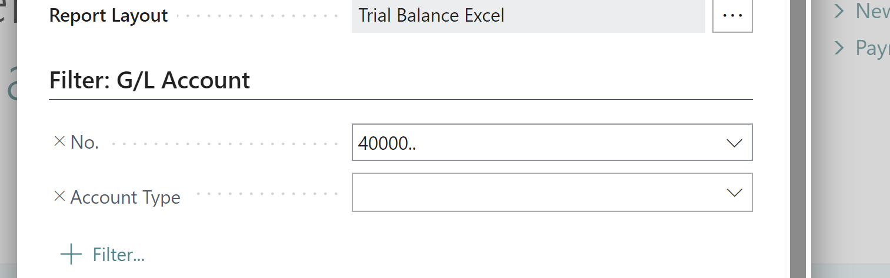
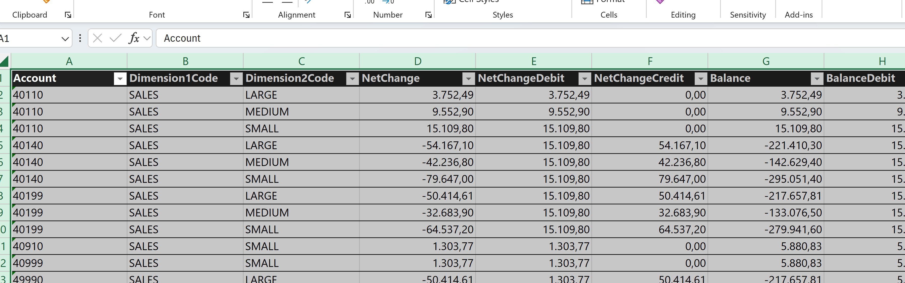
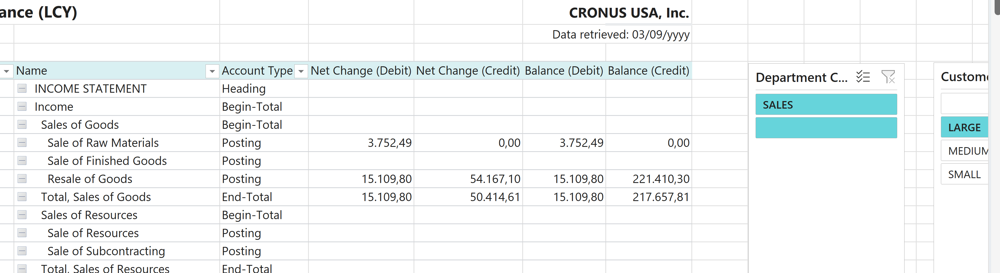
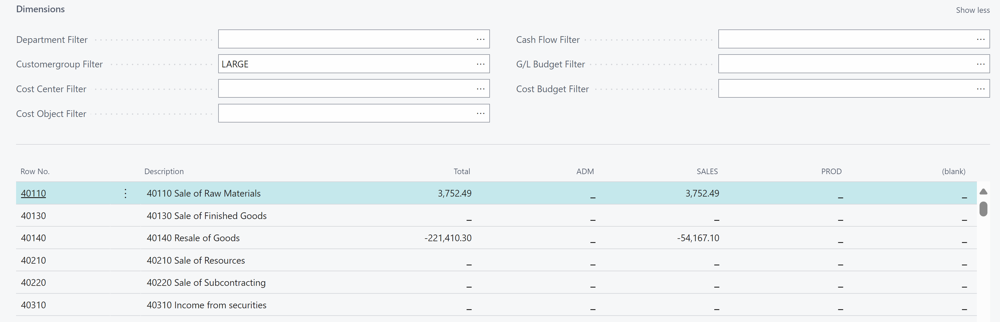

# Title: Excel layouts - dim breakdown results in repeated values (Trial Balance report a.o.)
## Repro Steps:
Open the Trial Balance Excel report
run it for p1..p3
tip: in US you can run it with this acc. filter:

so buggy rows are in top of page  ;o)
open excel
open TrialBalanceData tab

**expected**: a breakdown of revenue account per dimensions

**actual**: repeated values for dimensions   (NetchangeDebit and Balance Debit)

the repeated rows/fields appears to just 'sit' in the reports - because the other numbers are correct:

 compared to a financial reported filtered for same dim:

## Description:
