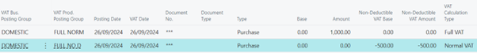

# Title: Non-deductible VAT is not showing as non-deductible when doing full VAT
## Repro Steps:
*** Were you able to reproduce the issue? Yes

The situation cx is testing is for a prospect who wants to post all their tax as non-recoverable and then make a quarter end adjustment for the recoverable VAT.

At the end of the quarter, I want to post a journal with a FULL NORM type VAT for the recoverable portion of the VAT and a FULL NORM 100% Non-deductible to move the VAT from Non-Deductible VAT Amount to Amount.

When you make the change in the VAT posting setup to Full VAT in the Calculation Type it posts the VAT as Amount instead of Non-Deductible VAT amount.

**Goal is to setup 2 full VAT codes to make a tax adjustment to move non-deductible VAT to deductible VAT (Amount).**

The second line on the journal is showing the tax as Amount instead of Non-Deductible VAT Amount.

If I change the VAT settings on the non-deductible line to make it Normal VAT instead of Full VAT and create the same journal. The VAT postings look like this

The amount is now 50:50 Net and VAT but it’s correctly showing in the non-deductible area.

The expected behavior is that if I use the settings of Full VAT it and set it as non-deductible it will treat it as non-deductible, and I will have the full amount displayed in the non-deductible column on the VAT entry. It is however treating it as deductible VAT.

**Here's more context:**

This short explanation of the accounting requirements for organizations such as not for profits in the UK.

Fundraising and donations are considered outside the scope of VAT. These organizations are not able to reclaim any of the purchase VAT on costs associated with fundraising.

Commercial activities such as licensing their logos and branding to other organizations for charitable partnerships are taxable under the same rules as any other commercial organization purchase tax is reclaimed during the HMRC submission.

Cost associated with shared services, e.g. An audit fee can have the costs reclaimed at a rate based on the ratio of income the organization has received during same period. e.g. if my fundraising to commercial was 2:1 I would be able to reclaim one third of the VAT cost on the audit fee.

At the end of each year the organization is required to make an adjustment based on the ratio when viewing the year in full instead of the isolated periods.

At this adjustment time some of the VAT will need to be moved between the Amount and the Non-deductible amount. Nothing needs to happen with the base or the non-deductible base.

An additional scenario would be

If I was to receive an import invoice for VAT only on something like T-shirts, I was giving away at a charity fundraising run, that would be a tax only invoice where I would not be able to reclaim any of the tax. So, I would expect to be able to code a purchase invoice to VAT only and non-deductible, but it will put the VAT as deductible marking it as something I can reclaim when I run the tax return to HMRC.

For the adjustment part, I can create a workaround where I post a base and a tax amount and contra the base amount as a non-deductible base amount. But this is not correct, it's an acceptable work around only.

Purchase transaction is just incorrect accounting and should be escalated as an error. If I set tax as non-deductible it must be treated as non-deductible. The current setup can allow incorrect tax figures to be filed to HMRC

## Description:
Non-deductible VAT is not showing as non-deductible when doing full VAT
