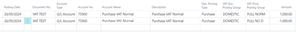
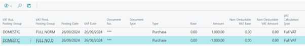

# Title: Full VAT is treated as non-deductible only when Non-Deductible VAT % is less than 100
## Repro Steps:
*** Were you able to reproduce the issue? Yes

The situation cx is testing is for a prospect who wants to post all their tax as non-recoverable and then make a quarter end adjustment for the recoverable VAT.

At the end of the quarter, I want to post a journal with a FULL NORM type VAT for the recoverable portion of the VAT and a FULL NORM 100% Non-deductible to move the VAT from Non-Deductible VAT Amount to Amount.

Full VAT is treated as non-deductible only when Non-Deductible VAT % is less than 100. When the Non-Deductible VAT % is set to 100, the system skips non-deductible processing for Full VAT.

## Description:
Full VAT is treated as non-deductible only when Non-Deductible VAT % is less than 100
