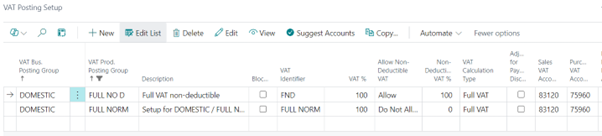

# Title: Full VAT amount is calculated but not reflected in the non-deductible VAT field on the VAT entry
## Repro Steps:
*** Were you able to reproduce the issue? Yes

The situation cx is testing is for a prospect who wants to post all their tax as non-recoverable and then make a quarter end adjustment for the recoverable VAT.

At the end of the quarter, I want to post a journal with a FULL NORM type VAT for the recoverable portion of the VAT and a FULL NORM 100% Non-deductible to move the VAT from Non-Deductible VAT Amount to Amount.

When you make the change in the VAT posting setup to Full VAT in the Calculation Type it posts the VAT as Amount instead of Non-Deductible VAT amount. The full amount is calculated but not reflected in the non-deductible column on the VAT entry.

## Description:
Full VAT amount is calculated but not reflected in the non-deductible VAT field on the VAT entry
