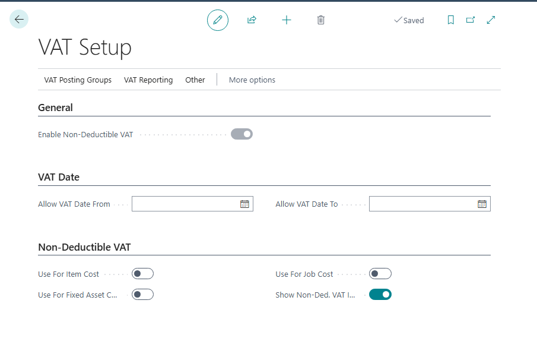
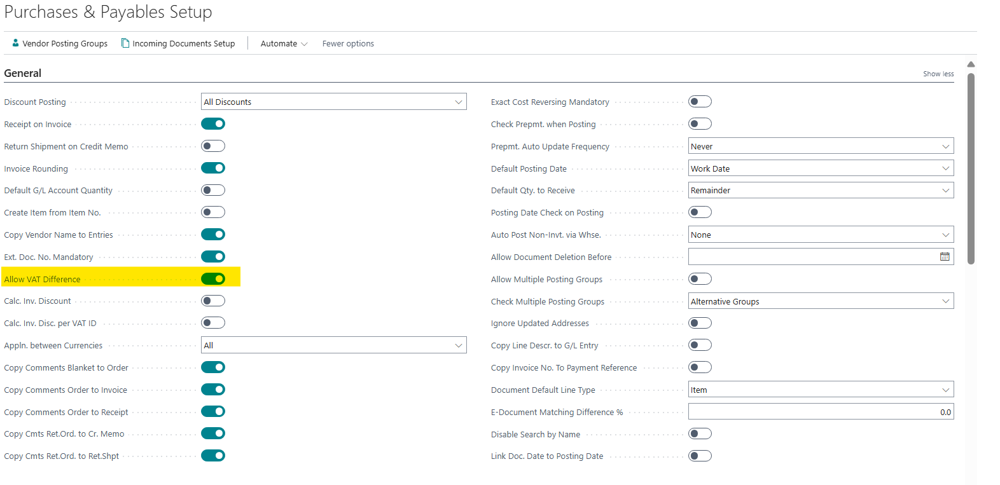
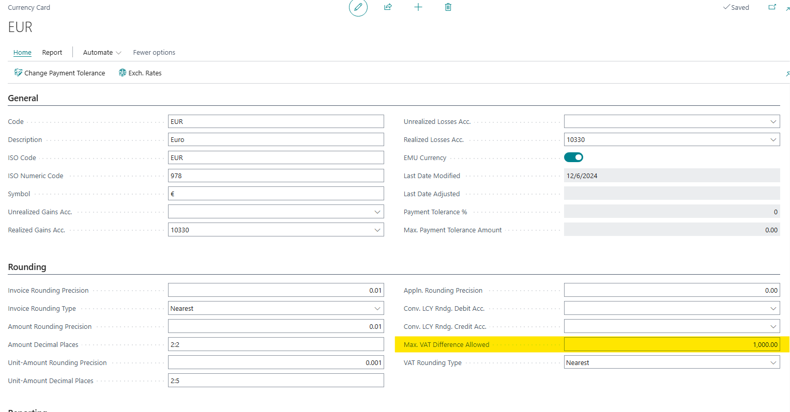
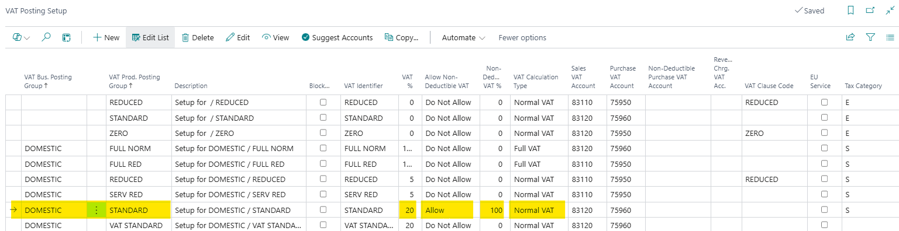
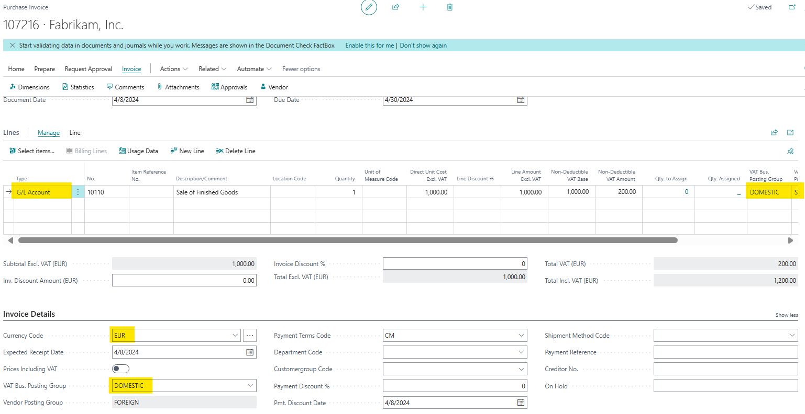
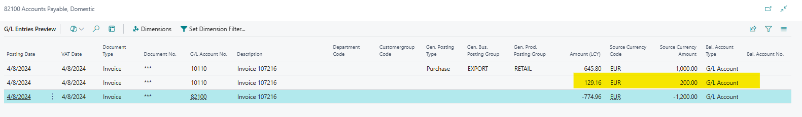
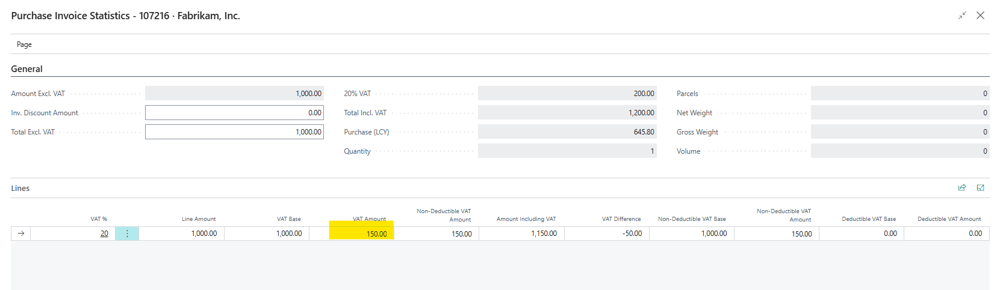
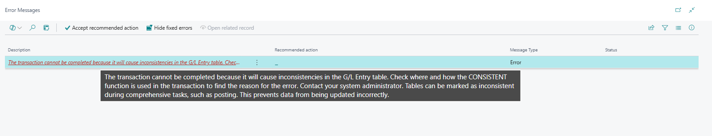

# Title: The transaction cannot be completed because it will cause inconsistencies in the G/L Entry table error message if try to post Purchase doc. with Currencies,  Non-Deductible VAT and the VAT Amount was previously modified in the Statistics.
## Repro Steps:
Take a BC 25.X environment (W1 issue)

Open the VAT Setup and enable the non-deductible VAT:

Open the purchase and receivables and allow VAT difference:

Open the Currencies, open the EUR card and adjust the max. VAT difference allowed:

Open the VAT posting setup and add the below line:

Open a Purchase invoice, add the below line and adjust the currency code as well:

Preview post and we get the below numbers:

Open the statistics page (Invoice => Statistics) and change the VAT amount to 150:

Preview post and check that the Amount (LCY) did not change:

Post the invoice and you will get the below error:

Note: Tested this in DE and ES localization and got the same error. Tested again without changing the currencies and was able to post successfully. Posting Preview shows no error, but the previous amounts as before changing the values in the Statistics.

Expected result: we should be able to post the invoice without the error message.

## Description:
"The transaction cannot be completed because it will cause inconsistencies in the G/L Entry table" error message if you try to post a Purchase document with Currencies, Non-Deductible VAT and the VAT Amount was previously modified in the Statistics.
