# Title: Alternative Customer VAT Registration issue when using Bill to customer and Ship-to-Code.
## Repro Steps:
1. Create the setup for customer 10000
Customer: 10000
* Country/Region Code = NL
* VAT Registration No. = 789456278
* VAT Bus. Posting Group = BINNENLAND
* Ship-to Code = DE
    * Country/Region Code = DE
* Bill-to Customer = 20000
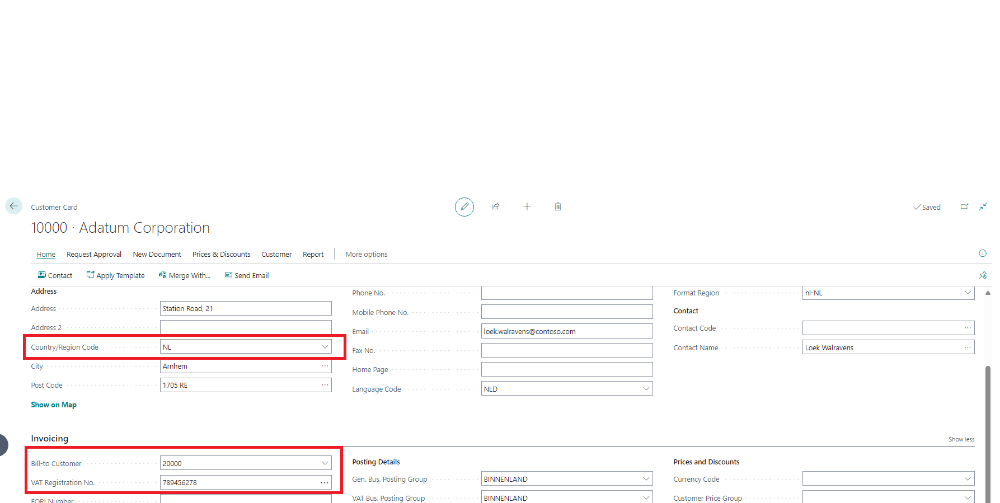

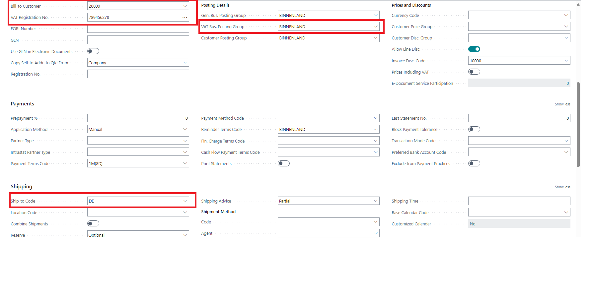

2. Customer: 20000 (Bill to customer)
    * Country/Region Code = NL
    * VAT Registration No. = 254687456
VAT Bus. Posting Group = BINNENLAND
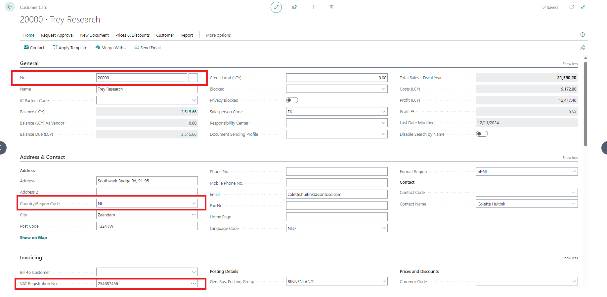

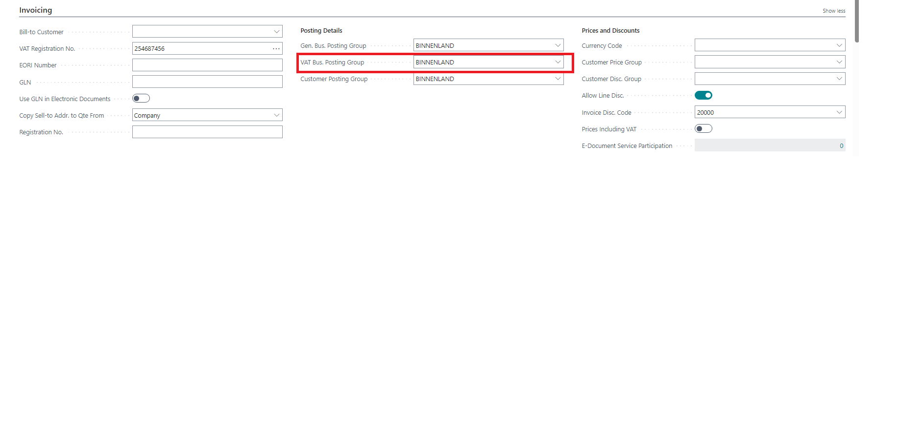

3. Alternative Customer VAT Registration
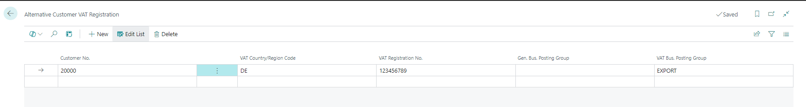

4. Create Sales document for customer 10000: message “The VAT Country/Region code has been changed to the value that does not have an alternative VAT registration.

The following fields have been updated from the customer card: VAT Registration No., VAT Bus. Posting Group”.

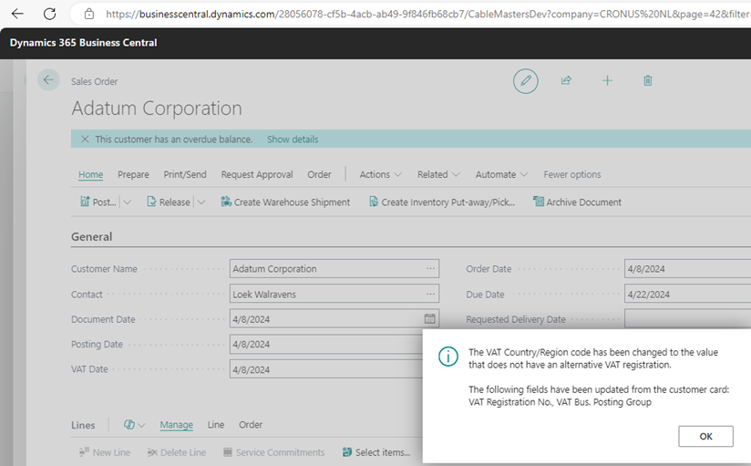

5.
Checking through it is expected that
VAT Country/Region Code should be (DE )
VAT Registration No. = ()
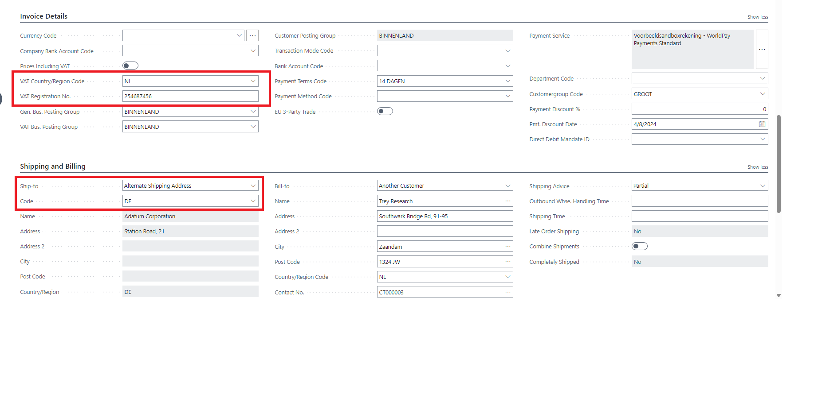

6. Not until you change the ship-to to another options (Custom address) and switch back to alternative address the correct VAT Country/Region Code populate correctly.
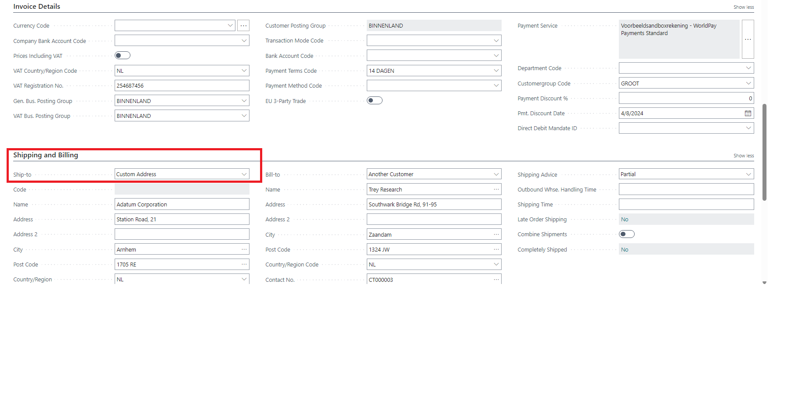

and the below process occurs

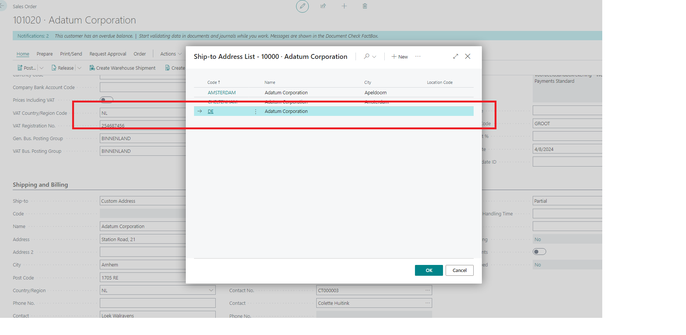

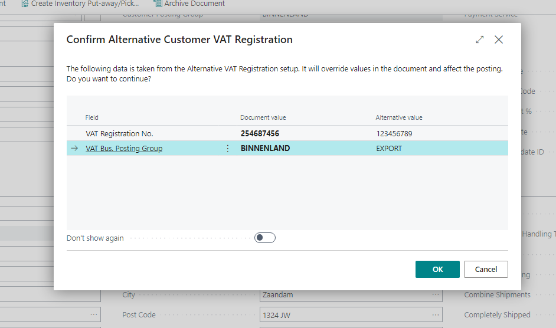

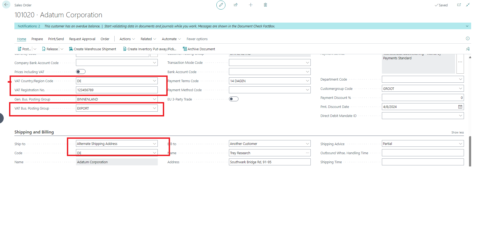

After thoroughly investigating, I've found that the validation process is not always reliable. Sometimes it works as expected, but other times you need to leave the page and come back for it to function properly.

For further clarification, please take a look at the attachment provided. If you have any questions or need additional assistance, feel free to reach out.

## Description:
Alternative Customer VAT Registration issue when using Bill to customer and Ship-to-Code.
