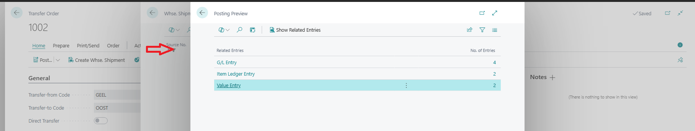

# Title: Warehouse shipment line linked to a Transfer Order seems to disappear after Preview posting
## Repro Steps:
Issue was reproduced on BC SaaS and on Prem version 25.2
**In base CRONUS USA, Inc. 25.2 Tenant**

**Steps to reproduce:**
1. Search for Locations and modify SILVER to have Require Shipment and Require Receive checked
2. Search for Warehouse Employees and add your User as Warehouse Employee.
3. Post a Positive Adjustment for Item 1896-S for 1 PCS to any Bin in SILVER Location (I used S-01-1
4. Search for Transfer Routes and add a Out Log for the Transfer Route setup Location SILVER as the From Location and MAIN as the To Location
5. Create Transfer Order from location SILVER to MAIN.
6. Add a line for the Item 1896-S for 1 PCS
7. Click on "Create Whse. Shipment" to create a Warehouse Shipment.
8. Complete the Preview Post from the Warehouse Shipment Page. (Notice that the warehouse shipment no longer appears on the warehouse shipment list page.)

9. To go back to the warehouse shipment document page, you need to close the page and reopen the warehouse shipment through "Related" link.

**Actual Result:** The warehouse shipment line in transfer order disappears after preview posting operation.

**Expected Result:** Preview posting operation should not clear the warehouse shipment from the warehouse shipment list page.

The Partner is pushing for this to be fixed because their client's users are "freaking out" because they think the document for the Warehouse Shipment was deleted.

## Description:
The Posting Preview from a Warehouse Shipment seems to remove the Warehouse Shipment from the lines.

The Ussr is able to Navigate back to the Transfer Order and go back into the Warehouse Shipment, but the User Experience scares the users into thinking the Document was deleted.

I don't know it is possible to correct this. We attempted to push back because the Warehouse Shipment may be navigated back to.

The Partner is pushing for this because the Warehouse Shipment > Posting Preview for Transfer Orders is the only preview where this behavior of removing the Warehouse Shipment from the list occurs.
