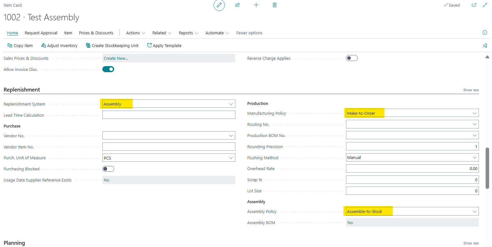
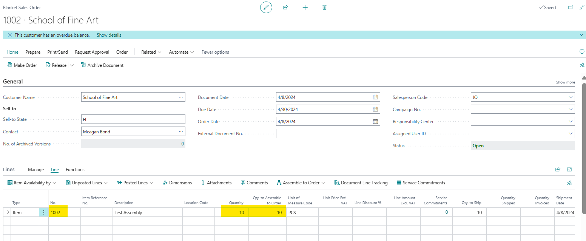
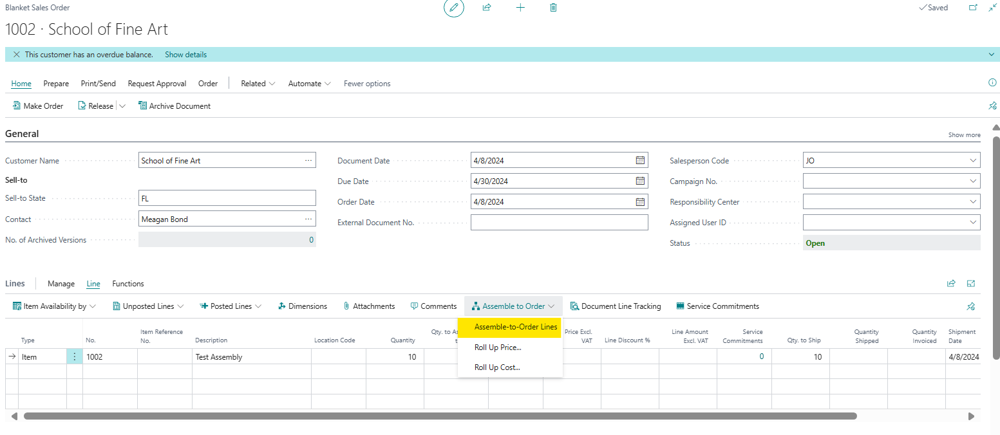
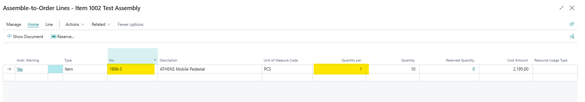
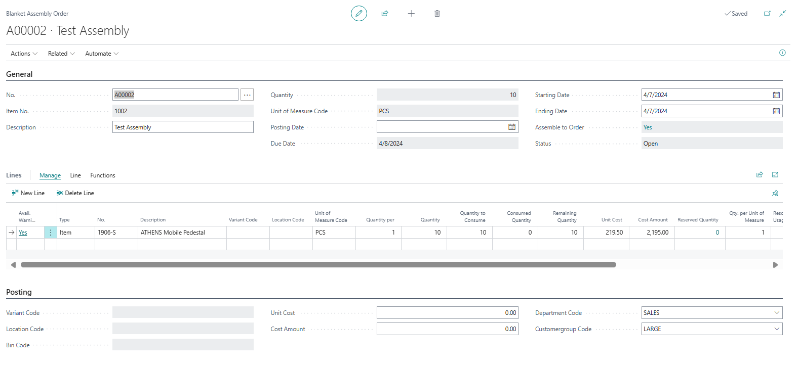
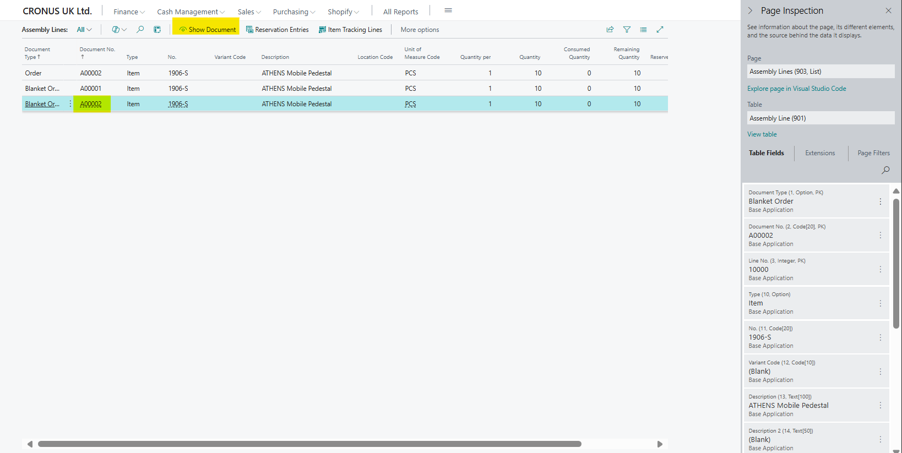
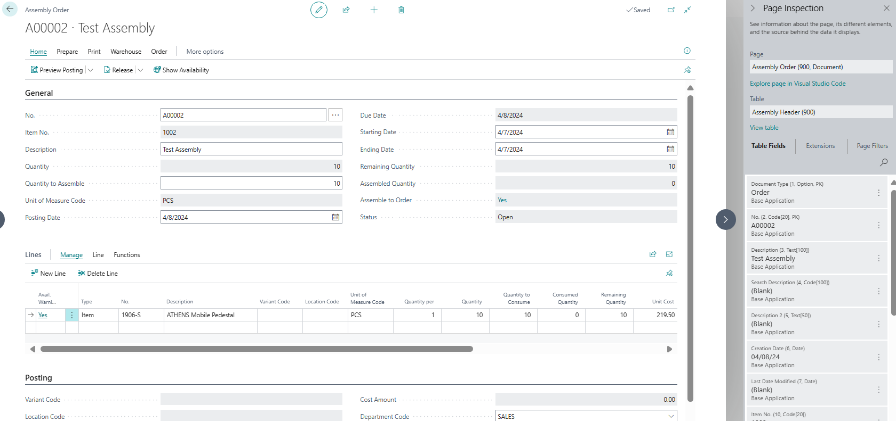
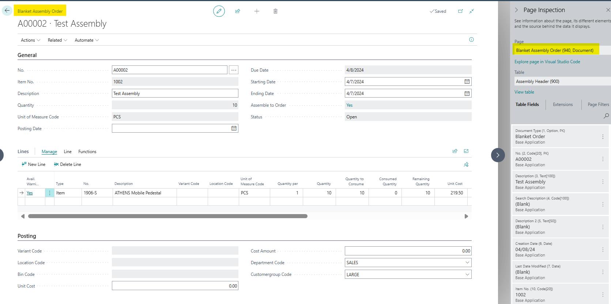

# Title: Show document in Assembly order line page opens the wrong page when the Assembly order line belongs a blanket assembly order.
## Repro Steps:
1- Search for Items
Create a new Item with replenishment system "Assembly":

Create a new blanket sales order and add the created item in the lines:

3- Select the below function:

4- Add the following line and then select show document: (notice that the blanket sales order was created)

5- Open the page "Blanket Assembly Order" and check if the order was created:

6- Search for Assembly order lines
7-Select the Blanket order that we just created and select "Show Document":

8- This function will open the Assembly Order page:

Expected result: the routing logic for opening the assembly document should be handled at the page level instead of the table level:

## Description:
Show document in Assembly order line page opens the wrong page when the Assembly order line belongs a blanket assembly order.
