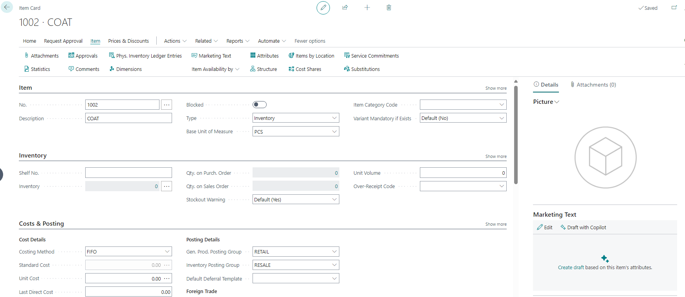
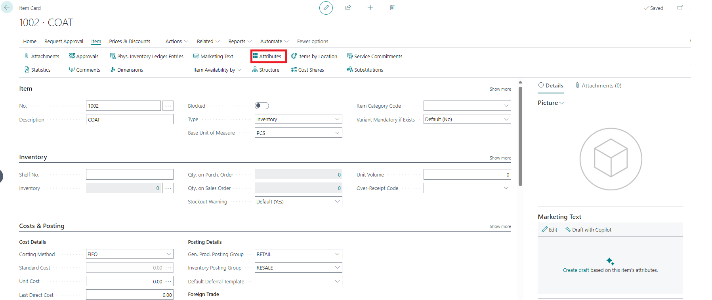
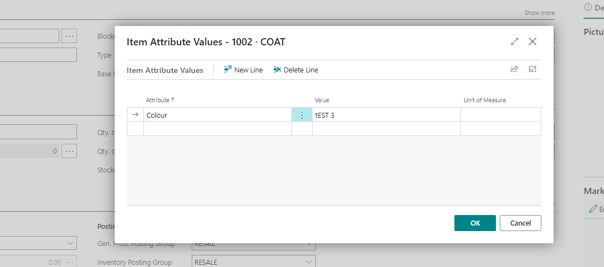
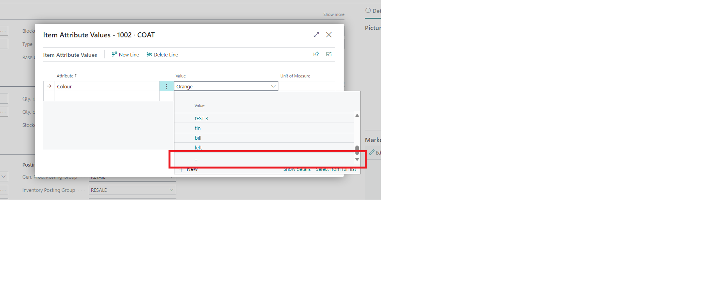

# Title: An empty attribute value was created through the item Card
## Repro Steps:
1.Create a new item in the item card 

2.In the item card, go to "Attributes" and add an Attribute. Make sure the "Value" column does not contain any empty rows.

3.- Exit the Item Attribute Value page.
4.Access "Attributes" again through the Item Card. If the "Attribute" field is empty, fill it again. Then, when checking the "Value" column, you will see that an empty Attribute Value has been created.

===================
ACTUAL RESULT
===================
An empty attribute value was created through the item Card
===================

EXPECTED RESULT
===================
An empty Attribute should NOT be created.

## Description:
An empty attribute value was created through the item Card
