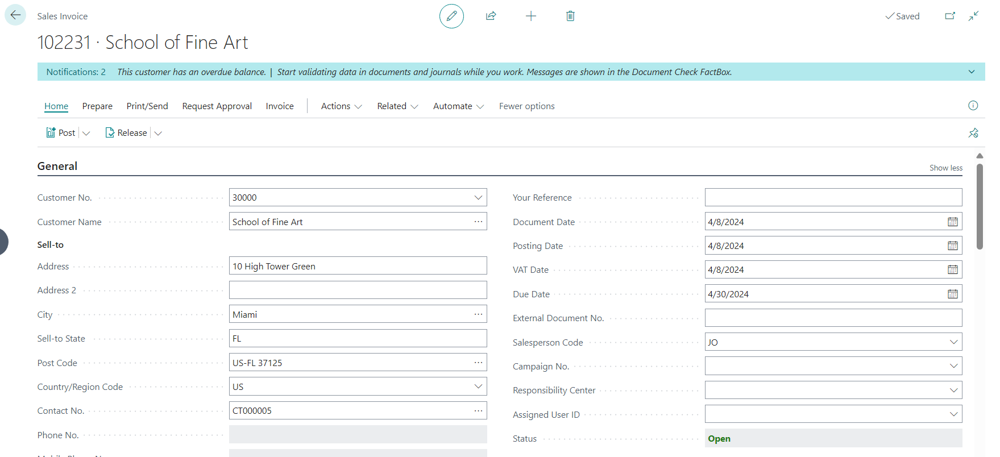
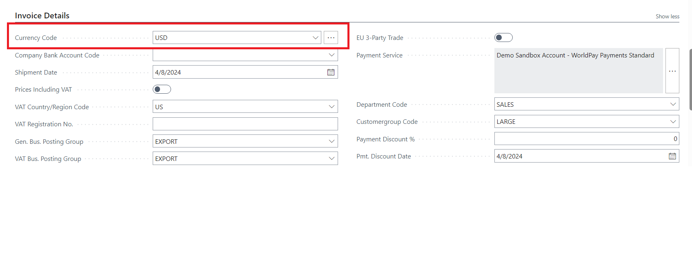
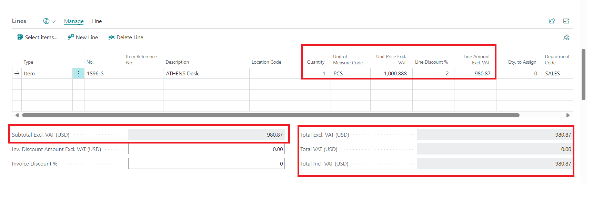
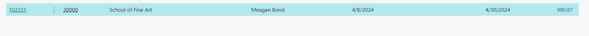
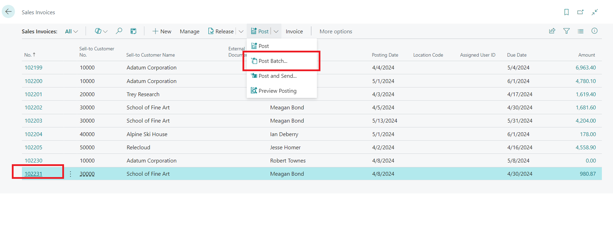
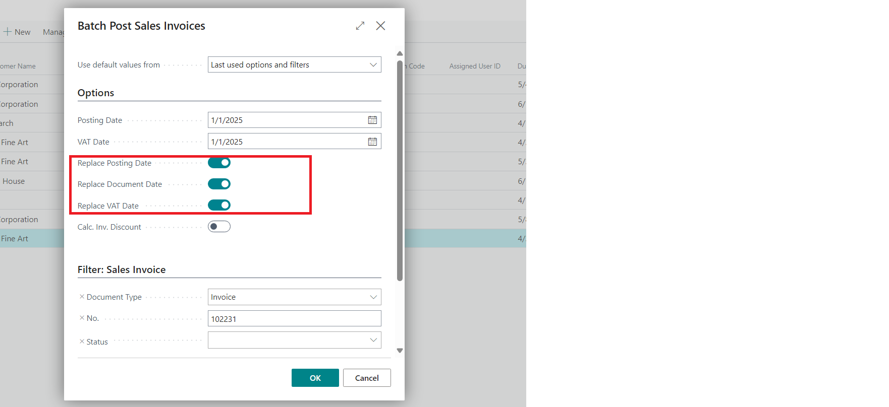
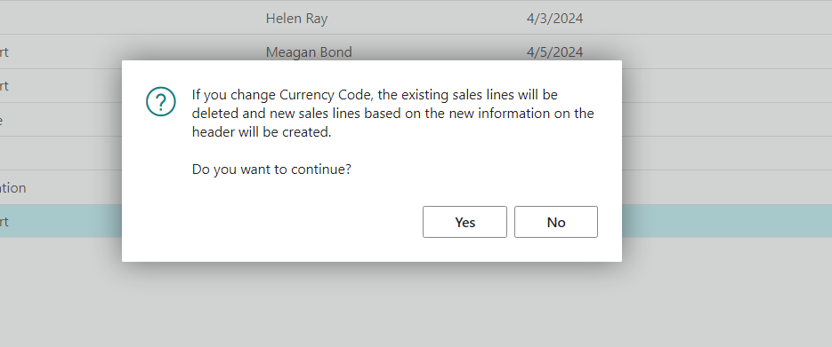
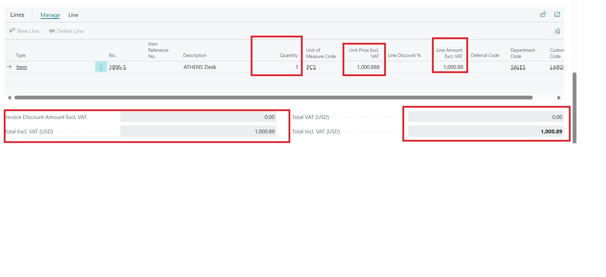
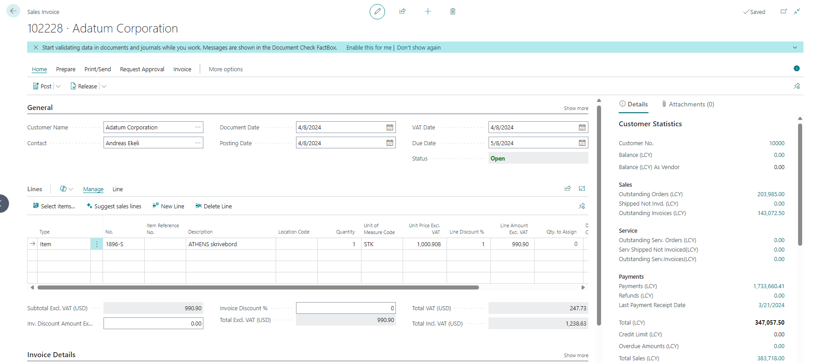
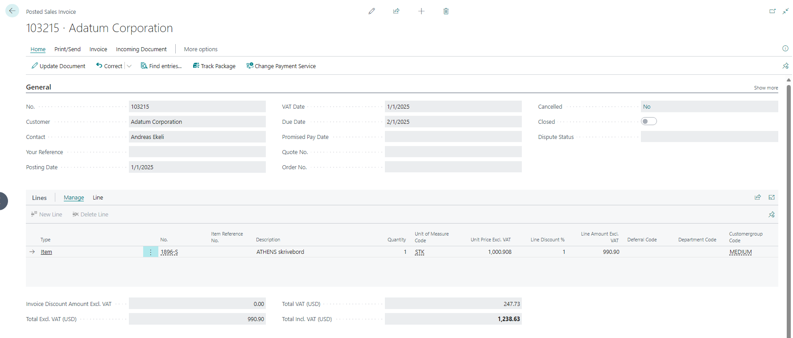

# Title: Post Batch of Sales Invoices with Currency Code and Replace Posting Date does not longer work
## Repro Steps:
1 Create a new sales invoice 

2.Select the currency code to USD

3.Add a single new line with item "1896-S" and quantity = 1

4.Go back to the overview of "Sales Invoices" and select the action "Post Batch..." when selecting your newly created "Sales Invoice"
select in the request page a different "Posting Date" like 1st January 2025
Select "Replace Posting Date" and "Replace Document Date"

5.Then when processing the invoice you receive this message:

If you select "No" then an error occurs, If you select "Yes" all lines will be recreated and all changes on the prices, amounts, discounts or description are lost on the lines because the lines get these information's from the base data. This is critical because not all lines get always their prices from a price list.

So the action "Batch Post..."  or the report 297 "Batch Post Sales Invoices" are not usable for our customer.
Following my further investigation, I made an attempt to replicate this issue on 24.5 and 25.0 versions it was working as expected.

And also following cx statement after checking through base code:
The critical change was made in the table "Sales Header". There a new procedure was added called "BatchConfirmUpdatePostingDate". In here the field "Currency Code" is validated. If you debug the process you will see in a further step the "Currency Code" gets checked if it is different than before. This does not work because during the process in this case the xRec in the Validate-trigger is not initialized and the check will always result in an true which leads to the nice message which leads to our problem.

Issue: Post Batch of Sales Invoices with Currency Code and Replace Posting Date does not longer work

Expected result: It is expected that all lines should maintain the same amount as it was when creating the sales invoice

## Description:
Issue: Post Batch of Sales Invoices with Currency Code and Replace Posting Date does not longer work

Expected result: It is expected that all lines should maintain the same amount as it was when creating the sales invoice
