# Title: If a comment is stored on Production BOM components, it is incorrectly transferred to the component lines for the Firm Planned Production order via Planning Worksheet when the same item is listed twice on the BOM and the Position field is used.
## Repro Steps:
1. A BOM is set up with several lines for one item.  You can use existing Prod. BOM  SP-BOM2000 and add a 2nd line for the SAME Item SP-BOM2001.
a. These lines have different “Position” numbers assigned to each line (Use personalization to populate the Position field).   You need this step otherwise the Planning Line will combine the 2 lines for this itme into 1, and you will not see the issue.
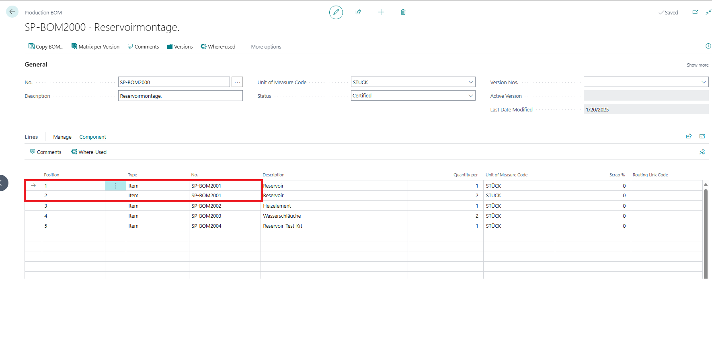 
2. The first and second component line has comments assigned to them.  Again, it is important to know these are the same item, just listed twice. In this example:
a. Line 1: Comment “Test1”
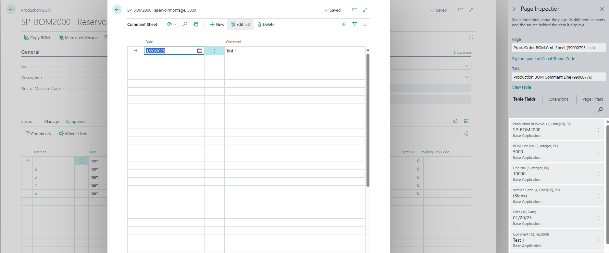
b. Line 2: Comment “Test2”
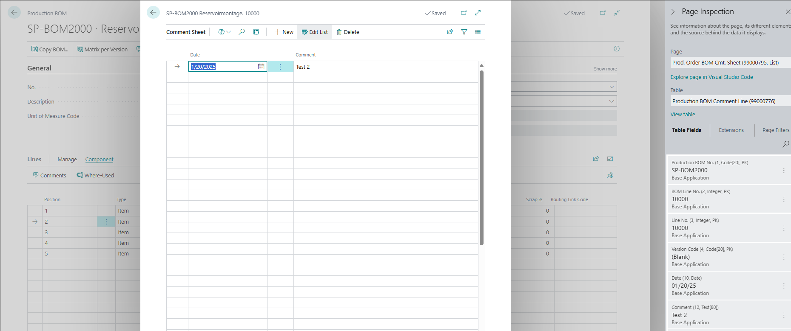
3. A sales order for item "SP-BOM2000" is created and released to have a demand in the system.
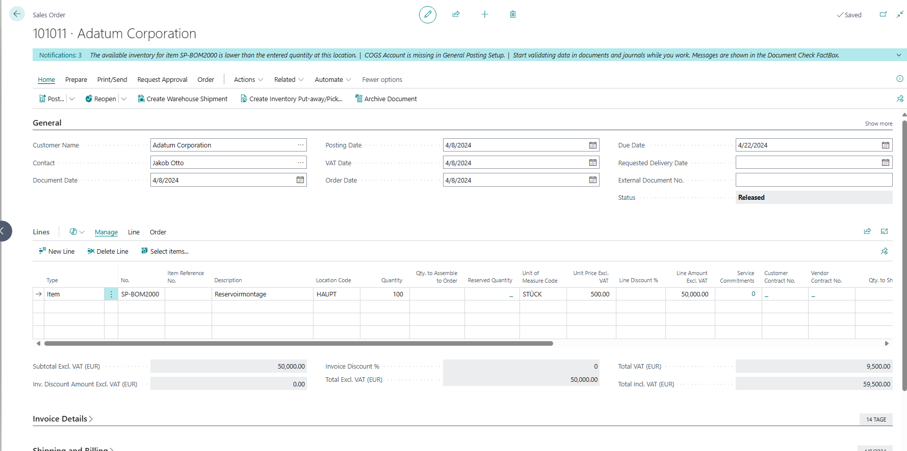 
4. Go to planning worksheet page and navigate to Prepare > Calculate Regenerative planning
a. The planning worksheet is calculated for item "SP-BOM2000"
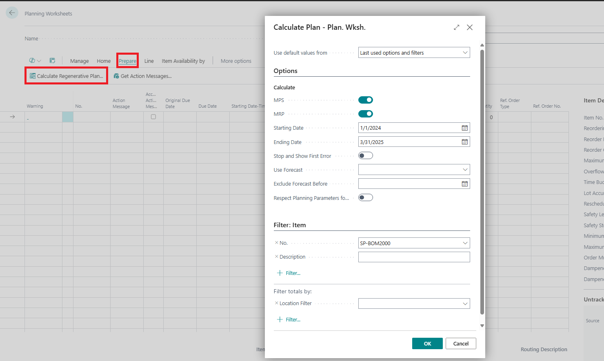
b. The planning worksheets now suggests creating a production order for item "SP-BOM2000".
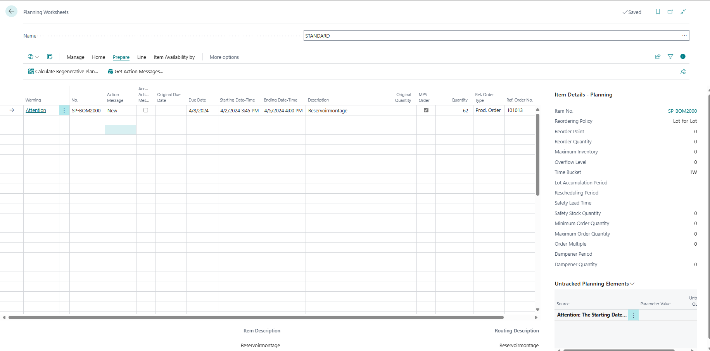
c. On the Planning worksheet page, navigate to Line > Component.
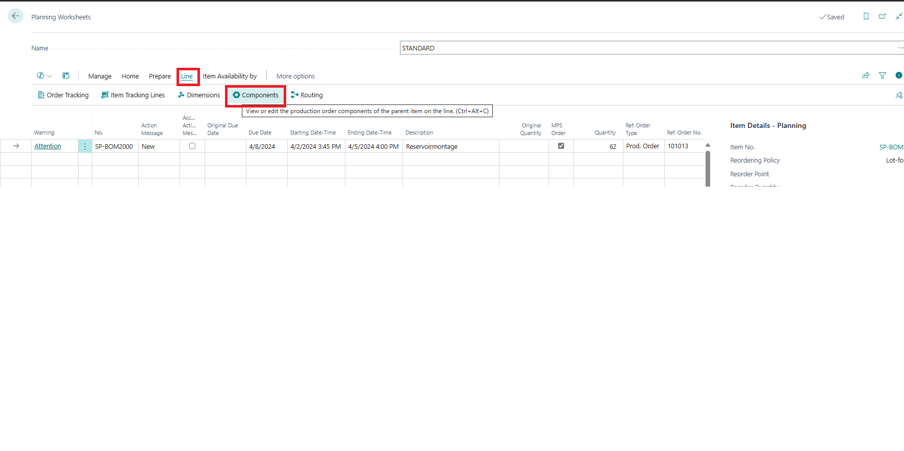
d. The planning components does not have any comments or have a way to check the comment on this page.
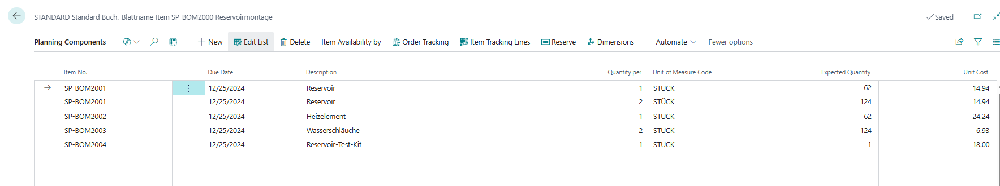 
5. Use "Carry Out Action message" function to create a Firm planned production order is created and opened. The components are opened.
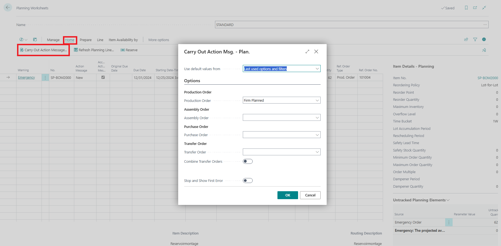
a. On the created Firm planned Prod. Order page, navigate to Line > Component.
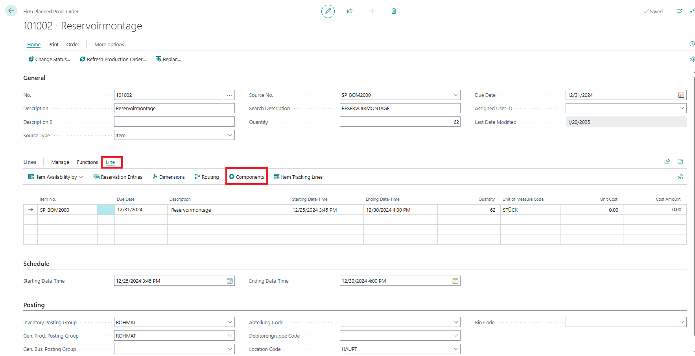
b. You will notice that both lines now have the same comment – the comment from BOM line 2 (“Test2”).
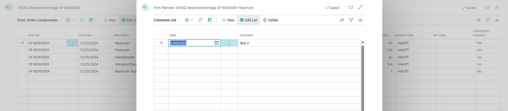
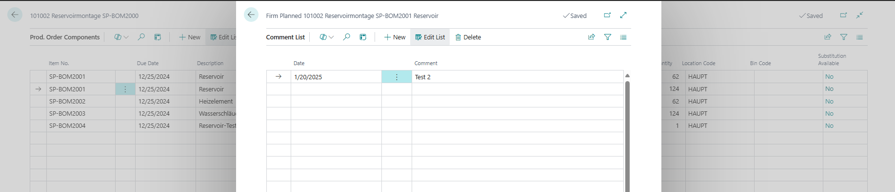
This shows that Line 1 now has the wrong comment as it has the same comment as Line 2

FYI: Manually creating a Firm planned production order does not lead to this issue.

**Actual Result:** Both Production BOM Line 1 and 2 has the same comment "Test2" in the Firm planned Prod. order created from the Planning Worksheet.

**Expected Result:** The Production BOM Line 1 should retain its comment "Test1" in the Firm planned Prod. order created from the Planning worksheet and Production BOM Line 2 "Test2"
**Also note, this is ONLY an issue when we use the 'POSITION' field.   If we do not, then we get just 1 line of the component with the 'Qty Per' summed from the 2 lines on the Prod. BOM.  But if we do NOT use the 'POSITION' field, then the combined Prod. Order Component line which is combined, just uses the Comment from the 2nd BOM Line "Test2".

## Description:
