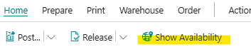
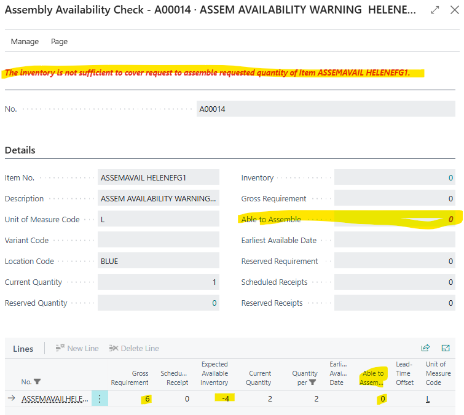
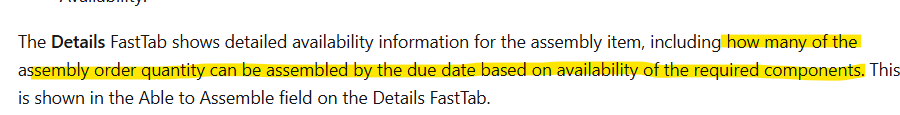

# Title: Avail. Warning on Assembly Orders are considering demand across all dates
## Repro Steps:
1.  In the Search, type  My Notifications and find 'Item availability is low' and Enable it
2.  Work Date = 2/13/25 (mm/dd/yy)
3.  Assembly Setup, set Default Location for Orders = BLUE
4.  Manufacturing Setup, set 'Component at Location' = BLUE
5.  Create a new Item Component  **ASSEMAVAILCOMP** (or use an existing item with no entries).
6.  Create a new Assembled Item  **ASSEMAVAILFG**  with
    Replenishment = PURCHASE Assembly Policy = Make-to-Stock
7.  In the 'Assembly BOM' field, drill into it and add your component item from step 3 and set **'Qty Per' = 2.**
8.  Create a new Assembly Order for Item **ASSEMAVAILFG** for 1 qty, BLUE location, while you can set all the dates 'Posting, Due, Starting, & Ending Dates' = 02/13/25.
9.  Now check the 'Avail. Warning' on the Assembly Order Line, it shows Yes.  This is correct of course because we have 0 QOH for the component.
    >You can also review the 'Show Availability' under the Home, and this looks good.
    
10.  Open Item Journal and create/post 2 qty to BLUE Location for your Component Item.  Now you will enough in stock to consume and make the Assembly Order.
11.  If you go back and reopen the Assembly Order, the 'Avail. Warning' field will be blank.  All good.
12.  Set Work Date = 02/18/25
13.  Create a 2nd Assembly Order for **ASSEMAVAILFG,** Blue location, for 3 quantity, and set all Dates should be 02/18/25.  We can see availability warning again, because this would require 6 more components.
14.  Now go back and reopen the 1st Assembly Order where there is a demand of 2 qty for the Component, and we have 2 in stock.

**EXPECTED RESULTS:**  'Aval. Warning' = blank

**ACTUAL RESULTS:**  'Aval. Warning' = Yes
*   Also, if I go into the 'Show Availability' we see "The inventory is not sufficient to cover request to assemble requested quantity of Item **ASSEMAVAILFG**"
*   'Able to Assembly' is also 0 (both header and line), despite the Document I provided in Description says "including how many of the assembly order quantity can be assembled by the due date based on availability of the required components."
*   The Lines seem to show everything else except for current Assembly.

## Description:
[Get an availability overview - Business Central | Microsoft Learn](https://learn.microsoft.com/en-us/dynamics365/business-central/inventory-how-availability-overview#assembly-availability-page)

