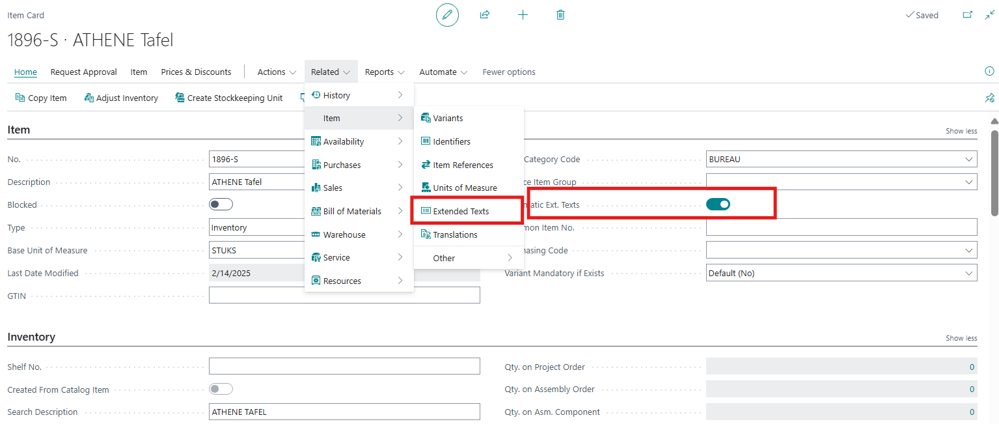
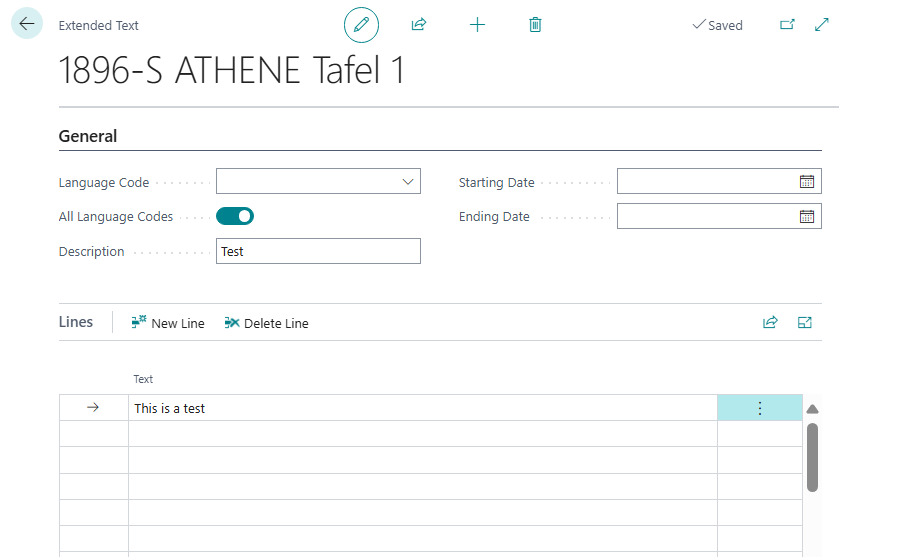
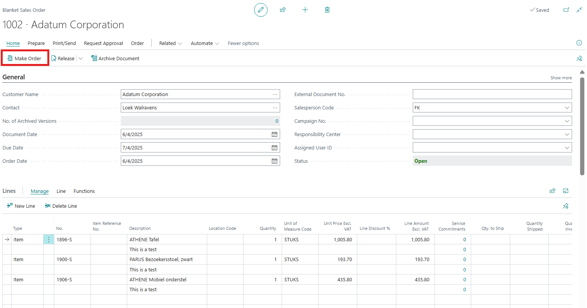
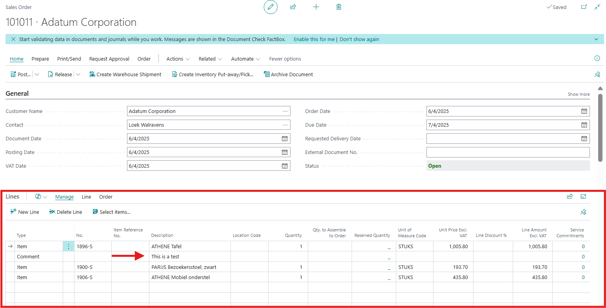

# Title: When multiple items with extended text are added to a Blanket Sales Order and Make Order is used to create a new Sales Order only the first Extended text is brought over
## Repro Steps:
Issue was tested on BE & DE localizations (it is working fine in GB)
Open item No. 1896-S and open the extended text:

Add the below line:

Repeat this step with another 2 items.
Open Blanket sales order and add 3 lines for the 3 items then select make order:

Open the created sales order and you will find that 1 line for the extended text was created, and the others were not carried out to the sales order:
 

Expected results:
All extended text lines should be carried out to the sales order.

## Description:
Extended text line is not carried out to the Sales order when created from blanket sales order
