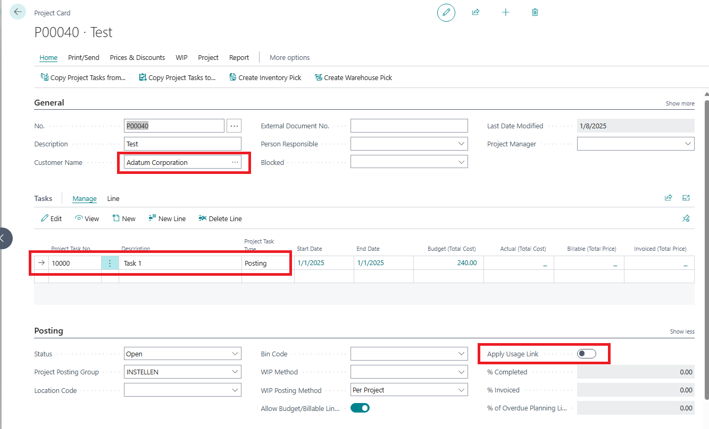
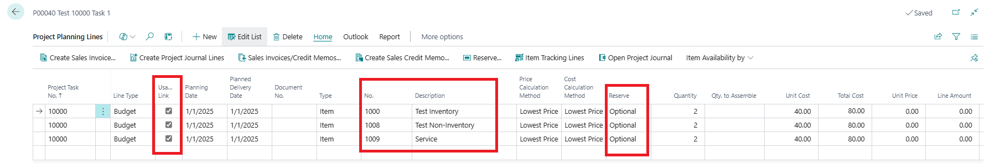
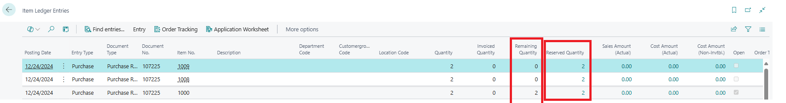

# Title: It should not be possible to reserve a non-inventory or service item for a job planning line
## Repro Steps:
1.  Open BC252 W1 on Prem
2.  Search for items
    Create 3 Items
    1. inventory 
    2. Non-Inventory 
    3. Service 
3.  Search for Projects
    Create a new Project
    Customer: 10000
    Add a Task line No. 1000
    Apply Usage Link= No
    
4.  Edit -> Open project planning lines
    Add the field Reserve and Apply Usage Link to the lines by personalisation
    Add 3 lines for the created items:
    Activate Apply Usage Link = YES
    Reserve: Optinal
    
5.  Search for purchase orders
    Create a purchase order ( make sure the posting date and the purchase line date is before the date on the project planning lines)
    Vendor: 10000
    Add all 3 items with quantity 2 to th purchase order
    Functions -> Reserve
    And reserve each line against the project journal lines.

    Post -> Receive
6.  Navigate to the item ledger entries page and you will see that the item of type "Inventory" has remaining quantity with reserved quantity, but the item of type "Service" and "Non-inventory" has remaining quantity of zero with reserved quantity available.
    

**ACTUAL RESULT:** The service item and non-inventory item allow reserve.

**EXPECTED RESULT:** No reservation should be allowed for items of type "Service" and "Non-inventory".

## Description:
It should not be possible to reserve a non-inventory or service item for a job planning line.
This is the documentation which describes it.https://learn.microsoft.com/en-us/dynamics365/business-central/inventory-about-item-types
Non-Inventory and Service items do not support the reservation functionality.
