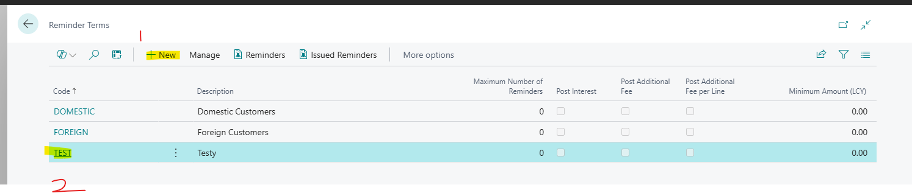
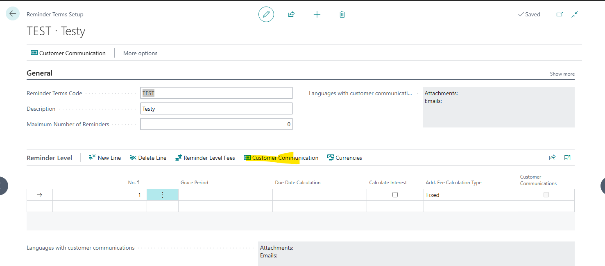
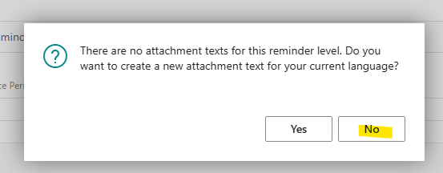
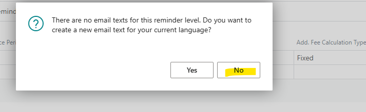
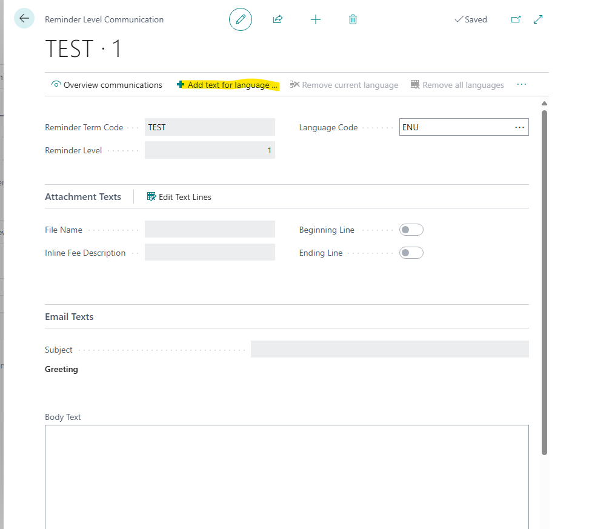
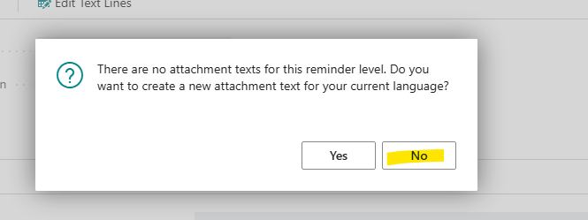
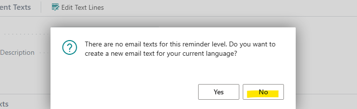
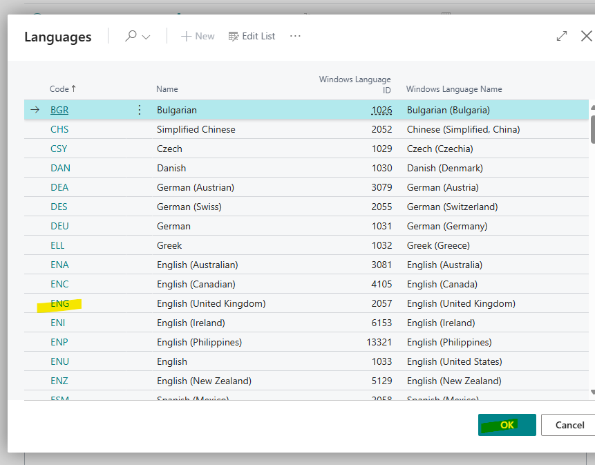
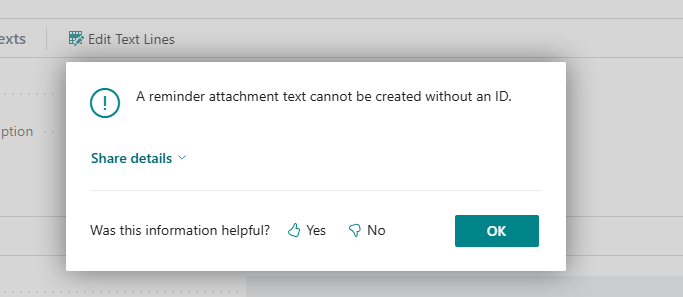

# Title: Error message "A reminder attachment text cannot be created without an ID" when adding text for language in Reminder Level Communication

## Repro Steps:
Issue was Reproduced in Version: GB Business Central 25.4 (Platform 25.2.29913.0 + Application 25.4.29661.29959)
**REPRO**
1. Navigate to Reminder Terms, Create a new one

2. On the Lines, Navigate to Customer Communication.

3. Press No to the next 2 x messages:

4. With no Attachment Texts inserted on the communication, press Add text for language.
 
5. Say No to the 2x messages,

6. Then select the language - ENGLISH:

**Actual Result**
Error- A reminder attachment text cannot be created without an ID.
 

**Expected Result**
The error message should not appear.

## Description:
Error message "A reminder attachment text cannot be created without an ID" when adding text for language in Reminder Level Communication
