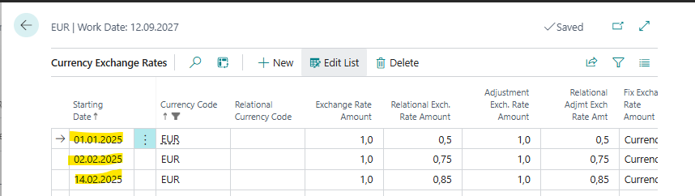
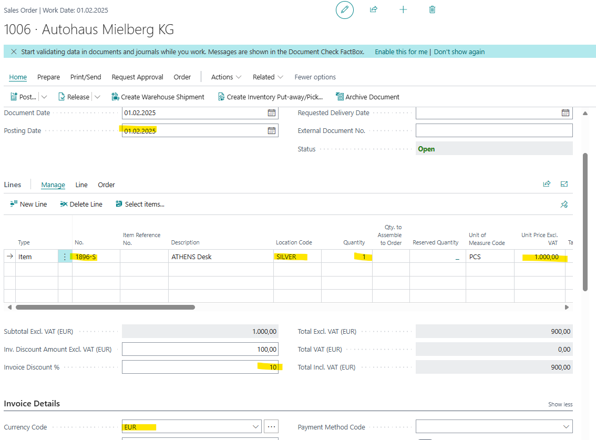
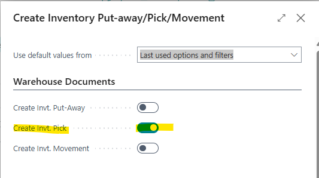
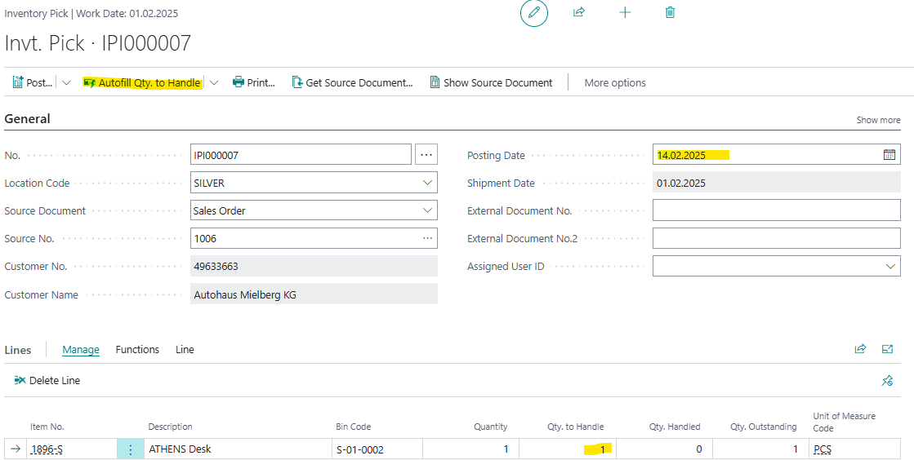
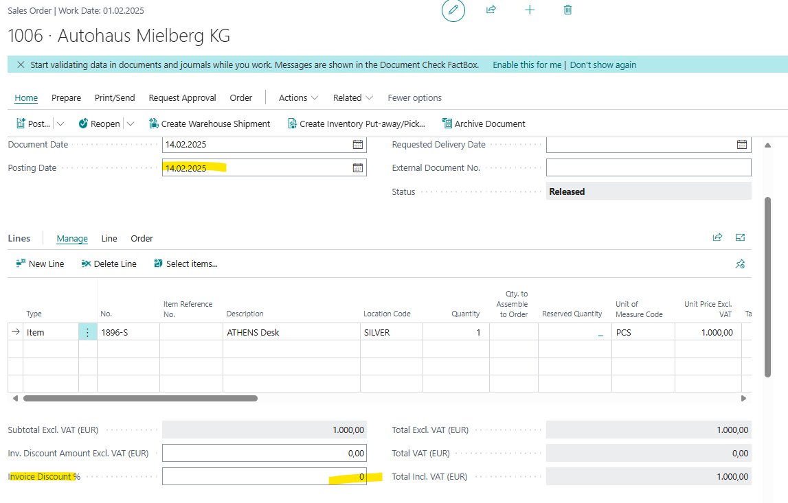

# Title: Sales Order -  Invoice discount disappears when currency exchange rate is changed by shipment posting date and a location is used with BIN
## Repro Steps:
1.  Open BC25.4 W1 on Prem
2.  Search for Currencies
    Select EUR  -> edit
    Click on Exchange Rates
    Add the following Exhange Rates:
    
3.  Search for locations
    Select SILVER edit
    Do the following change
    Require Pick: TRUE
4.  Search for user
    Add your user as Admin
5.  Search for Warehouse Employees
    Add your user for Location SILVER
6.  Search for Item Journal
    positive Adjustment 
    Item: 1896-s
    Location SILVER
    Bin S-01-0002
    Quantity: 20
    post
7.  Open my Settings
    Work Date: 01.02.25 (1. February 2025)
8.  Search for Sales Orders
    Create a new Sales Order
    Customer: 49633663
    Item: 1896-s
    Location: SILVER
    Quantity: 1
    Unit Price: 1000,00
    Currency Code: EUR
    Line Discount: 10%
    
9.  Create Inventory Pick
    Home -> Create Inventory Put-away/Pick
    
10.  Open the created Pick
    Related -> Warehouse -> Invt. Put-away/Pick lines
    Show Document
    Autofill Qty. to Handle
    Change the Posting Date to: 14.02.25
    
    Post -> Ship
11.  Go back to the Sales order

**ACTUAL RESULT:**
Posting Date is changed to 14.02.25 (which is correct)
But the Inoice Discount is gone

**EXPECTED RESULT:**
The Invoice Discount should be:10 %

## Description:
Sales Order -  Invoice discount disappears when currency exchange rate is changed by shipment posting date and a location is used with BIN
