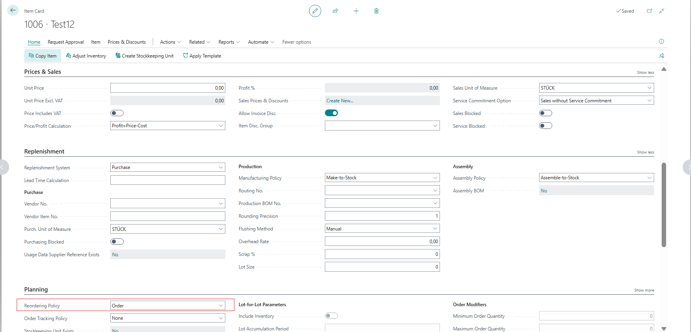
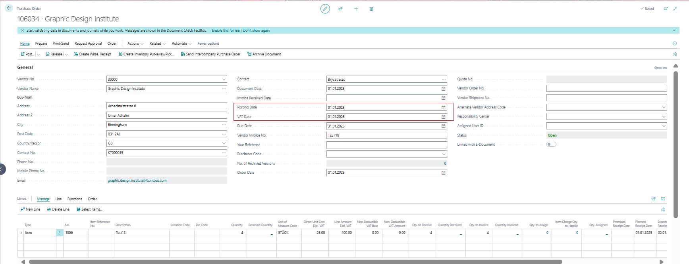
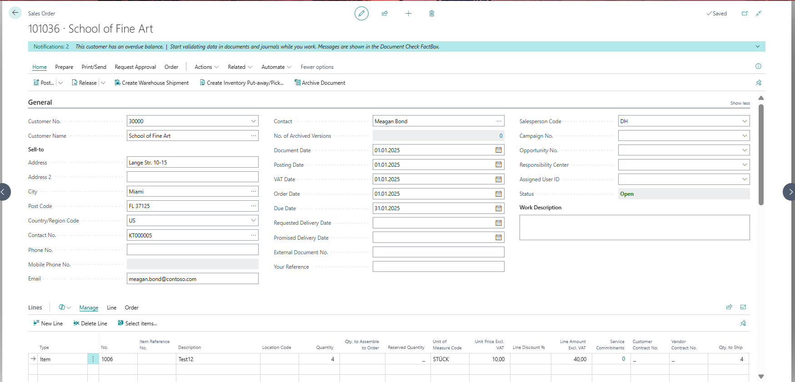
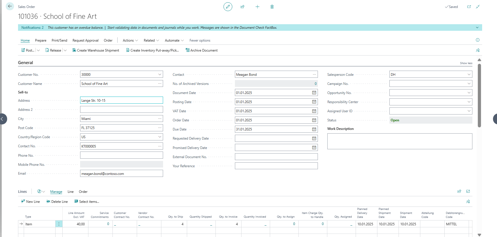
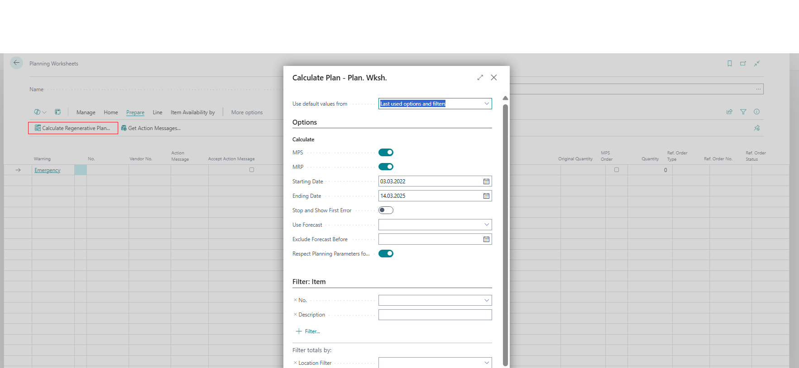
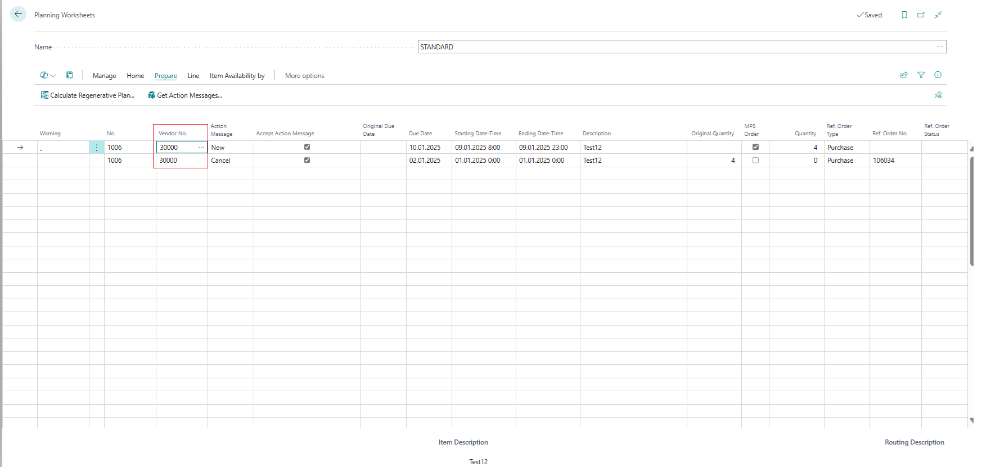
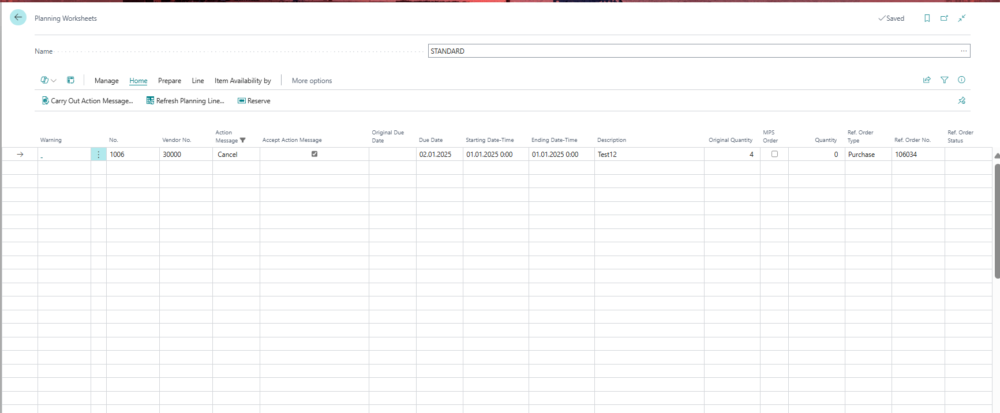
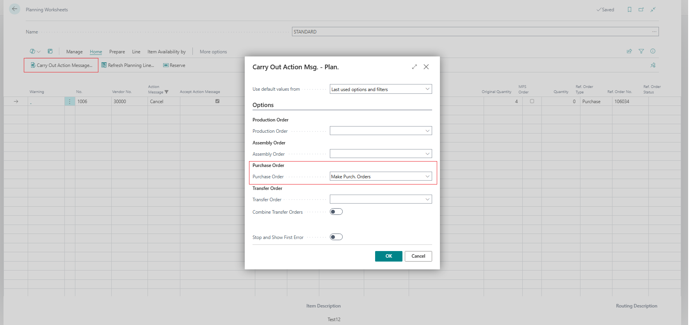
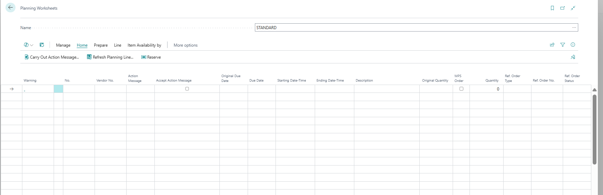

# Title: When a Filter is set in the Planning Worksheet to a specific Action Message (e.g. Cancel) and Carry Out Action Message is completed, additional Planning lines are carried out that were not presented.
## Repro Steps:
1- Create a new item with the reordering policy set to "Order".

2- Create a purchase order for the item with the date set to January 1st, but do not post it.

3- Create a sales order for the same item, ensuring the shipment date is set out to a future Date

| Type | No.  | Item Reference No. | Description | Location Code | Quantity | Qty. to Assemble to Order | Reserved Quantity | Unit of Measure Code | Unit Price Excl. VAT | Line Discount % | Line Amount Excl. VAT | Service Commitments | Customer Contract No. | Vendor Contract No. | Qty. to Ship | Quantity Shipped | Qty. to Invoice | Quantity Invoiced | Qty. to Assign | Item Charge Qty. to Handle | Qty. Assigned | Planned Delivery Date | Planned Shipment Date | Shipment Date | Abteilung Code | Debitorengruppe Code |
| ---- | ---- | ------------------ | ----------- | ------------- | -------- | ------------------------- | ----------------- | -------------------- | -------------------- | --------------- | --------------------- | ------------------- | --------------------- | ------------------- | ------------ | ---------------- | --------------- | ----------------- | -------------- | -------------------------- | ------------- | --------------------- | --------------------- | ------------- | -------------- | -------------------- |
| Item | 1006 |                    | Test12      |               | 4        |                           |                   | STÜCK                | 10,00                |                 | 40,00                 | 0                   |                       |                     | 4            |                  | 4               |                   | 0              | 0                          | 0             | 10.01.2025            | 10.01.2025            | 10.01.2025    |                | MITTEL               |

4- Go to the planning worksheet and calculate the regenerative plan.

5- Add the vendor number and the vendor for the item, ensuring the two lines are selected correctly.

6- Filter using the "Action message" field to the Cancel Planning Line 

7- Click the "Carry out Action Message" for the line selected

**RESULT:**
When filtering with the Action Message field and specifically the "Cancel" line, the other line was also carried out to generate the New Purchase Order.

**EXPECTED BEHAVIOR:**
Only the selected line will carry out and the open Purchase Order is cancelled. It is expected that the New Purchase Order is not generated and that the line would remain in the Planning Worksheet Line.
FURTHER CLARIFICATION FROM THE PARTNER (KUMAVISION)
When filtering by Vendor Number or Item Number, as examples, the Carry Out Action Messages works without any issue and as expected. Only the filtered to line is "carried out" when the Carry Out Action Message is processed. 
The perceived problem by the Customer is that this different behavior only occurs when filtering by the Action Message, where the Action Message Filter is not "honored"
As shown below, both lines were "carried out" and the Planning Worksheet is cleared.

**Expected Results:** The correct lines should appear when filtering by the action message. Currently, all lines are processed when the "accept action message" is enabled.

## Description:
Partner is reporting an issue on behalf of their client. The issue is with the Planning Worksheet - Carry Out Action Message when filters are applied to the Planning Worksheet Lines.

If the client filters to Planning Worksheet Lines by filter to Action Message of 'Cancel', the Carry Out Action Message will process planning lines not selected/shown with the filter. For example. an Action Message of 'New" will be carried out for the Item along with the Cancel line,

However, if the client filters by an Item No. or Vendor No, for example, the filter is respected. Only the lines "filtered to" will be "carried out".
