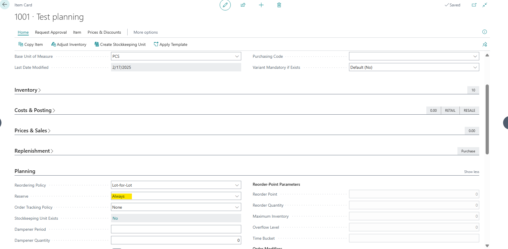
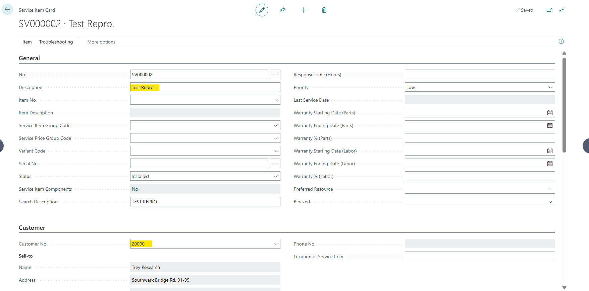
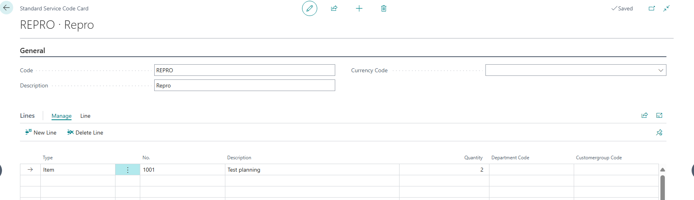
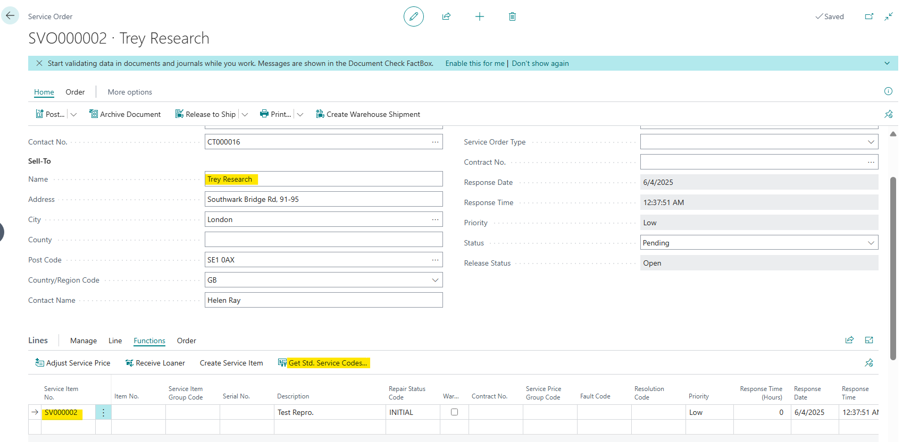
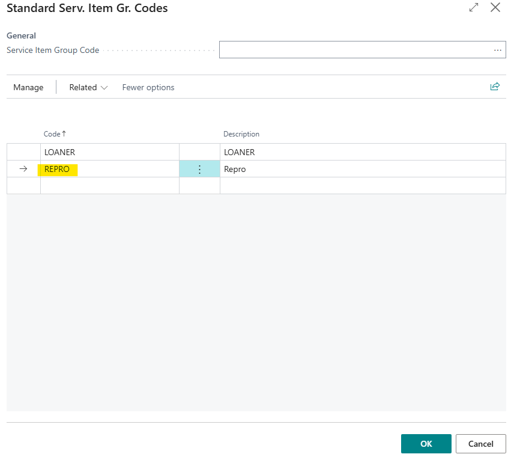
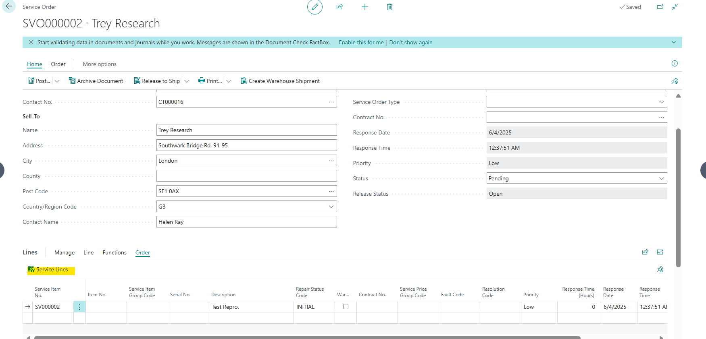
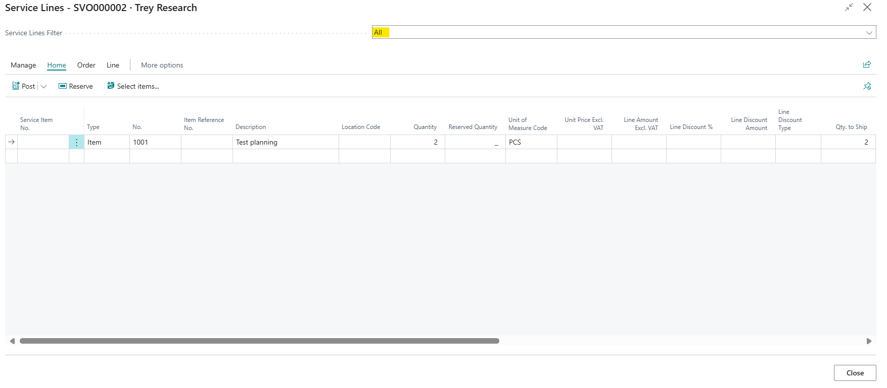

# Title: Using Get Std. Service Codes. on a Sales Order to pull in an Item that has Reserve = Always into the Service Line, there is no Reservation.
## Repro Steps:
1.  **Item Card**

2. Create Positive Adjustment Item Journal and for BLUE Location for this item for 2 qty and post it.
3. Create Service Item for Customer 30000.

4- Create standard service code for the item:

5- Create service order for BLUE Location, and fill in the fields as following.  Then click on Functions > Get Std. Service Codes then select the ones that you created: 

6- Open the service lines and **filter by ALL** so that you can see the Code you pulled in:

**The actual result:**
The item was added with the correct quantity, but 'Reserved Quantity' = blank (You will need to add this field via Personalization):

**The expected result:**
The 'Reserve Quantity' = 2 
​If you were to type 2 over in the quantity field, it will then Auto Reserve.

## Description:
