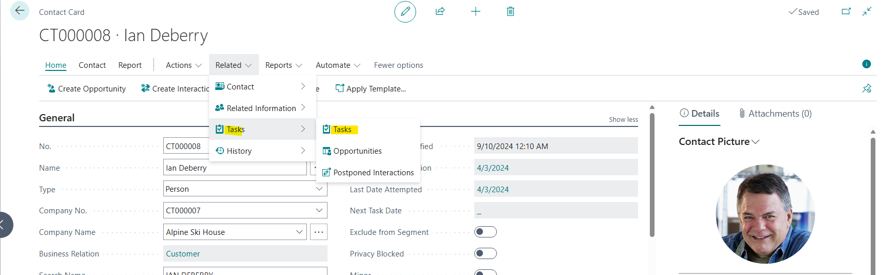
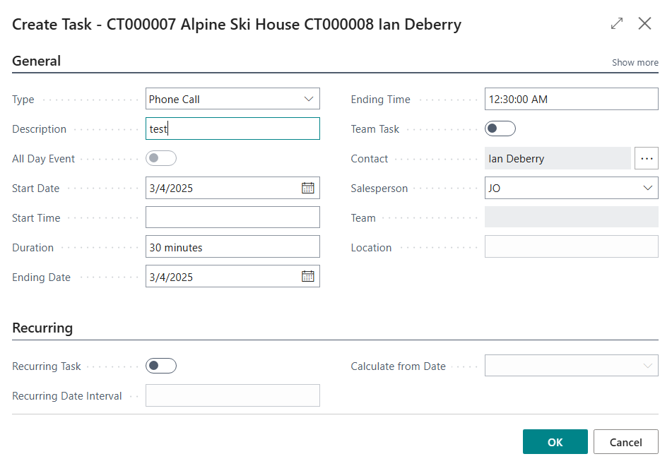
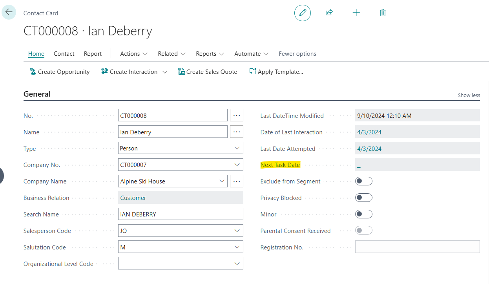
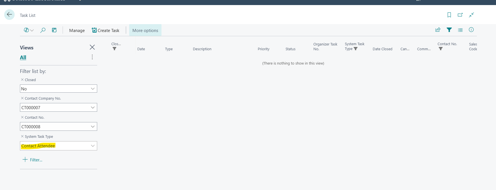
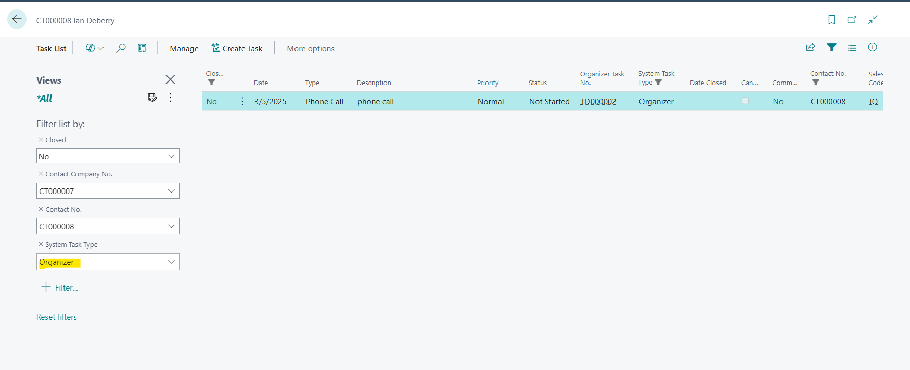

# Title: Next Task Date has a fixed System Task Type filter in Contact card
## Repro Steps:
1.  Go to Contacts -> Related -> Tasks -> Tasks.
    
2.  Create Task - Phone Call and click Ok.
    
3.  Go back to the contact card - Next Task Date is empty.
    
4.  Drill on the empty value _ It's filtering with fixed System Task Type.
    
5.  If you remove it or change it to Organizer - Task will appear.
    

**Expected Results:**
Next task Date should read the date value correctly.
No System Task Type filter should be applied.

**Actual Results.**
Fixed filter for System Task Type is applied.
No Next Task Date populates on the Contact Card.

## Description:
Next Task Date has a fixed System Task Type filter.
