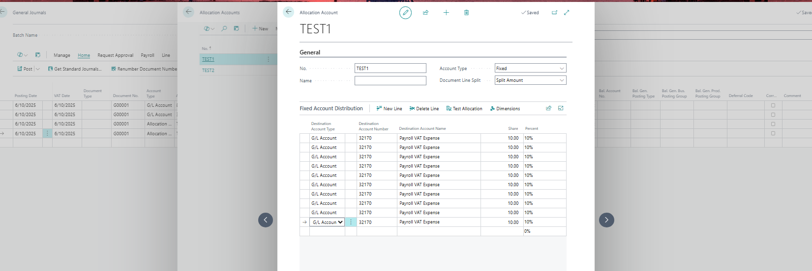
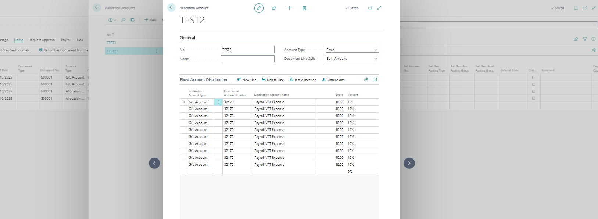
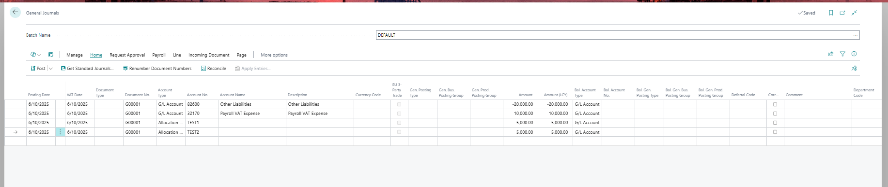
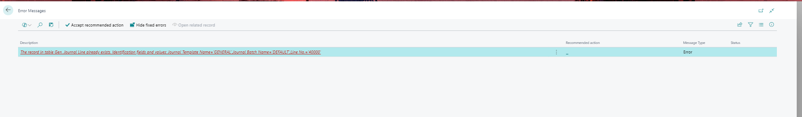

# Title: Issue with posting General Journals that contain Allocation Account lines with 10 entries resulting in the error: "The record in table Gen. Journal Line already exists.
## Repro Steps:
1- Navigate to the Allocation account and create a new G/L account with the number 32170. Add 10 lines as shown in the image.

2- Create another Allocation account with the same 10 lines.

3- Proceed to the general journal and input the lines as the following screenshot.

4- Attempt to post the lines. You will encounter the following error: "The record in table Gen. Journal Line already exists. Identification fields and values: Journal Template Name='GENERAL', Journal Batch Name='DEFAULT', Line No.='40000'."
**

****Expected Results**: You should be able to post the lines in the general journal when the account allocation contains 10 lines.
I've tested in GB and W1 and it has the same outcome.

## Description:
Issue with posting General Journals that contain Allocation Account lines with 10 entries resulting in the error: "The record in table Gen. Journal Line already exists.
