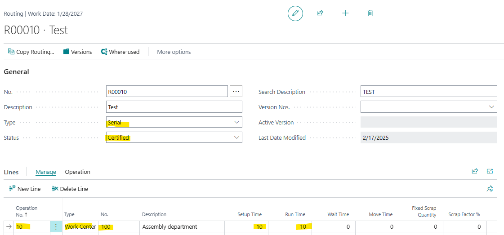
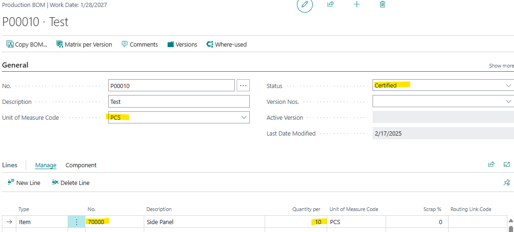
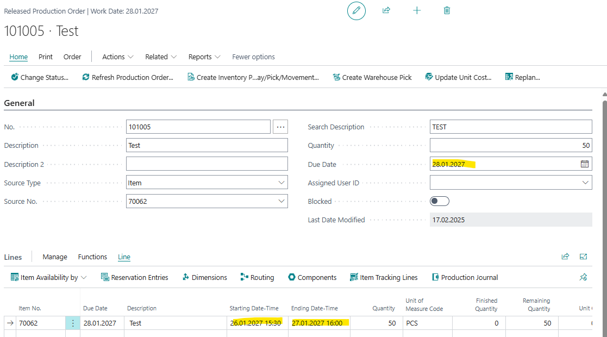
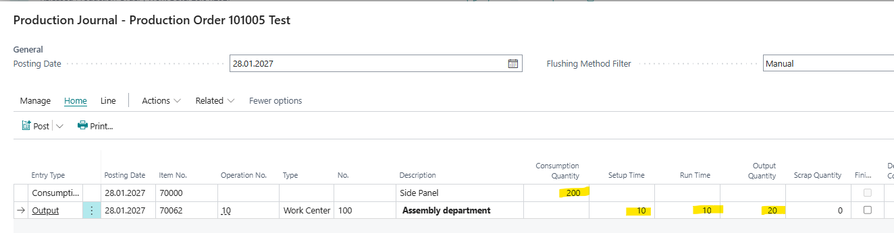
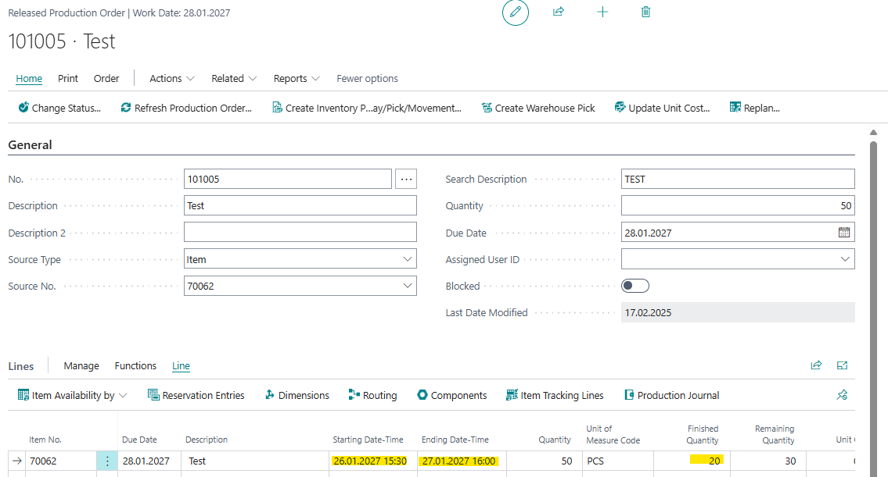
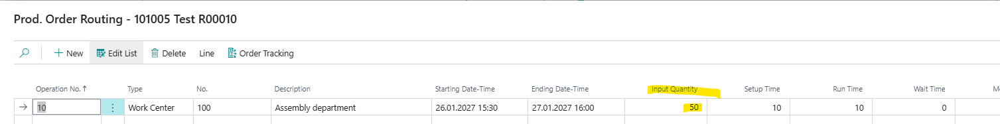
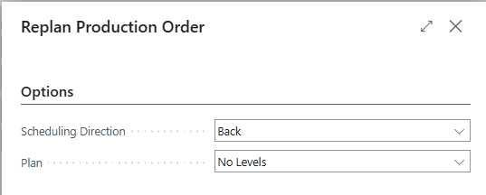
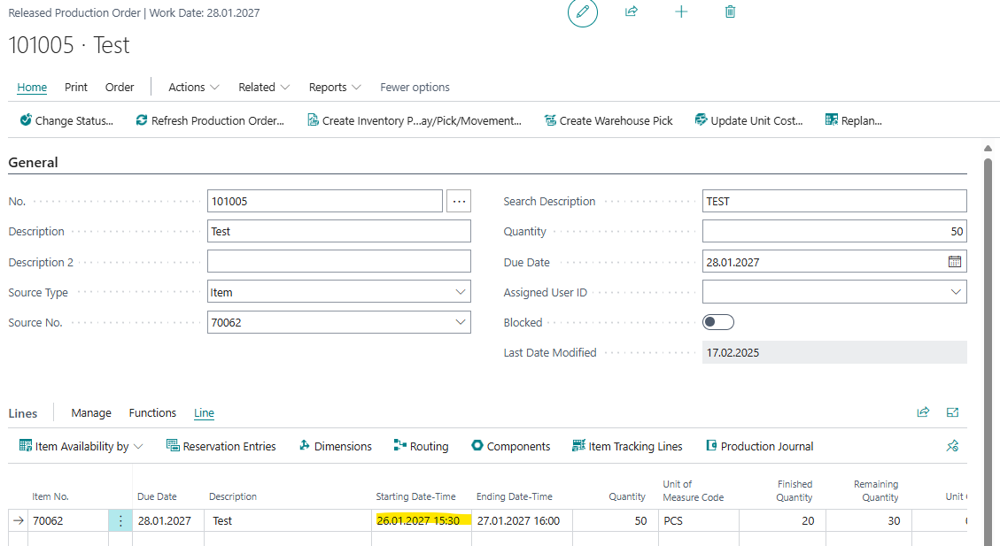
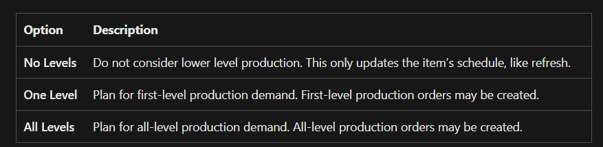
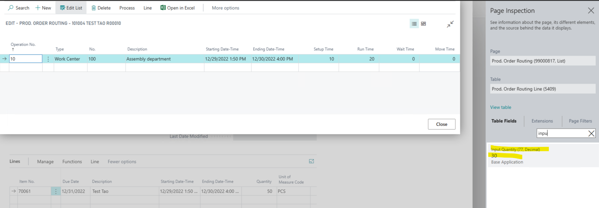

Title: Input quantity and related production time is not recalculated in a released production order when using the function "Replan"
Repro Steps:
1.  Open BC 25.4 W1 on prem
2.  Go to "Routing", create a new routing
    Type = serial
    Work Center: 100
    Setup Time: 10 
    Run Time: 10
    Status: Certified
    
3.  Go to Production BOMs and create a new one.
    Unit of Measure Code: PCS
    Item: 70000
    Quantity per: 10
    Status: Certified
    
4.  Go to Items Create a new item (70062)
    Use Template: ITEM
    Replenishment System = Prod. Order
    Manufacturing Policy = Make-to-Stock
    Routing = R00010 (Created in step 2)
    Production BOM No. = P00010 (Created in step 3)
    Reordering policy = Empty
    Reserve = Optional
    Order Tracking policy = None
5.  Go to "Released Production order" - Create a new one
    Source type = item
    Source No. = Created item in step 4 (70061)
    Quantity = 50
    Due date = 28/1/2027
    ->Refresh Production Order
    Note that the "starting date-time" on the line is "26/01/2027" while the "ending date-time" is "27/01/2027"
    
6.  Open the Production journal
    Line  Production Journal
    Post an output of 20
    And a consumption of 200
    Setup Time: 10
    Run Time: 10
    
    Post
7.  Go back to the "Released Production Order", note that you now have 20 finished quantities.
    
8.  Without using the replan function, the input quantity is expected to remain the same and the "Starting date-time" should also be same.
    Check the input quantity, for the "Routing" Line -> Routing
    Add the field Input Quantity with the Design functionality:
    
    Back in the production Order - > Replan the production order
    Home -> Replan
    

    ACTUAL RESULT:
    Nothin happened

    EXPECTED RESULT:
    The Starting Time should be recalculated based on the Remaining Quantity
    
    And the Input Quantity should be reduced to the Remaining Quantity:
    

    According to the documentation [https://learn.microsoft.com/en-us/dynamics365/business-central/production-how-to-replan-refresh-production-orders](https://learn.microsoft.com/en-us/dynamics365/business-central/production-how-to-replan-refresh-production-orders), looking through, it states that when you select "Plan" as "No Level", it should only update the item schedule, this includes the starting date-time and ending date-time.
    
    With the present design, if a new routing line or component line is added, it will keep the original quantity instead of taking the remaining quantity.

    ADDITIONAL INFORMATION
    I tested in BC 16.5 there the results are as expected:
    

Description:
Input quantity and related production time is not recalculated in a released production order when using the function "Replan". In Version BC16.5 did it work as expected.
