# Title: An error is generated when attempting to change (renumber) the Item No. After Posting and Generating Value Entries with Variant Codes and blank Variant Code for the Item
## Repro Steps:
In Version 26 - An error occurs when Attempting to Renumber an Item No. when the Item has Variant Codes and Item Ledger Entries and Value Entries posted for the Item and Variant Codes.
1.Create a new item - Item: Table - No: 1005
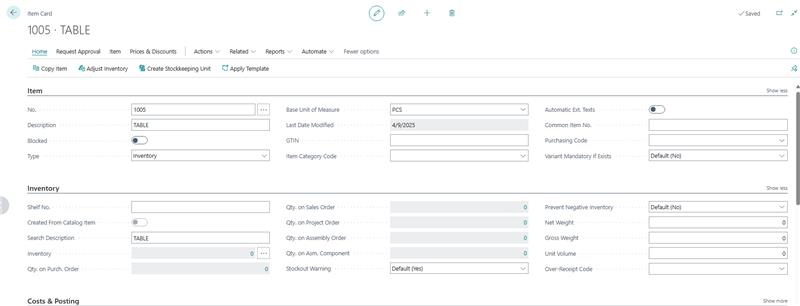
2.In the Item created add a variant=Related=item=related
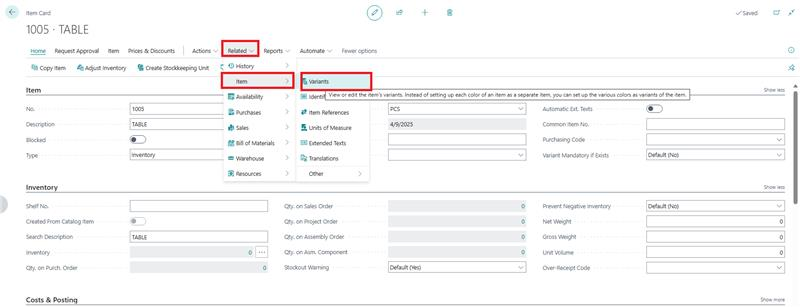
Variant=GREY AND ASH
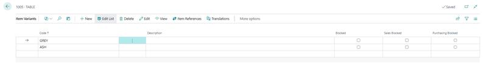
3.Go to item journal to get some quantities for the Item created include the variant and post each.
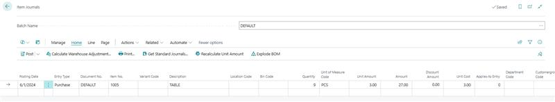
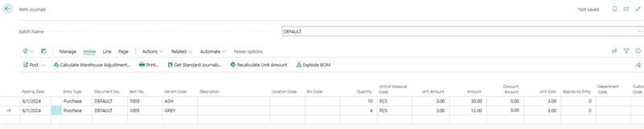
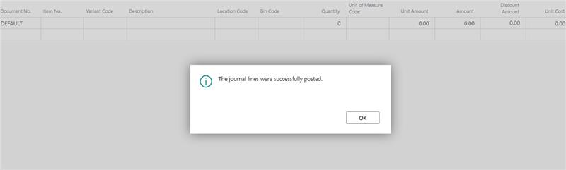
4.Create a sale invoice for the Item TABLE without the variant and post
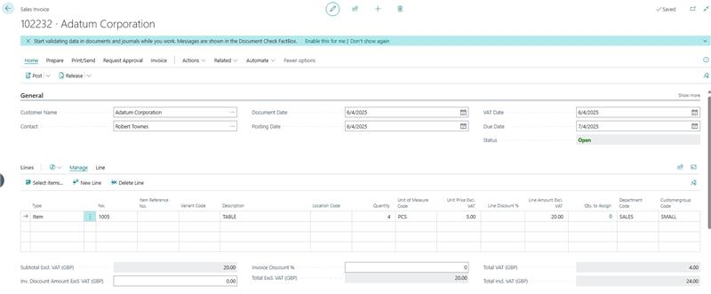

5.Create a sales invoice with Item "TABLE" include the variant and post
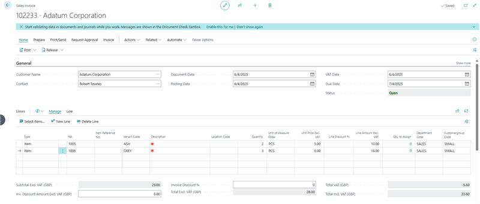
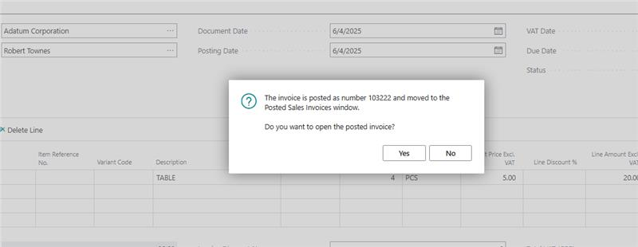
6.Make an attempt to change the item No" you receive the error message stating: You cannot rename Item No. in a Item Variant, because it is used in Value Entry.
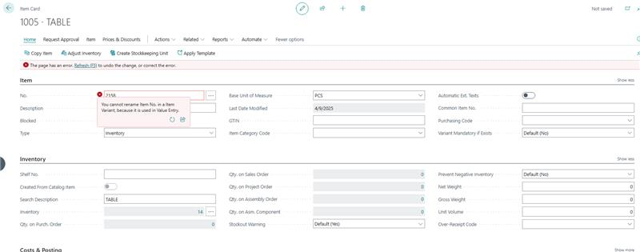
I attempted to perform more tests, and in previous versions like 25.5, I could change the Item No. without any errors.
Could this be a new change or possibly a bug?
Before
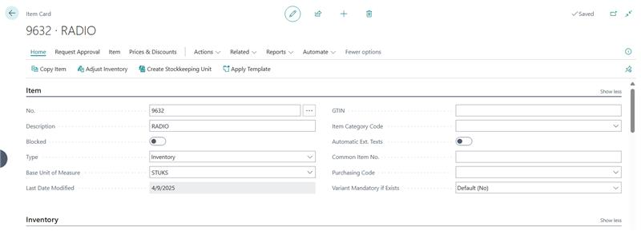
After
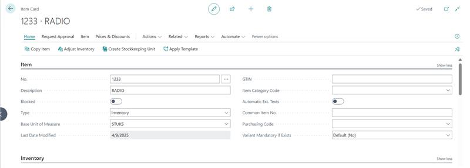

## Description:
Issue: An Error Occurs When Attempting to Change Item No. After Posting and Generating Item Ledger Entries and Value Entries in Version 26.0 with Items and Variant Codes involved.
The issue did not occur in Version 25.X Version or earlier. Was this a Design Change or is the an issue in the new version. If it is By Design, is there a reason for the change?
