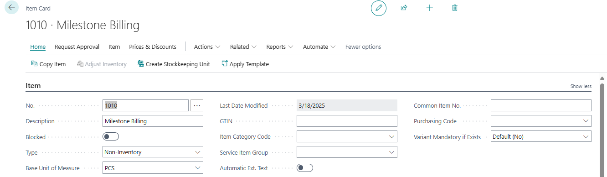
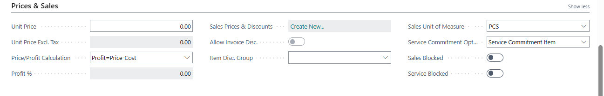
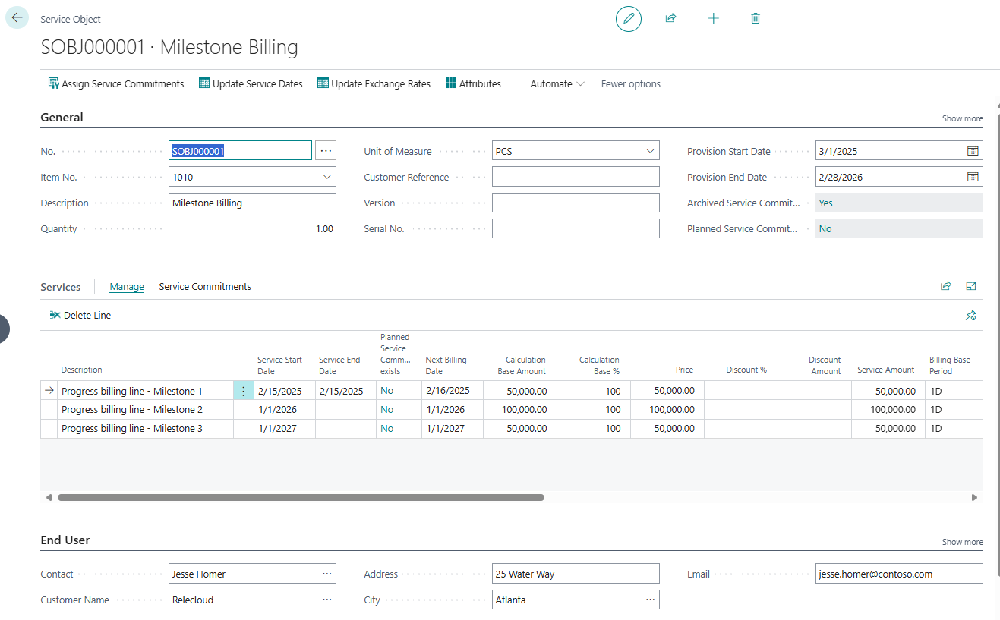
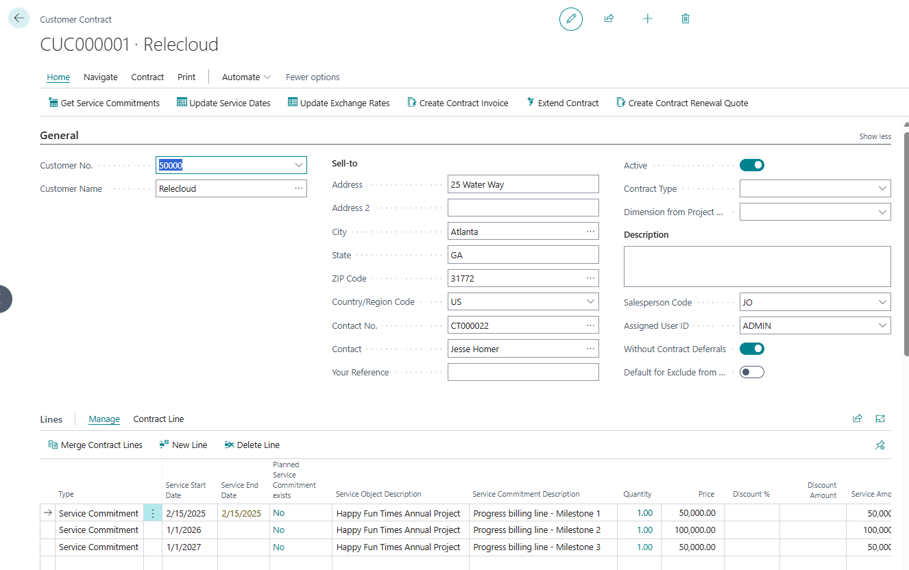
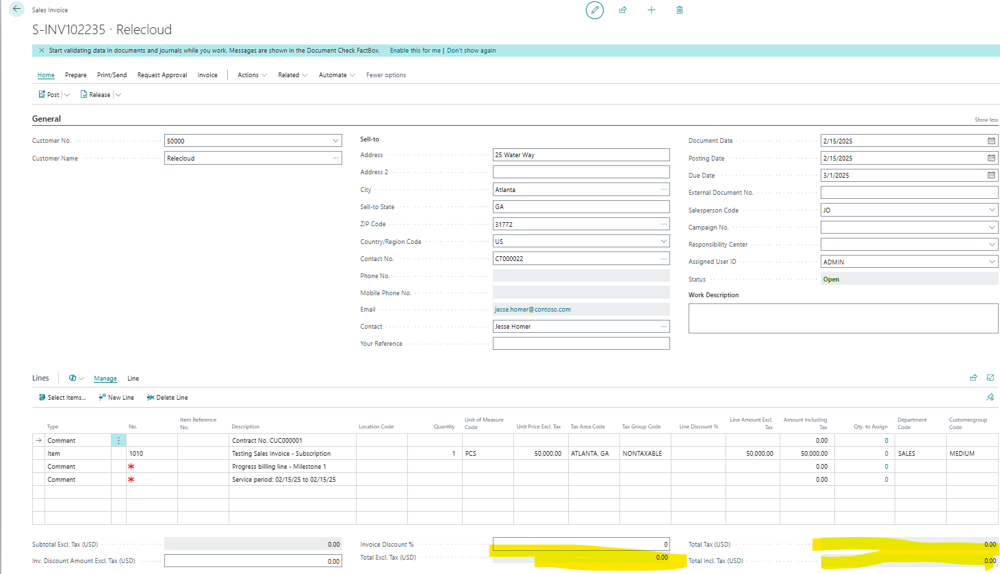
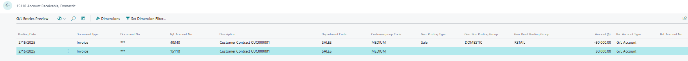
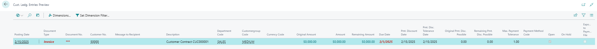

# Title: The Contract Invoice generated through the Subscription Billing process does not show an amount in the header of the generated Contract Invoice in the US or Canada Localized tenant even though the Sales Lines and Preview posting show value.
## Repro Steps:
*   Create a New Item of Type Non-Inventory to be able to uses in Subscription Billing and set as Service Commitment Item in Service Commitment Option field.

*   Create a new Service Object using the Item for Customer Relecloud to use the new Item generated.

*   Created the contract for the Customer using the Service Object 

*   On the Customer Contract Page, directly create Contract Invoice without enabling invoicing item insertion.
*   Entered the following details:
    *   **Start date** and **end date** for the invoice.
    *   **Document date** and **posting date**.
*   Clicked **OK**.
*   Navigate to the Created Sales Invoice

In Review of the generated Sales Invoice. we can see the Amounts on the Lines and the values appear to be correct.  However, the Total Amounts for Total Excl. Tax show $0.00.
When Posting Preview is completed, it appears to show the $50,000 billed correctly.
General Ledger Preview

Customer Ledger Preview

The End Result seems correct, but the issue is that the Sales Invoice Header shows $0.00 in the highlighted fields on the unposted Invoice.

**Expected Result:**
Before Posting, the Contract Sales Invoice should show the correct totals from the lines in the Sales Invoice Header fields.

## Description:
The Client is reporting an issue with the Subscription Billing Contract Invoice in Business Central in the Canada (or US Localization), where the Sales Invoice Header does not display any Amounts calculated, although the amounts correctly entered on the Sales Invoice Lines and the values are calculated and visible when previewing the posting. This issue is problematic for accounting personnel who need to validate invoices prior to posting.
