Title: When recalculating an item in a requisition or planning worksheet with no planning results lead to wrong surplus entries in the reservation table whic are added to the item tracking page.
Repro Steps:
I tested in BC 25.5 and 26.0 GB and DE Localization.

Repro Steps:
1. We start with creating a new Item:
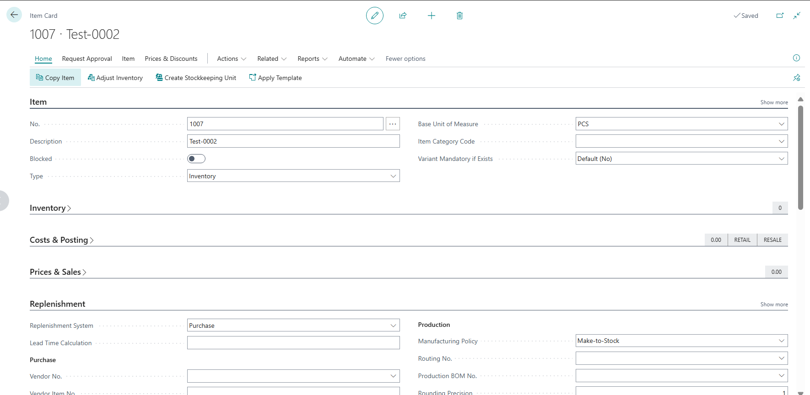 
With item tracking:
 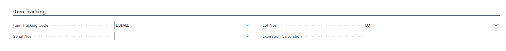
And Replenishment System = Purchase and Reordering Policy = Lot-for-Lot
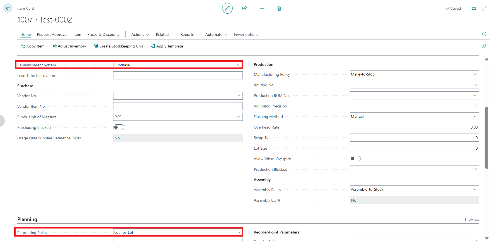  
2. Create a Sales Order for 100 PCS of the item:
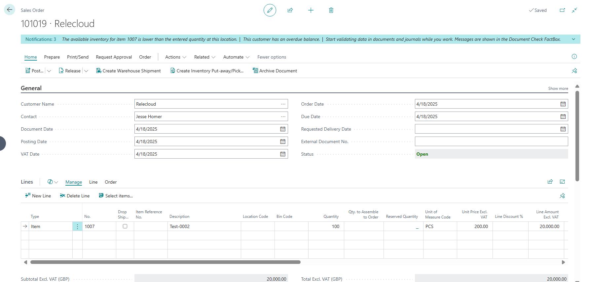
3. Now plan the item in the requisition worksheet, to meet the demand of the Sales Order:

As expected, the system recommends a Purchase Order
4. Now make the following changes
a. Vendor. No. 10000
b. Change the Quantity from 100 to 150
c. Change the planning flexibility to None (you need to add this field by personalization)
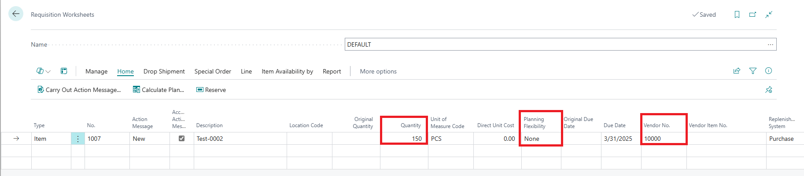 
5. Then enter the item tracking lines and click the "Assign Lot No." option. As expected, the corrected quantity of 150 is filled.
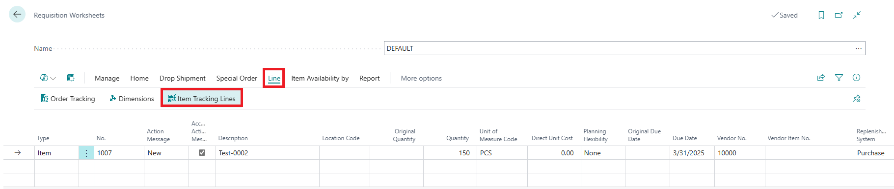
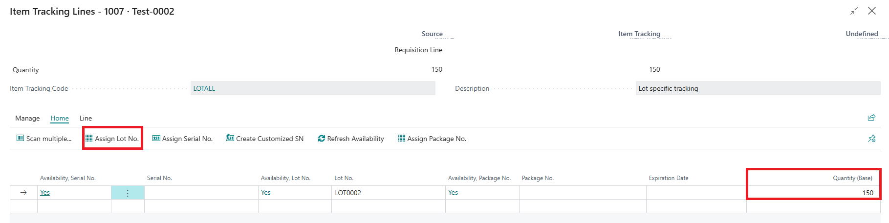 
6. Now Carry out the Action message and a Purchase Order is created, with the corrected quantity of 150. 
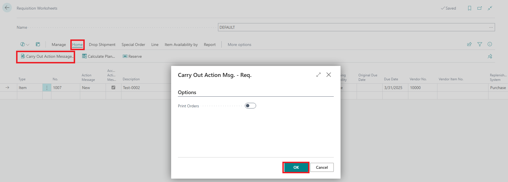
7. Open the created Purchase Order
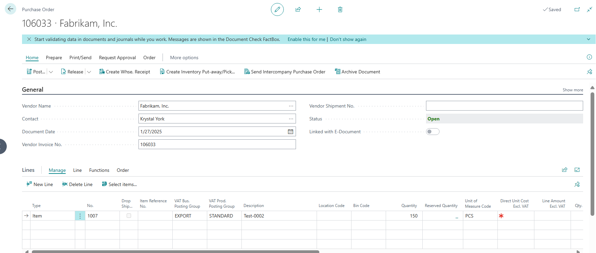
This is how the reservation entry table looks like after the purchase order was created from the Plan worksheet:
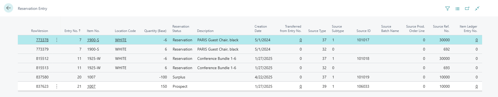
In the purchase line, navigate to the item tracking line to confirm the lines are available.

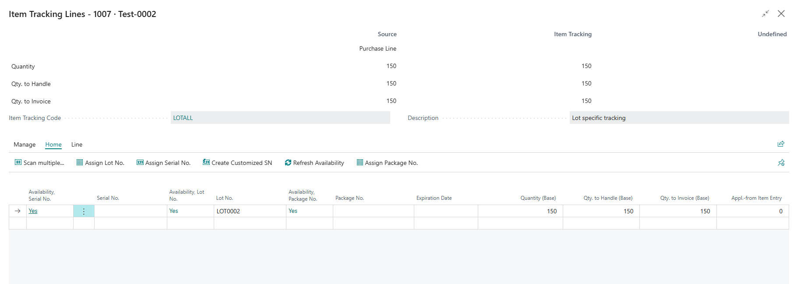  
8. Now go back to the Requisition Worksheet page and plan the item again.
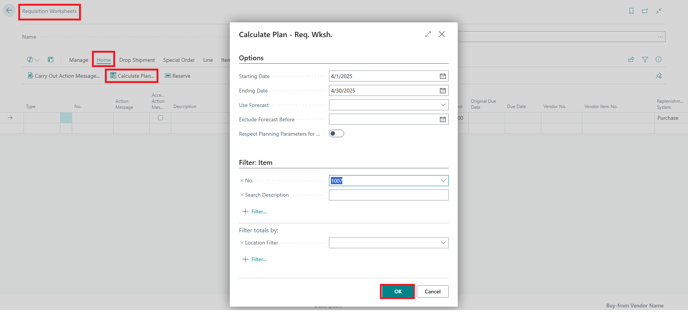
Since earlier we used planning flexibility = none, nothing gets planned, as expected. If we hadn’t, the system would want to reduce the quantity back to 100 to meet the demand exactly.
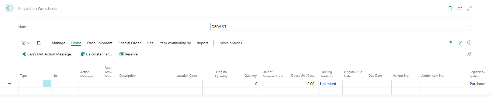 
9. If we now go back to the purchase order and look into it again, the purchase line itself has not changed as shown below:

Check the reservation entry table again right after you replan the worksheet, you will notice the following below a new surplus entry for 50 pcs was created which is not correct
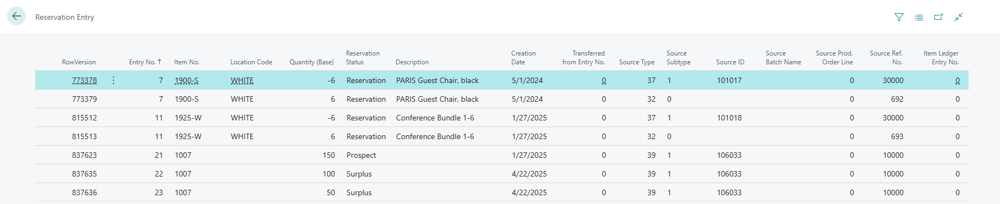
And if you go the item tracking lines on the purchase line, you will notice that the item tracking line has increased by 50pcs we added to the line. (due to the wrong newly created Surplus entry)  This happens again and again, always adding with each calculation. 
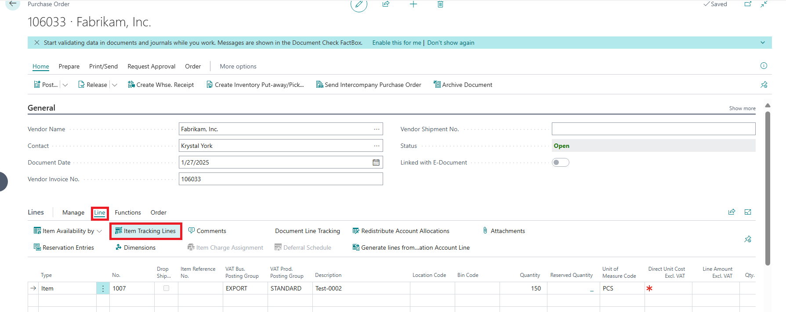
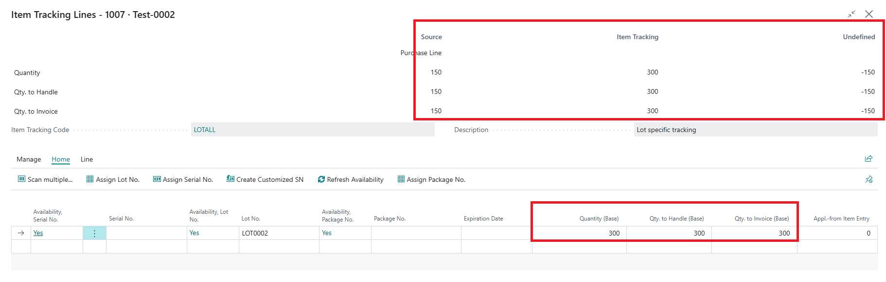 
10. When we attempt to close the item tracking page, the following message appears:
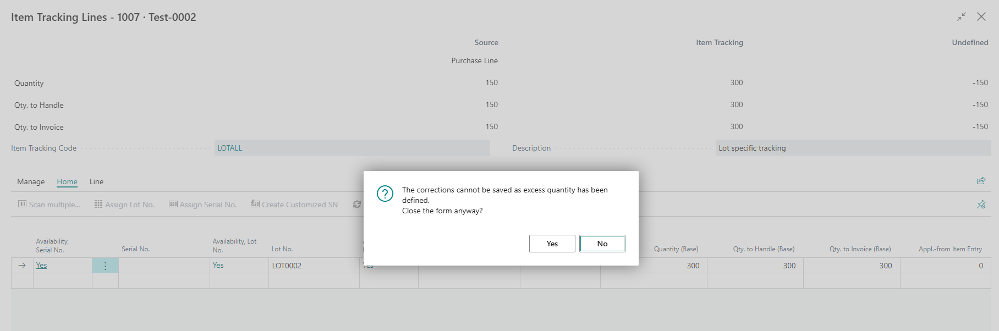 

**Actual Result**: The wrongly created surplus entry for the added quantity (50pcs) leads to wrong quantities in the Item tracking lines after replanning the worksheet.

**Expected Result**: These quantities should not be changed and the reservation entries with surplus shouldn't be created.

**Additional information:** Same behavior if you use instead the planning worksheet.
When you post the purchase order everything is posted correctly, and the wrongly created reservation entries are gone.

Description:

