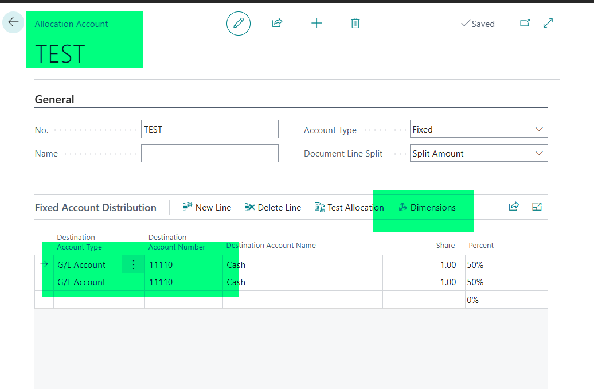
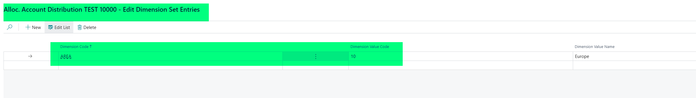
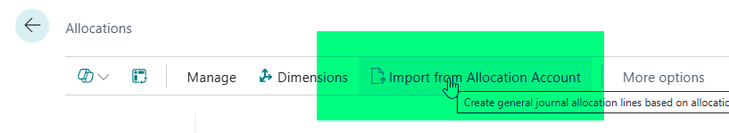
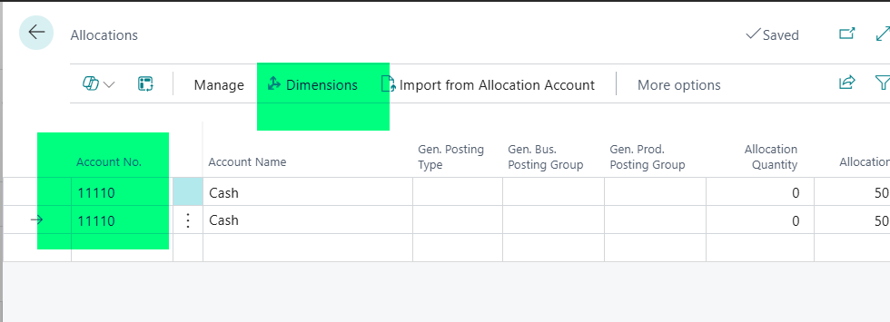
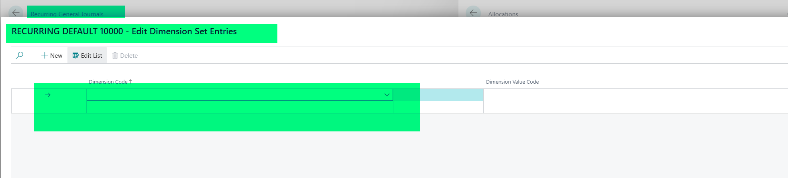

Title: In Recurring General Journals Import from Allocation Accounts does not import dimensions
Repro Steps:
Repro steps in US version to use Allocation Accounts in Recurring General Journals: 
Create an allocation account, assign dimensions on each line.

Each line has its dimension:

In Recurring General Journals, create a journal line. Navigate to Home/Process > Allocations.

Choose "Import from Allocation Account"

Choose the Allocation Account you chose earlier:

Both lines from AA come. Open the dimensions for each line:

Dimensions come empty:

Expected Result:
The lines should have the same dimesion as setup on the Allocation Account.

Description:
In Recurring General Journals Import from Allocation Accounts does not import dimensions.
When you use the Allocation Account on a General Journal line, the dimensions are added correctly.
