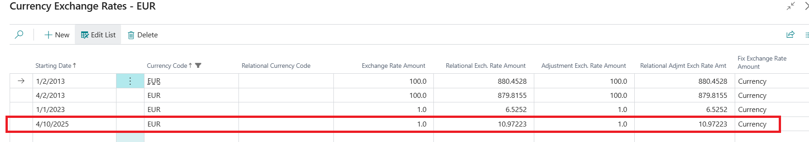
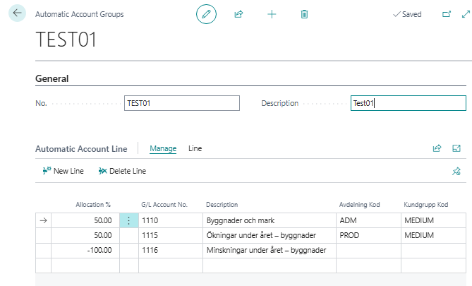
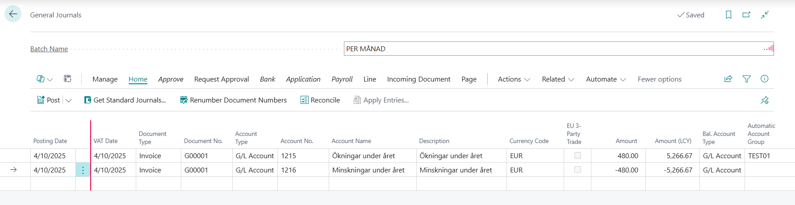
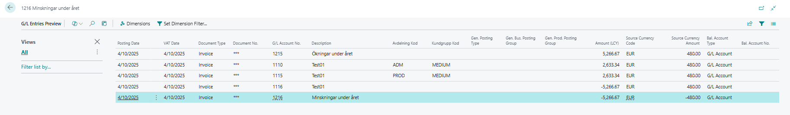
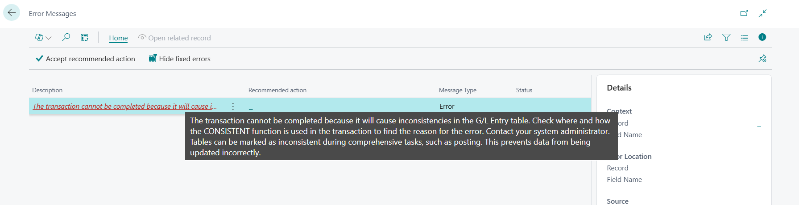
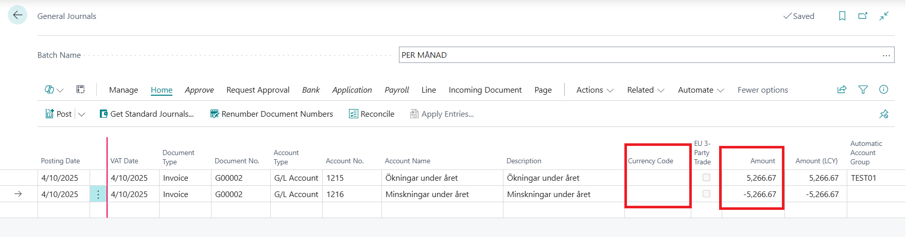
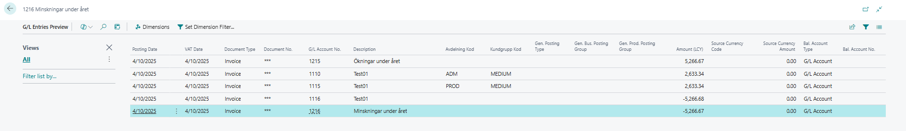

# Title: Rounding issue leading to "Inconsistency" error when trying to post with different currency and automatic accounting in Swedish localisation
## Repro Steps:
Issue was reproduced in Swedish localization version 26.0

To reproduce the issue, follow the steps below:
1.  Go to currencies page
    Search "Euro"
    Starting date = 4/10/2025
    Exch. Rate Amt and Adj. Exch. Rate Amt = 1.0
    Relational Exch. Rate Amt and Relational Adj. Exch. Rate Amt = 10.97223
    Fix Exch. Rate Amt. = Currency
    

2.  Go to "Automatic Account Groups" page
    Create a new one
    No. and Name = Test01
    Line 1: Allocation % = 50, G/L Account No. = 1110, Avdelning Kod = ADM, Kundgrupp Kod = Medium

    Line 2: Allocation % = 50, G/L Account No. = 1115, Avdelning Kod = PROD, Kundgrupp Kod = Medium

    Line 3: Allocation % = -100, G/L Account No. = 1116 (You must have a total balance = 0)
    

3.  Go to General Journals
    Line 1: Posting & VAT date = 4/10/2025, Doc. No. = G00001, Acc. Type = G/L Account, Acc. No. = 1215, Currency = EUR, Amount = 480, Automatic Account Group = Test01

    Line 2: Posting & VAT date = 4/10/2025, Doc. No. = G00001, Acc. Type = G/L Account, Acc. No. = 1216, Currency = EUR, Amount = -480 (To balance the account).
    
    Preview posting.

    **Note
    **The Amount (LCY) = 5266.67
    Due to the setting that the allocation is 50% for each line in the automatic account groups, the system will try to divide the Amount by 2, which will result in 2633.335, the system rounds up correctly to 2633.34, but the summation of this results (2633.34) will give a different amount LCY (5266.68) compared to the original amount which the EUR currency is converted to.

    Preview posting is allowed.
    
    Try to post the document now, an error is generated that "The transaction cannot be completed because it will cause inconsistencies in the G/L Entry table........"
    

**Actual result:** Posting cannot be done due to inconsistencies in the rounding.

**Expected Result:** The system should correct LCY rounding when source currency imbalance exists.

**More Information:** If the operation above is carried out without foreign currency and the amount = 5266.67, the system allows posting with the same inconsistent value.

## Description:
Rounding issue leading to "Inconsistency" error when trying to post with different currency and automatic accounting in Swedish localisation
