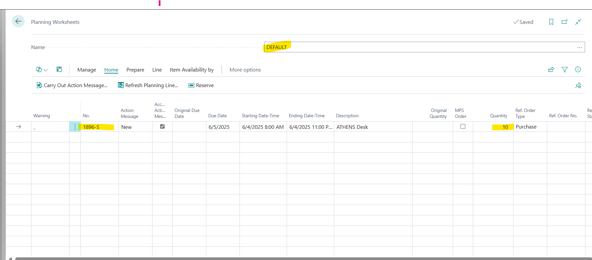
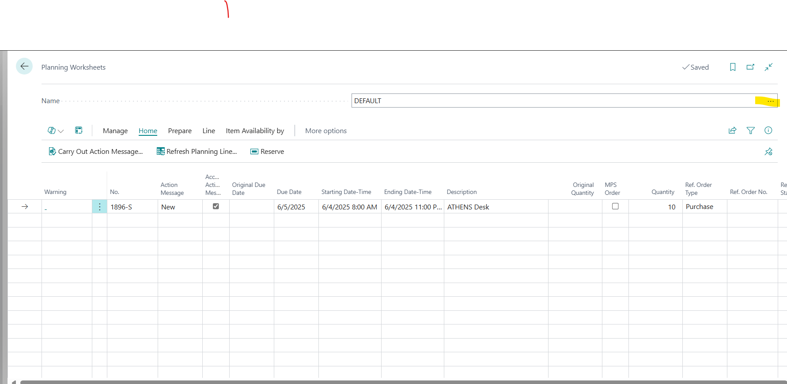
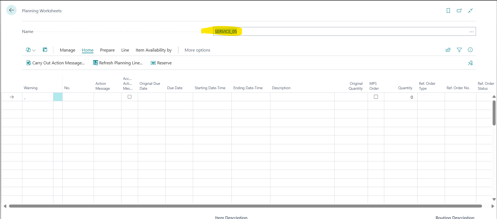
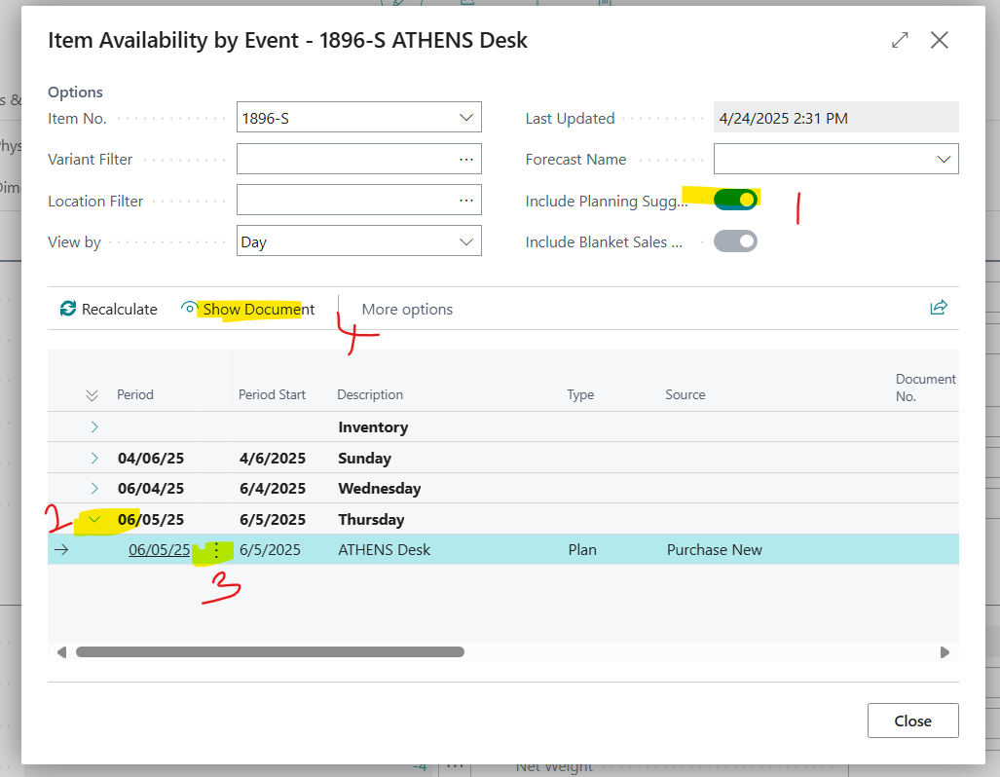
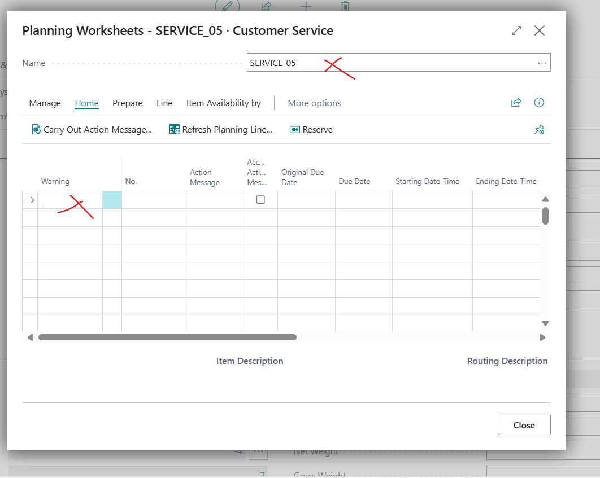
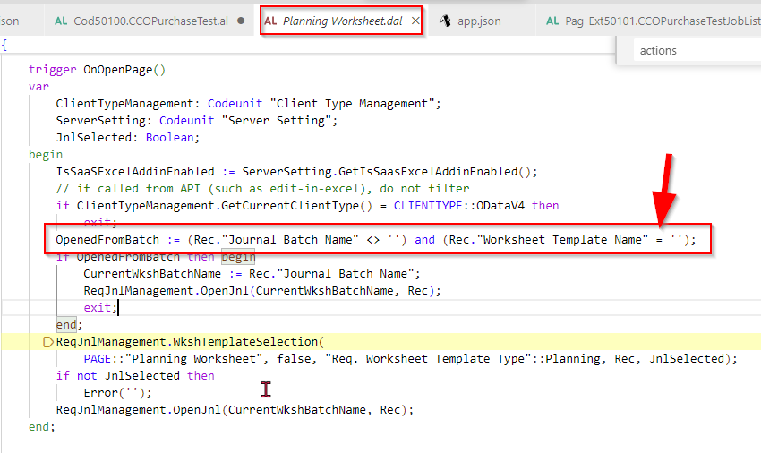

Title: Lookup Item Availability by Event on Item Card opens the Wrong Planning Worksheet Batch (Last Used)
Repro Steps:
Lookup Item Availability by Event on Item Card opens the Wrong Planning Worksheet Batch (Last Used)
Issue was reproduced in **Version: GB Business Central 26.0 (Platform 26.0.32850.0 + Application 26.0.30643.33009)**
1.Open the Planning Worksheet
2.For the Default Batch, manually create a new Line for Item 1896 -Athens Desk, Quantity of 10

3.Then Create a new Batch Called Service and open it, it will be empty

4.Select the new Batch 
You can close the Planning Worksheet and come back in to ensure that the Last Opened Batch is the Newly Created one (Service)

5.Search for Items and Open the Item Card for Item 1896 -Athens Desk
6.Then on the Header, Click on Item => Item Availability By => Select Event
7.Enable _Include Planning Suggestion_, and the Planning Entry also shows up here
8.Open the Planning Entry and Click on Show Document.

**ACTUAL RESULT**
The system Opens the Last Opened Batch, that is the Newly Created one (Service) and this is not where the Planning line exists

**EXPECTED RESULT**
The system should open the Batch where the Entry of the Planned Item exists
**ROOT CAUSE OF THE SOURCE CODE PROVIDED BY PARTNER**
 

Description:
If you have 2 or more planning worksheets with a planned item line the systems does not open the correct planning worksheet batch by show document from the item availabily page.
