Title: Manually change quantity of "Take Line" in Warehouse Pick changes the quantity of the Wrong "Place Lines"
Repro Steps:
SETUP
1.Location Card in DK Localization, require Pick = yes and Prod. Consumtion Whse. Handling = Warehouse Pick (mandatory) (The rest does not need to be filled)
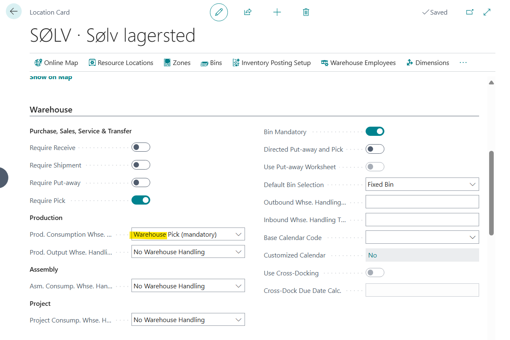
Set up the Production Bins
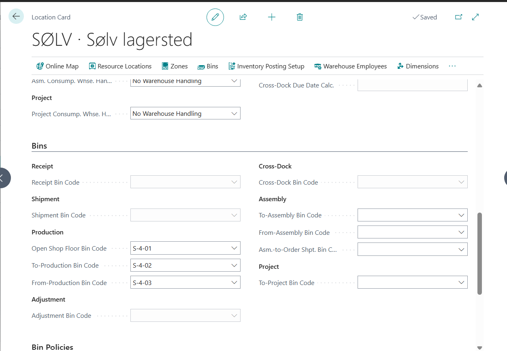
2.Setup yourself as the Warehouse Employee
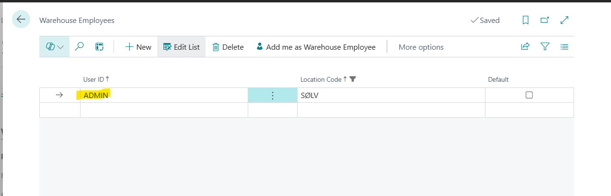
3.I have the Item that I want to manufacture (1000)
4.Replenishment is Prod. Order, and I have attached a BOM.
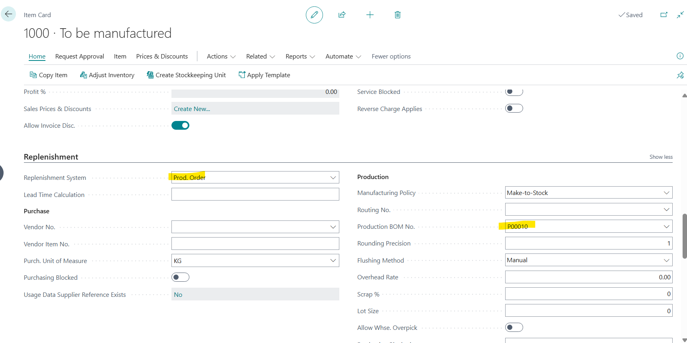
5.Only one Item in the BOM (Item should be different Item, NOT same item as being made...should be **COMPONENT** Item  >>  Note this from DP Repro Steps)
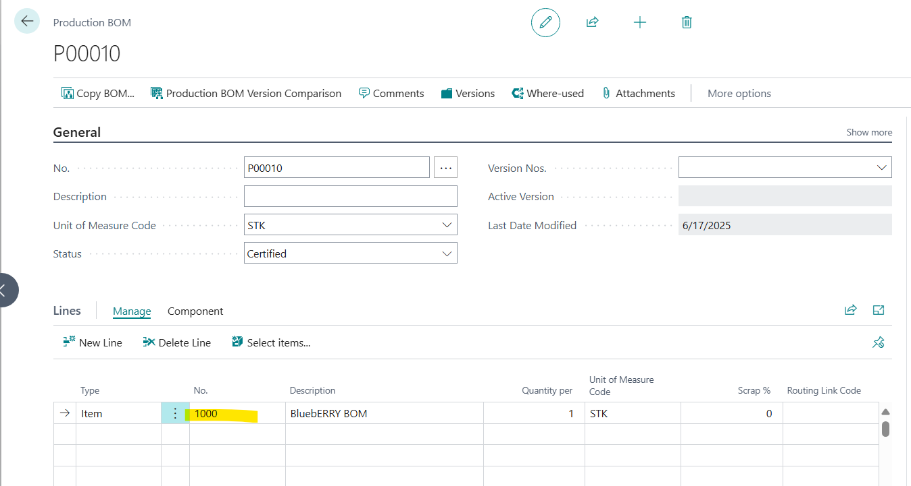
6.The Item in the BOM has replenishment Purchase, Allow Whse. Overpick is true and then Flushing Method is Pick + Manual (Again, this is different item, NOT 1000...should be **COMPONENT** Item)
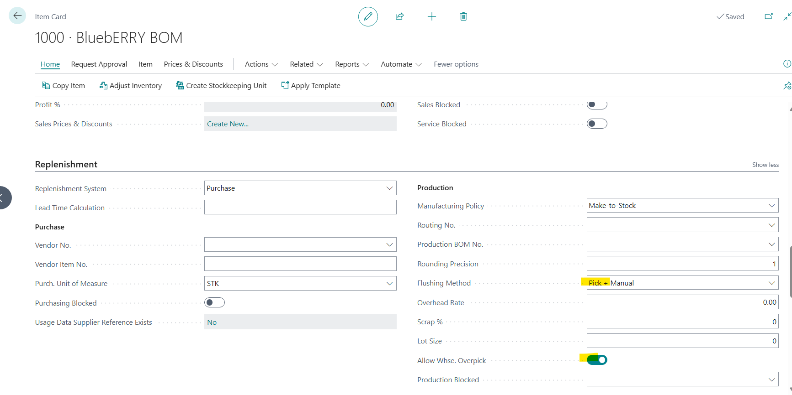
7.Navigate to Item Journals, for the **COMPONENT** Item, Create 5 lines, 900 quantities from Bin S-01-01 to S-01-05 (Everything would total 4500 qty)
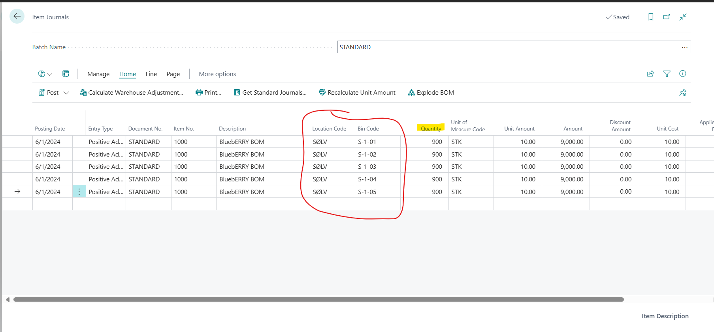
8.Post the Journal

Repro
1.Create a Released Prod Order for the Item created in step 3 (Item to be manufactured) above, quantity is 4200, Location is Silver then Refresh the Order.
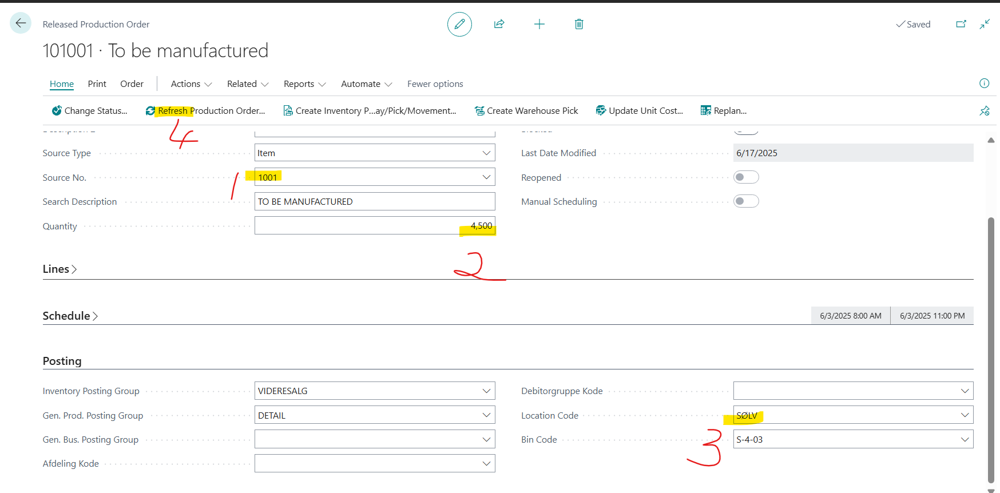
2.Create Warehouse Pick once the Prod Order Line is populated
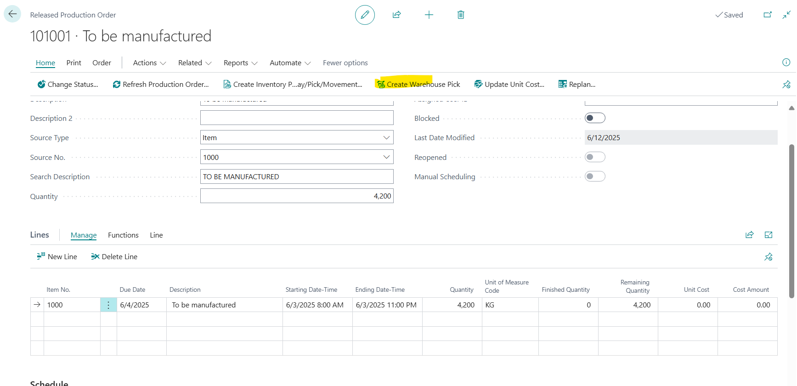
3.Navigate to the Warehouse Pick created
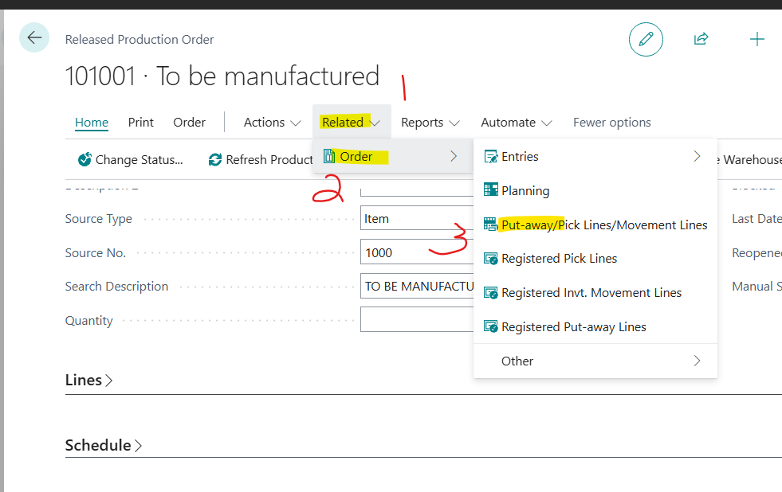
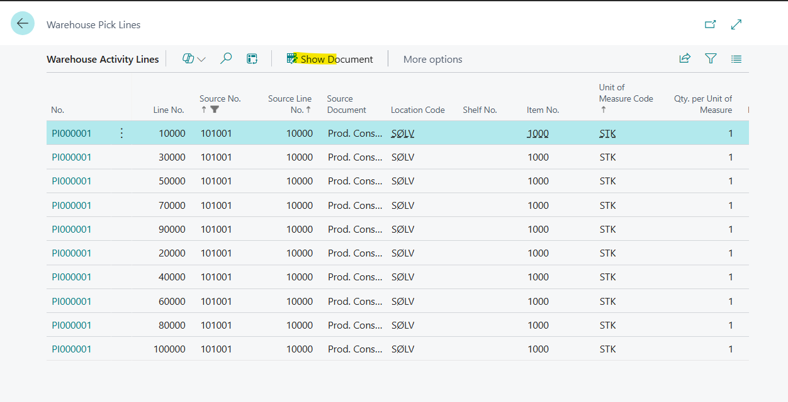
4.on Last Take Line for Example, change the Quantity to take from 900 to 400

**Expected Result**
The Last Place line would be updated to 400

**Actual result**
The Second Place Line is updated instead which is confusing
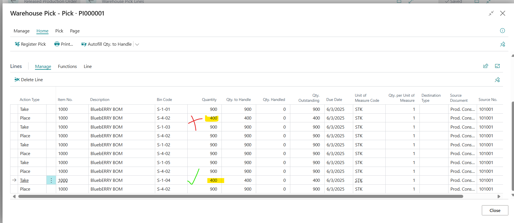
The Partner mentioned that the in the Code there seems to be a filter that always updates the First line of the Placing

Description:

