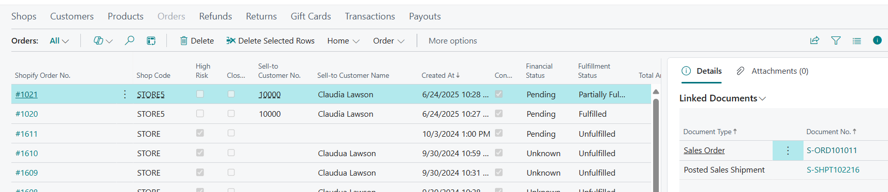
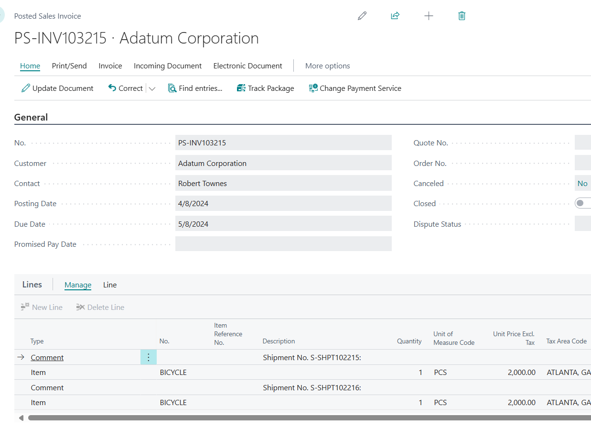
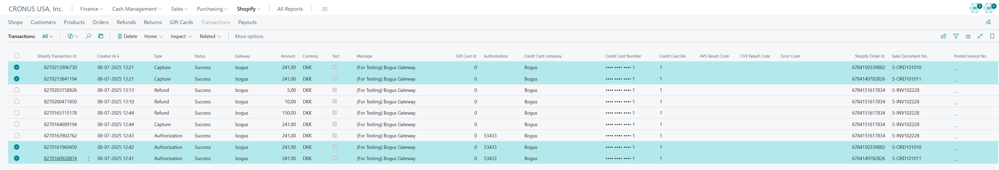
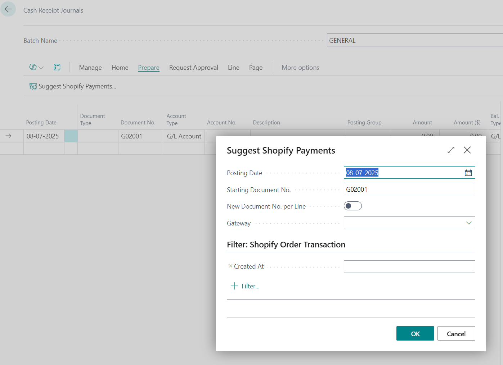
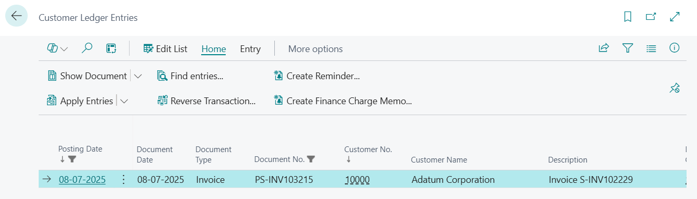

# Title: Shopify - invoices created via Get Receipt lines - won't be Suggested by Suggest Shopify Payments
## Repro Steps:
Connect BC to Shopify.
Create in Shopify two orders for the same customers (with credit card transaction, make sure it is paid)
Import them into Business CEntral, convert to Order. Post shipment only

Create new sales invoice. Choose customer. In lines subpage use Get Receipt Lines functions to pull lines from these two shipments.
Post invoice

Inspect transactions:

Notice that there is no Posted Sales Invoice No (expected as the posted sales inv header doesn't contain the Shopify Order Id)
Navigate to Cash Receipt Journal and choose Suggest Shopify Payment

Result - empty.
Expected - 
payments are proposed to be linked to the same sales invoice/ledger entry

## Description:
