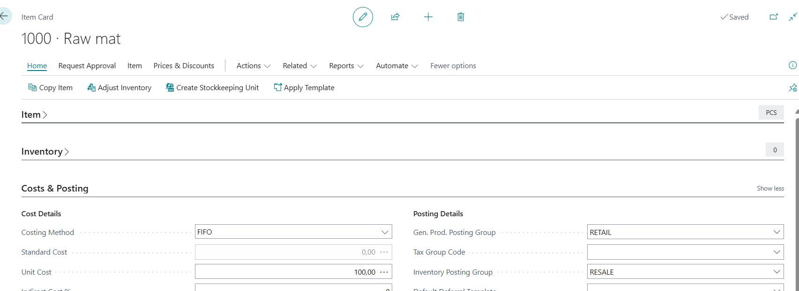
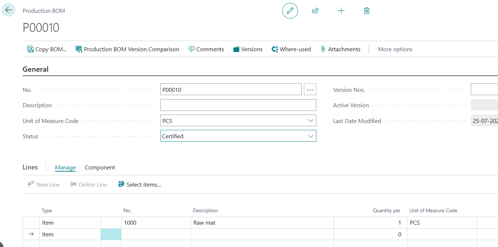
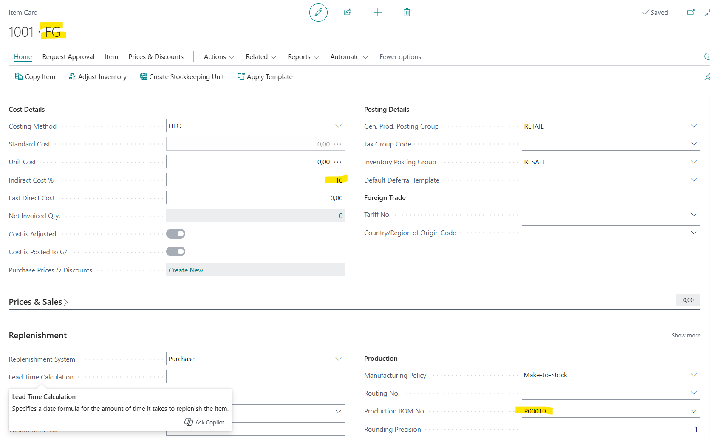
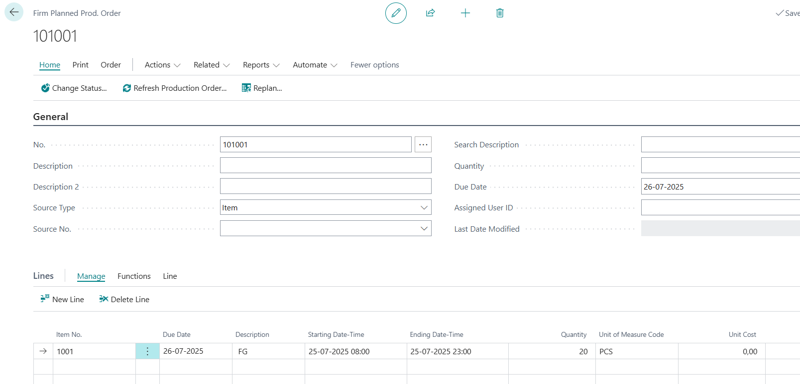
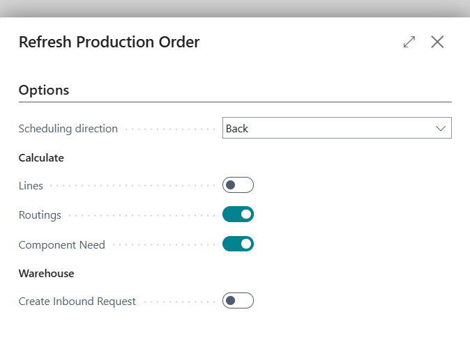
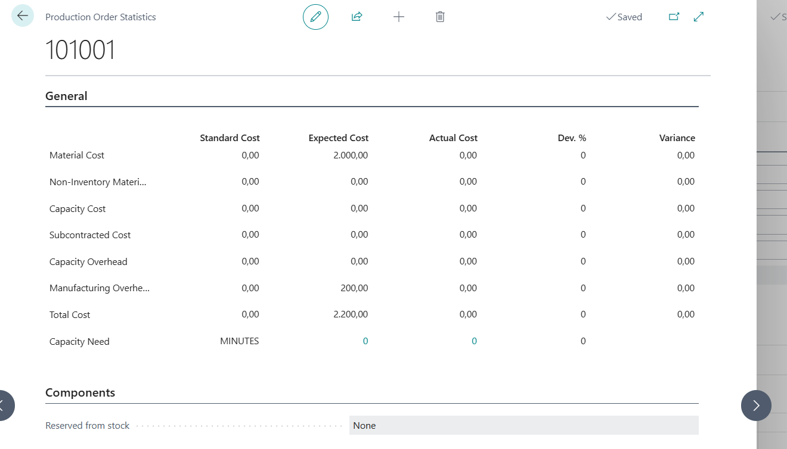
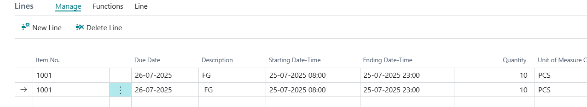
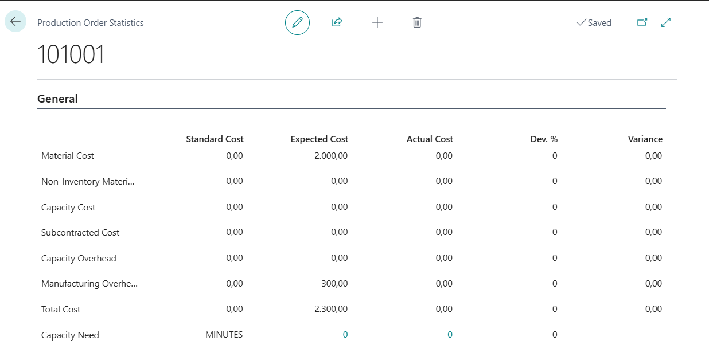
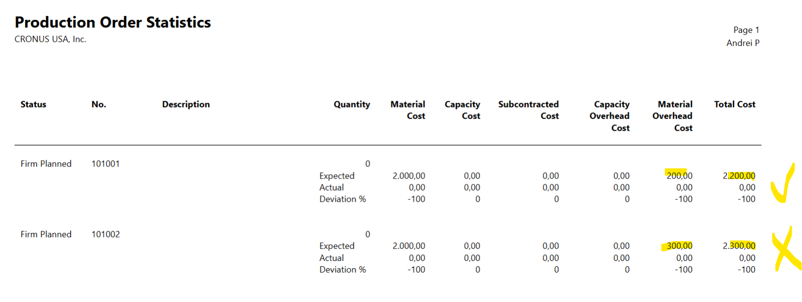

Title: Manufacturing overhead is wrong in the production order statistics page (99000816) and report (99000791).
Repro Steps:
New item, called RAW. Set Unit Cost = 100.

Create new Production BOM.
PCS
Type = Item, RAW, Qty =1
Certify.

Create new item FG
Set Indirect Cost = 10%
Assign prod BOM created earlier.

Create new released (or firm planned production order)
Don't populate header. Go directly to lines.
Add line with item FG, Qty 20.

Choose Refresh prod ord, deselect Lines.

Check statistics.

Expected cost:
Material 2000 (correct Unit cost of one item is 100, we need 1 per FG and we are building 20 FG.)
Manufacturing overhead is correct - we defined 10%. 10% of 2000 is 200.
Total expected cost is 2200.
Now create another released (or firm planned) prod order.
Don't populate header. Go directly to lines.
Add two lines with item FG, Qty 10 each. (so total qty is 20)

Choose Refresh prod ord, deselect Lines.
Check statistics.

Now with the same qty, the total is 2300.
For some reason Manufacturing Overhead is 300 (wrong), instead of 200 (expected).

you can also run report Production Order Statistics:

You can see difference.

Description:

